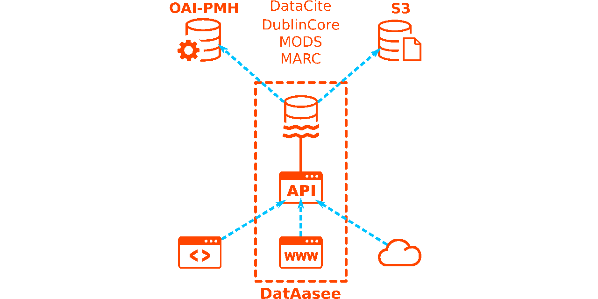

DatAasee (0.2)
==============



### Repository: [github.com/ulbmuenster/dataasee](https://github.com/ulbmuenster/dataasee)
### Maintainer: [Christian Himpe](https://github.com/gramian)
### Licenses: [MIT](LICENSE) (additionally: [CC-BY](https://creativecommons.org/licenses/by/4.0/) for [openapi.yaml](api/openapi.yaml))
### Function: Metadata-Lake, Metadata Catalog, Metadata Aggregator
### Audience: University Libraries, Research Libraries, Academic Libraries, Scientific Libraries

## Tech Stack Outline

* **Setting:** Many distributed data and metadata sources
* **Goals:**
    * Centralize metadata
    * Interlinked metadata catalog
    * Super-index for bibliographic and research data
* **Features:**
    * Interact through HTTP-API (JSON)
    * Search by filter or full-text
    * Custom query via: `SQL`, `Gremlin`, `Cypher`, `MQL`, `GraphQL`
* **Frontend:** [Lowdefy](https://www.lowdefy.com)
* **Backend:** [Connect](https://docs.redpanda.com/redpanda-connect/about/) (Benthos)
* **Data Storage:** [ArcadeDB](https://arcadedb.com)
* **Infrastructure:** [Compose](https://compose-spec.io) (via [Docker](https://www.docker.com) or [Podman](https://podman.io))
* **Deployment:** via [Harbor](https://harbor.uni-muenster.de) (at Uni Münster)
* **Monitoring:** [Prometheus](https://prometheus.io)
* **Integrations:**
    * **Protocols:** `OAI-PMH` (HTTP), `S3` (HTTP)
    * **Encodings:** `DataCite` (XML), `DC` (XML), `MARC` (XML), `MODS` (XML)
* **Security:** Priviledged endpoints (CQRS)
* **Testing:** [check-jsonschema](https://check-jsonschema.readthedocs.io/en/stable/)
* **Development:** [Github](https://github.com/ulbmuenster/dataasee)

## Getting Started (Deployment)

* Depends on `docker-compose` or alternatively `podman-compose`.
* To deploy, no need to clone just use the [`compose.yaml`](compose.yaml) file.
* See the [Deploy Documentation](docs/docs.md#deploy) for details.

Quick Start:
```shell
$ mkdir -p backup
$ wget https://raw.githubusercontent.com/ulbmuenster/dataasee/0.2/compose.yaml
$ echo -n 'password1' > dl_pass && echo -n 'password2' > db_pass && docker compose up -d; rm -f dl_pass db_pass; history -d $(history 1)
```

## Documentation

* [Dependencies Overview](docs/deps.md)
* [Software Documentation](docs/docs.md)
* [Architecture Documentation](docs/arc42.md)
* [Database Schema](docs/schema.md)
* [OpenAPI Schema](api/openapi.yaml)
* [`DatAasee`: A Metadata-Lake as Metadata Catalog for a Virtual Data-Lake]( TODO:) (Companion Paper, Open Access)

## Default Ports

* `8343` DatAasee API
* `9999` Database JMX (Development Only)
* `8000` Web Frontend (Development Only)
*   `80` Web Frontend (Deployment Only)

## Repository Contents

* `api/`       - API definition and message schemas
* `assets/`    - Project images and styles
* `backend/`   - Processor pipeline and component definitions
* `container/` - Dockerfiles
* `database/`  - Database initialization, schemas and enumerated data
* `docs/`      - Software, data and architecture documentation
* `frontend/`  - Prototype frontend definitions
* `tests/`     - Test definitions and data

## Getting Started (Development)

* `make` List available targets:
    * `make setup` Build server images
    * `make start` Start servers
    * `make stop`  Stop servers (after attempting a backup)
    * `make logs`  Show logs
    * `make state` Report container status (requires `bash`)
    * `make watch` Monitor container status (requires `bash`)
    * `make peak`  Report peak database memory usage (requires `pgrep`)
    * `make sbom`  Create per container SBOMs (requires `syft`)
    * `make test`  Run HTTP API tests (requires `check-jsonschema`)
    * `make tidy`  List violations of StrictYAML (requires `yamllint`)
    * `make todo`  List inline TODOs in repo

## Contributors

* [See here](CONTRIBUTORS.md)
