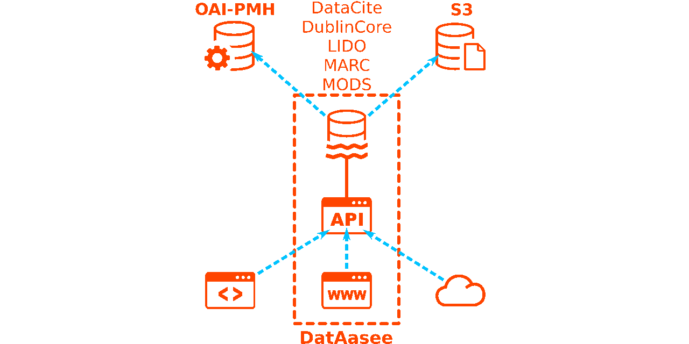

DatAasee (0.3)
==============



### Repository: [github.com/ulbmuenster/dataasee](https://github.com/ulbmuenster/dataasee) (nb [sources backup](https://doi.org/10.5281/zenodo.13734194))
### Maintainer: [Christian Himpe](https://github.com/gramian) (at [University and State Library of Münster](https://github.com/ulbmuenster))
### Licenses: [MIT](LICENSE) (add. [CC-BY](https://creativecommons.org/licenses/by/4.0/) for [openapi.yaml](api/openapi.yaml))
### Function: Metadata-Lake, Metadata Catalog, Metadata Aggregator, Union Catalog
### Audience: University Libraries, Research Libraries, Academic Libraries, Scientific Libraries

## Tech Stack Canvas

* **Setting:** Many distributed data and metadata sources
* **Goals:**
    * Centralize metadata
    * Interlinked metadata catalog
    * Super-index for bibliographic and research data
* **Features:**
    * Interact through HTTP-API (JSON)
    * Search by filter or full-text
    * Custom query via: `SQL`, `Gremlin`, `Cypher`, `MQL`, `GraphQL`
* **Frontend:** [Lowdefy](https://www.lowdefy.com)
* **Backend:** [Connect](https://docs.redpanda.com/redpanda-connect/about/) (Benthos)
* **Data Storage:** [ArcadeDB](https://arcadedb.com)
* **Infrastructure:** [Compose](https://compose-spec.io) (via [Docker](https://www.docker.com) or [Podman](https://podman.io))
* **Deployment:** via [Harbor](https://harbor.uni-muenster.de) (at Uni Münster)
* **Monitoring:** [Prometheus](https://prometheus.io)
* **Integrations:**
    * **Protocols:** `OAI-PMH` (HTTP), `S3` (HTTP), `GET` (HTTP), `DatAasee` (HTTP)
    * **Encodings:** `XML` (Plain-Text)
    * **Formats:** `DataCite` (XML), `DC` (XML), `LIDO` (XML), `MARC` (XML), `MODS` (XML)
* **Security:** Priviledged endpoints (CQRS)
* **Testing:** [check-jsonschema](https://check-jsonschema.readthedocs.io/en/stable/)
* **Development:** [Github](https://github.com/ulbmuenster/dataasee)

## Documentation

* [Dependencies Overview](docs/deps.md)
* [Software Documentation](docs/docs.md)
* [Architecture Documentation](docs/arc42.md)
* [Database Schema](docs/schema.md)
* [OpenAPI Schema](api/openapi.yaml)
* [`DatAasee`: A Metadata-Lake as Metadata Catalog for a Virtual Data-Lake](https://arxiv.org/abs/2409.05512) (Companion Paper, Open Access)

## Getting Started (Deployment)

* Depends on `docker-compose` (and compatible to `docker` and `podman`)
* To deploy, no need to clone, just use the [`compose.yaml`](compose.yaml) file.
* See the [Deploy Documentation](docs/docs.md#deploy) for details.

Quick Start:
```shell
$ wget https://raw.githubusercontent.com/ulbmuenster/dataasee/0.3/compose.yaml
$ mkdir -p backup
$  DB_PASS=password1 DL_PASS=password2 docker compose up -d
```

## Default Ports

* `8343` DatAasee API
* `2480` Database API (**Development Only**)
* `9999` Database JMX (**Development Only**)
* `8000` Web Frontend (**Development Only**)
*   `80` Web Frontend (**Deployment Only**)

## Repository Contents

* `api/`       - API definition and message schemas
* `assets/`    - Logos and style definition
* `backend/`   - Processor pipeline and component definitions
* `container/` - Dockerfiles
* `database/`  - Database initialization, schemas and enumerated data
* `docs/`      - Documentation of software, data and architecture
* `frontend/`  - Prototype frontend definition
* `tests/`     - Test definitions and data

## Getting Started (Development)

* Available `make` targets:
    * `make setup` Build server images
    * `make start` Start servers
    * `make stop`  Stop servers
    * `make reset` Stop and start servers
    * `make empty` Delete database backups (requires priviledges)
    * `make logs`  Show logs (requires `grep`)
    * `make peak`  Report peak database memory usage (requires `grep`)
    * `make test`  Run tests (requires `check-jsonschema`, `busybox`, `wget`)
    * `make tidy`  List violations of StrictYAML (requires `yamllint`)
    * `make todo`  List inline TODOs in repo (requires `grep`)
* Custom `make` variable: [`COMPOSE`](docs/docs.md#compose-setup)

## Contributors

* [See here](CONTRIBUTORS.md)
