# DatAasee Architecture Documentation

**Version: 0.2**

The Metadata-Lake (MDL) **DatAasee** gathers research metadata and bibliographic
data from a multitude of sources, associates them with underlying data-sets, and
provides a HTTP API for access, that is utilized by a (prototype) web frontend.

The main goal of the Metadata-Lake is to provision a one-stop shop for research
data discovery at university libraries, research libraries, academic libraries,
and scientific libraries.

**Sections:**

1.  [Introduction & Goals](#1-introduction--goals)
2.  [Constraints](#2-constraints)
3.  [Context & Scope](#3-context--scope)
4.  [Solution Strategy](#4-solution-strategy)
5.  [Building Block View](#5-building-block-view)
6.  [Runtime View](#6-runtime-view)
7.  [Deployment View](#7-deployment-view)
8.  [Crosscutting Concepts](#8-crosscutting-concepts)
9.  [Architectural Decisions](#9-architectural-decisions)
10. [Quality Requirements](#10-quality-requirements)
11. [Risks & Technical Debt](#11-risks--technical-debt)
12. [Glossary](#12-glossary)

**Summary:**

* Data Architecture: Data-Lake with Metadata Catalog
* Software Architecture: 3-Tier Architecture
  * Data-Tier Model: Graph of wide, denormalized one-big-table vertex
  * Logic-Tier Type: Semantic layer
  * Presentation-Tier Type: HTTP-API

--------------------------------------------------------------------------------

## 1. Introduction & Goals

### 1.1 Requirements Overview

Given research and bibliographic (meta)data is maintained in various distributed
databases and there is no central access point to browse, search, or locate
data-sets. The metadata-lake:

* ... allows users to search, filter and browse metadata (and data).
* ... incorporates metadata of research outputs as well as bibliographic metadata.
* ... cleans, normalizes, and provides metadata.
* ... facilitates exports of data/metadata bundles to external repositories.
* ... integrates with other services and processes.

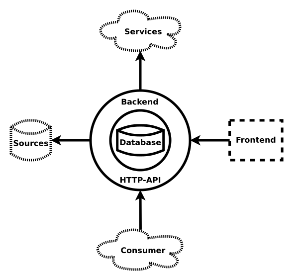

* The database is the core component (included)
* The backend encapsulates the database and spans the API (included)
* A frontend uses the API (optionally included)
* Imports of sources to the database via the backend (through the API)
* Exports to services are triggered externally (through the API)
* Consumers can interact (through the API)

### 1.2 Quality Goals

| Quality Goal           | Associated Scenarios
|------------------------|----------------------
| Functional Suitability | F0
| Transferability        | T0
| Compatibility          | C0
| Operability            | O0
| Maintainability        | M0, M1

--------------------------------------------------------------------------------

## 2. Constraints

### 2.1 Technical Constraints

| Constraint | Explanation
|------------|-------------
| Cloud Deployability | To integrate into existing infrastructure and operation environments, a containered service is required.
| Interoperability | Data pipelining is required to be compatible to existing systems such as databases.
| Extensibility | Components such as metadata schemas, data pipelines, and metadata exports are required to be extensible.

### 2.2 Organisational Constraints

| Constraint | Explanantion
|------------|--------------
| [OAI-PMH](http://www.openarchives.org/OAI/2.0/openarchivesprotocol.htm) | Many existing data sources provide a OAI-PMH API which needs to be supported.
| [S3](https://docs.ceph.com/en/quincy/radosgw/s3/) | File-based ingest has to be also performed via object storage, particularly Ceph's S3 API.
| [K8](https://kubernetes.io/) | If possible Kubernetes should be supported (in addition to Compose).

### 2.3 Conventions

#### Technical

| Standard | Function
|----------|---------
| [JSON](https://www.json.org) | Serialization language for **all** external messages
| [JSON:API](https://jsonapi.org) | External message format standardization
| [JSON Schema](https://json-schema.org) | External message content validation
| [YAML](https://yaml.org) | Internal processor (and prototype frontend) declaration language
| [StrictYAML](https://hitchdev.com/strictyaml) | Preferred declaration language dialect
| [OpenAPI](https://www.openapis.org) | External API definition and documentation format
| [MD5](https://en.wikipedia.org/wiki/MD5) | Raw metadata checksums
| [XXH64](https://github.com/Cyan4973/xxHash) | Identifier Hashing
| [Base64URL](https://base64.guru/standards/base64url) | Identifier Encoding
| [Compose](https://www.compose-spec.io) | Deployment and orchestration

#### Content

| Standard | Function
|----------|---------
| [DataCite](https://schema.datacite.org) | Core metadata vocabulary
| [FRBR](https://en.wikipedia.org/wiki/Functional_Requirements_for_Bibliographic_Records) | Entity relationships
| [Fields of Science](https://en.wikipedia.org/wiki/Fields_of_Science_and_Technology) | Scientific classification
| [SPDX License List](https://spdx.org/licenses/) | Software license names
| [ISO 8601](https://en.wikipedia.org/wiki/ISO_8601) | Data and time formatting
| [ISO 639-1](https://iso639-3.sil.org/) | Language name abbreviations
| [DOI](https://doi.org) | Preferred resource identifier
| [ORCID](https://orcid.org) | Preferred creator identifier 

#### Documentation
| Standard | Function
|----------|---------
| [divio](https://documentation.divio.com/) | Software documentation structure
| [arc42](https://docs.arc42.org) | Software architecture documentation
| [yasql](https://github.com/aryelgois/yasql) | Database schema documentation

--------------------------------------------------------------------------------

## 3. Context & Scope

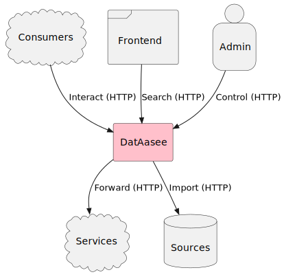

### 3.1 Business Context

| Channel  | Description
|----------|----------------------------------------------------
| Interact | All unpriviledged functionality
| Search   | Query metadata records
| Control  | Monitor, trigger ingests and backups (priviledged)
| Forward  | Send metadata record(s) to service
| Import   | Ingest metadata records from source system

### 3.2 Technical Context

| Channel  | Description
|----------|--------------------------------------------
| Interact | Unpriviledged `HTTP` API
| Search   | Requested and responded through `HTTP` API
| Control  | Priviledged `HTTP` API
| Forward  | Performed via `HTTP`
| Import   | Pulled via `HTTP`

--------------------------------------------------------------------------------

## 4. Solution Strategy

* Three-tier architecture:
    * HTTP-API is the primary presentation layer (part of the backend)
    * Web frontend (exclusively using API) is secondary presentation tier
* Two main components:
    * Database (data tier)
    * Backend (state-less application tier)
* All components are packaged in containers for:
    * infrastructure compatibility
    * cloud deployability
* All messaging happens via HTTP APIs:
    * internal between components (containers)
    * external via endpoints (including frontend)
*  Source codes and external messages are in plain text and in standardized formats:
    * External messages are in JSON, formatted as JSON-API, and documented by JSON-Schemas.
    * Declarative sources are in YAML, following StrictYAML.
* Separate horizontal scaling of database and backend for high availability:
    * Database has replication capability
    * Backend has no state, hence unproblematic
* Further components are optional:
    * Storage not necessary since only metadata is handled, payload data referenced 
    * Web-Frontend uses HTTP API (prototype is included)
* Declarative realization for high level of abstraction via:
    * Internal Queries: [ArcadeDB SQL](https://docs.arcadedb.com/#SQL) (external queries may use various query languages)
    * Processes: Configuration-based + [Bloblang](https://docs.redpanda.com/redpanda-connect/guides/bloblang/about/) (data mapping language)

--------------------------------------------------------------------------------

## 5. Building Block View

### Level 0 (Outside View)

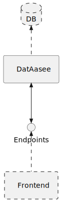

#### DatAasee

* Imports metadata from source systems (DB) via pull
* Provides API to interact with metadata (endpoints)
* Exports metadata to other services (triggered via endpoints)

#### Source Databases (External)

* Known URLs (ie service or database endpoints) holding metadata
* Bulk ingested
* Pollable regularly for updates

#### Prototype Web-Frontend (Optional)

* Included prototype frontend
* External to core system
* Template and documentation for a production frontend

### Level 1 (Inside View)

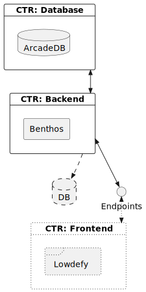

#### Database

* Container holding a _ArcadeDB_ database system
* This core component stores and serves all metadata
* A system backup saves its database

#### Backend

* Container holding a _Benthos_ stream processor
* This component spans the external API endpoints and translates between data formats as well as between API and database
* Has no state

#### Prototype Web-Frontend (Optional)

* Container holding a _Lowdefy_ web-frontend
* This optional component renders a web-based user interface
* Uses API endpoints, (but from the internal network, thus the frontend does not need the external port)

### Level 2 (Container View)

#### Database

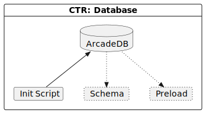

* The native schema is created via SQL (during build)
* Enumerated types are inserted via SQL (during build)
* The initialization script loads the schema and preloaded data

#### Backend

* The HTTP API endpoints are setup
* Custom configurable components (templates) are defined
* Reusable fixed components (resources) are defined

#### Prototype Web-Frontend

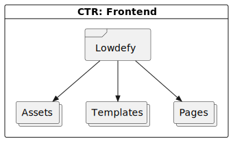

* Pages are defined via YAML
* Static assets (images and styles) are loaded
* Reused template blocks are loaded

--------------------------------------------------------------------------------

## 6. Runtime View

### Processes

#### `/ready` Endpoint

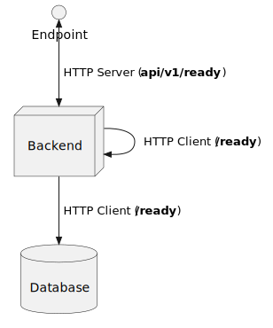

See [`ready` endoint docu](docs.md#ready-endpoint).

---

#### `/api` Endpoint

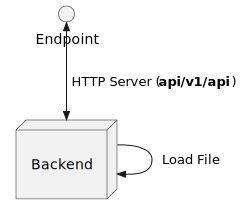

See [`api` endoint docu](docs.md#api-endpoint).

---

#### `/schema` Endpoint

See [`schema` endoint docu](docs.md#schema-endpoint).

---

#### `/attributes` Endpoint

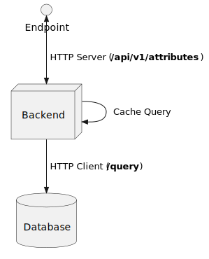

See [`attributes` endoint docu](docs.md#attributes-endpoint).

---

#### `/stats` Endpoint

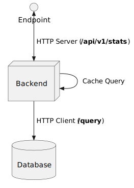

See [`stats` endoint docu](docs.md#stats-endpoint).

---

#### `/metadata` Endpoint

See [`metadata` endoint docu](docs.md#metadata-endpoint).

---

#### `/insert` Endpoint

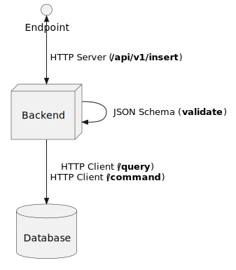

See [`insert` endoint docu](docs.md#insert-endpoint).

---

#### `/ingest` Endpoint

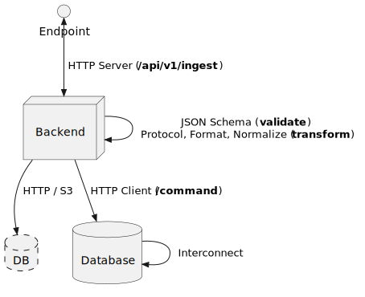

See [`ingest` endoint docu](docs.md#ingest-endpoint).

---

#### `/backup` Endpoint

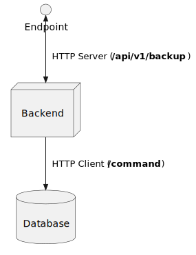

See [`backup` endoint docu](docs.md#backup-endpoint).

---

#### `/health` Endpoint

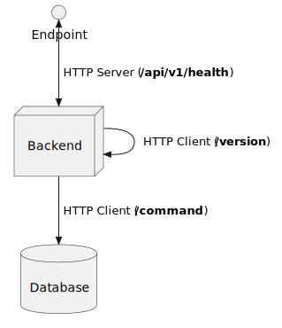

See [`health` endoint docu](docs.md#health-endpoint).

--------------------------------------------------------------------------------

## 7. Deployment View

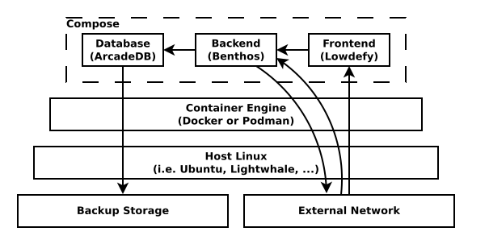

### Level 0

See [`compose.yaml`](../compose.yaml) for deployment details.

--------------------------------------------------------------------------------

## 8. Crosscutting Concepts

### Internal Concepts

* All components are separately containerized.
* All communication between components is performed via HTTP and in JSON.

### Security Concepts

* **Read access** is granted to every user without limitation.
* **Write access** (trigger ingest or backup, insert record) is only granted to the "admin" user.

### Development Concepts

* Container images are multi-stage with a generic base stage and a custom develop and release stage.
* All images run a health check.

### Operational Concepts

* All components provide (internal) `ready` endpoints and write logs to the standard output.
* Secrets are mounted as files.

--------------------------------------------------------------------------------

## 9. Architectural Decisions

| Timestamp    | Title
|--------------|-------
| Status       | ...
| Decision     | ...
| Consequences | ...

| 2024-07-04   | Indirect Processor Dependency Updates
|--------------|---------------------------------------
| Status       | Approved
| Decision     | Indirect processor dependency updates do not cause a (minor) version update.
| Consequences | A release image build (of the current version) can be triggered and processor dependencies are updated in the process.

| 2024-06-03   | API Licensing
|--------------|---------------
| Status       | Approved
| Decision     | The OpenAPI license definition is additionally licensed under CC-BY.
| Consequences | Easier third-party reimplementation of the DatAasee API.

| 2024-02-21   | Use OAI vs Non-OAI metadata format variants
|--------------|---------------------------------------------
| Status       | Approved
| Decision     | Non-OAI variants of the DC and DataCite formats are supported.
| Consequences | More lenient, and less strict ingest of fields.

| 2024-01-17   | Compose-only Deployment
|--------------|-------------------------
| Status       | Approved
| Decision     | Deployment is solely distributed and initiated by the `compose.yaml`.
| Consequences | The compose file and orchestrator have central importance.

| 2023-11-20   | Database Storage
|--------------|------------------
| Status       | Approved
| Decision     | Database uses in-container storage, only backups are stored outside.
| Consequences | Faster database at the price of fixed savepoints.

| 2023-08-24   | Record Identifier
|--------------|-------------------
| Status       | Approved
| Decision     | Use xxhash64 / SHA256 of ingested or inserted raw record.
| Consequences | Identifier is reproducible but not a URL.

| 2023-08-08   | Ingest Modularity
|--------------|-------------------
| Status       | Approved
| Decision     | Ingest sources are passed via API to the backend.
| Consequences | Sources can be maintained outside and appended during runtime.

| 2023-05-16   | Graph Edges
|--------------|-------------
| Status       | Approved
| Decision     | Graph edges are only set by ingest (or other automatic) processes, not by a user.
| Consequences | Edge semantics need to be machine-interpretable.

| 2022-12-07   | Frontend Language
|--------------|-------------------
| Status       | Approved
| Decision     | Use English language only for frontend and metadata labels and comments.
| Consequences | Additional translations (German) are not prepared for now.

| 2022-10-10   | Only Virtual Storage
|--------------|----------------------
| Status       | Approved
| Decision     | No explicit storage component for data, only metadata is managed.
| Consequences | No interface or instance ie to Ceph is developed, but URL references (to data storage) are stored. 

| 2022-10-05   | API-only Frontend
|--------------|-------------------
| Status       | Approved
| Decision     | The HTTP API is the sole frontend, further frontends are only expressions of the API.
| Consequences | Web frontend can only use API frontend

| 2022-10-04   | Declarative First
|--------------|-------------------
| Status       | Approved
| Decision     | Prefer declarative (YAML-based) approaches for defining processes and interfaces to reduce free coding and increase robustness.
| Consequences | Frontrunners Benthos as backend, and Lowdefy (or uteam) as prototype web-frontend.

| 2022-09-16   | Multi-model Database
|--------------|----------------------
| Status       | Approved
| Decision     | Use (property)-graph / document / key-value database as central catalog component for maximal flexible data model.
| Consequences | Frontrunner ArcadeDB (or OrientDB) as database.

--------------------------------------------------------------------------------

## 10. Quality Requirements

### 10.1 Quality Requirements

| Quality Category       | Quality          | ID | Description
|------------------------|------------------|----|-------------
| Functional Suitability | Appropriateness  | F0 | DatAasee should fulfill the expected overall functionality.
| Transferability        | Installability   | T0 | Installation should work in various container-based environments.
| Compatibility          | Interoperability | C0 | The available protocols (and format parsers) should fit the most common systems.
| Operability            | Ease of Use      | O0 | The API should be self-describing, well documented, and following standards and best practices.
| Maintainability        | Modularity       | M0 | New protocols, format parsers or other pipelines should be implementable without too much effort.
| Maintainability        | Reusability      | M1 | The protocol and format parser codes serve as sample and documentation.

### 10.2 Quality Scenarios

| ID | Scenario
|----|----------
| F0 | Stakeholder project evaluation
| T0 | Setup of DatAasee by a new operator
| C0 | Ingesting from a new source system
| O0 | User and (downstream) developer API Usage
| M0 | Extending the compatibility to new systems
| M1 | Development of a follow-up project to DatAasee

----------------------------------------------------------------------------------

## 11. Risks & Technical Debt

| Risk | Description | Mitigation 
|------|-------------|------------
| DBMS project might cease | [`ArcadeDB`](https://github.com/ArcadeData/arcadedb) is a small project which has small-project risks | However, `ArcadeDB` is derived from [`OrientDB`](https://github.com/orientechnologies/orientdb), which could be a replacement (but not drop-in).
| Processor project might complicate | [`Benthos`](https://github.com/redpanda-data/benthos) was acquired by "Red Panda" who may change its license or of the [connectors](https://github.com/redpanda-data/connect) | Using hard fork [`bento`](https://github.com/warpstreamlabs/bento) or self-maintain.

--------------------------------------------------------------------------------

## 12. Glossary

| Term | Acronym | Definition
|------|---------|------------
| Metadata | **MD** | All statements about a (tangible or digital) information object.
| Metadata-Set |  | A record containing metadata.
| Intra Metadata |  | Metadata about the underlying data.
| Inter Metadata |  | Metadata about data related to the underlying data.
| Descriptive Metadata |  | Metadata describing the underlying data.
| Process Metadata |  | Metadata about lineage.
| Technical Metadata |  | Metadata about format and structure.
| Administrative Metadata |  | Metadata about accessibility.
| Social Metadata |  | Metadata about usage and discoverability.
| Database | **DB** | Collection of related records.
| Database Management System | **DBMS** | The software running the databases.
| Backend | **BE** | Software component encoding the internal logic.
| Frontend | **FE** | (Web-based) software component presenting a user interface.
| Container | **CTR** | Software packaged into standardized unit for operating-system-level virtualization.
| Data Catalog | **DCAT** | Inventory of databases.
| Metadata Catalog | **MDCAT** | Inventory of databases of metadata.
| Data Lake | **DL** | Structured, semi-structures, and unstructured data architecture.
| Metadata Lake | **MDL** | Structured, semi-structures, and unstructured data architecture for metadata management.
| Extract-Transform-Load | **ETL** | A typical ingestion process for structured data.
| Extract-Load-Transform | **ELT** | A typical ingestion process for unstructured data.
| Extract-transform-Load-Transform | **EtLT** | An ingestion process for semi-structured data.
| Declarative Programming |  | Programming style of expressing logic without prescribing control flow ("what", not "how").
| Low-Code |  | Functionality assembly using high-level prefabricated components.
| Declarative Low-Code |  | Defining an application only by configuration of components (and minimal explicit transformations).
| Application Programming Interface | **API** | Specification and implementation of a way for software to interact (here HTTP API).
| Domain Specific Language | **DSL** | A formal language designed for a particular application.
| Command-Query-Responsibility-Segregation | **CQRS** | API pattern separating read and write requests.
