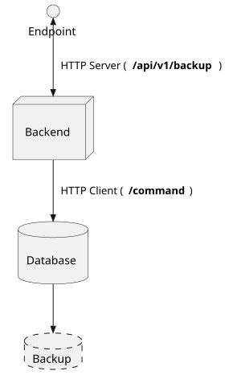
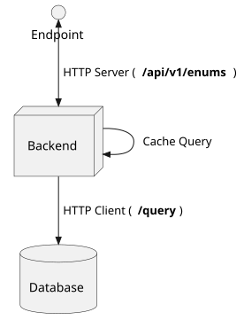
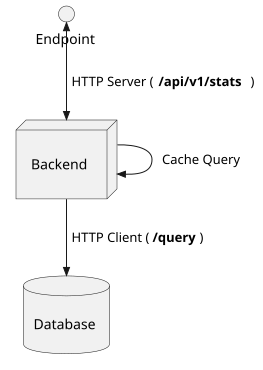
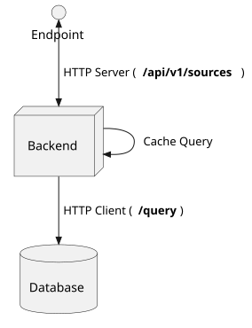

# DatAasee Architecture Documentation

**Version: 0.5**

The principal goal of **DatAasee** is to provision a library-focused one-stop
shop for research data discovery and a metadata hub.
**DatAasee** is a Metadata-Lake (MDL) that aggregates and interconnects research
metadata and bibliographic data from various data sources and interacts via an
HTTP API which is prototypically utilized by a web front-end.

**Sections:**

1.  [Introduction & Goals](#1-introduction--goals)
2.  [Constraints](#2-constraints)
3.  [Context & Scope](#3-context--scope)
4.  [Solution Strategy](#4-solution-strategy)
5.  [Building Block View](#5-building-block-view)
6.  [Runtime View](#6-runtime-view)
7.  [Deployment View](#7-deployment-view)
8.  [Crosscutting Concepts](#8-crosscutting-concepts)
9.  [Architectural Decisions](#9-architectural-decisions)
10. [Quality Requirements](#10-quality-requirements)
11. [Risks & Technical Debt](#11-risks--technical-debt)
12. [Glossary](#12-glossary)

**Summary:**

* Data Architecture: Data-Lake with Metadata Catalog
* Software Architecture: 3-Tier Architecture
  * Data-Tier Model: Wide, denormalized One-Big-Table (Graph)
  * Logic-Tier Type: Semantic layer
  * Presentation-Tier Type: HTTP-API (and Web-Frontend)

> **NOTE:** For background information on data and software architecture, see: https://arxiv.org/abs/2409.05512 and references therein

--------------------------------------------------------------------------------

## 1. Introduction & Goals

### 1.1 Requirements Overview

Given research and bibliographic (meta)data is maintained in various distributed
databases and there is no central access point to browse, search, or locate
data-sets. The metadata-lake ...

* ... allows users to search, filter and browse metadata (and data).
* ... incorporates metadata of research outputs as well as bibliographic metadata.
* ... cleans, normalizes, and provides metadata.
* ... facilitates exports of data/metadata bundles to external repositories.
* ... integrates with other services and processes.

* The database is the core component (included)
* The backend encapsulates the database and spans the API (included)
* A frontend uses the API (optionally included)
* All external and internal communication via HTTP
* Imports of sources to the database via the backend (through the API)
* Exports to services are triggered externally (through the API)
* Users and downstream services can interact (through the API)

### 1.2 Quality Goals

| Quality Goal           | Associated Scenarios
|------------------------|----------------------
| Functional Suitability | [F0](#10-2-quality-scenarios)
| Transferability        | [T0](#10-2-quality-scenarios)
| Compatibility          | [C0](#10-2-quality-scenarios)
| Operability            | [O0](#10-2-quality-scenarios)
| Maintainability        | [M0](#10-2-quality-scenarios), [M1](#102-quality-scenarios)

--------------------------------------------------------------------------------

## 2. Constraints

### 2.1 Technical Constraints

| Constraint | Explanation
|------------|-------------
| Cloud Deployability | To integrate into existing infrastructure and operation environments, a containered service is required.
| Interoperability | Data pipelining is required to be compatible to existing systems such as databases.
| Extensibility | Components such as metadata schemas, data pipelines, and metadata exports are required to be extensible.

### 2.2 Organizational Constraints

| Constraint | Explanation
|------------|--------------
| [OAI-PMH](http://www.openarchives.org/OAI/2.0/openarchivesprotocol.htm) | Many existing data sources provide a OAI-PMH API which needs to be supported.
| [S3](https://docs.ceph.com/en/quincy/radosgw/s3/) | File-based ingest has to be also performed via object storage, particularly Ceph's S3 API.
| [K8](https://kubernetes.io/) | If possible Kubernetes should be supported (in addition to Compose).

### 2.3 Conventions

#### Technical

| Standard | Function
|----------|---------
| [JSON](https://www.json.org) | Serialization language for **all** external messages
| [JSON:API](https://jsonapi.org) | External message format standardization
| [JSON Schema](https://json-schema.org) | External message content validation
| [YAML](https://yaml.org) | Internal processor (and prototype frontend) declaration language
| [StrictYAML](https://hitchdev.com/strictyaml) | Preferred declaration language dialect
| [OpenAPI](https://www.openapis.org) | External API definition and documentation format
| [MD5](https://en.wikipedia.org/wiki/MD5) | Raw metadata checksums
| [XXH64](https://github.com/Cyan4973/xxHash) | Identifier Hashing
| [Base64URL](https://base64.guru/standards/base64url) | Identifier Encoding
| [Compose](https://www.compose-spec.io) | Deployment and orchestration

#### Content

| Standard | Function
|----------|---------
| [DataCite](https://schema.datacite.org) | Core metadata vocabulary
| [OpenWEMI](https://www.dublincore.org/specifications/openwemi/specification/) | Entity relationships
| [Fields of Science](https://en.wikipedia.org/wiki/Fields_of_Science_and_Technology) | Scientific classification
| [SPDX License List](https://spdx.org/licenses/) | Software license names
| [Creative Commons](https://creativecommons.org/) | License names
| [RightsStatements.org](https://rightsstatements.org) | Copyright classification
| [ISO 8601](https://en.wikipedia.org/wiki/ISO_8601) | Data and time formatting
| [ISO 639-1](https://iso639-3.sil.org/) | Language name abbreviations
| [DOI](https://doi.org) | Preferred resource identifier
| [ORCID](https://orcid.org) | Preferred creator identifier
| [DublinCore](https://www.dublincore.org/specifications/dublin-core/dces/) | Import format
| [MODS](https://www.loc.gov/standards/mods/) | Import format
| [MARCXML](https://loc.gov/standards/marcxml/) | Import format
| [LIDO](https://lido-schema.org) | Import format
| [BibJSON](https://github.com/rufuspollock-okfn/bibjson) | Export format

#### Documentation
| Standard | Function
|----------|---------
| [Tech Stack Canvas](https://techstackcanvas.io/) | Product tech stack (README)
| [Diataxis](https://diataxis.fr/) | Software documentation structure
| [arc42](https://docs.arc42.org) | Software architecture documentation
| [yasql](https://github.com/aryelgois/yasql) | Database schema documentation (can be rendered with PlantUML)

--------------------------------------------------------------------------------

## 3. Context & Scope

### 3.1 Business Context

| Channel  | Description
|----------|----------------------------------------------------
| Interact | All unprivileged functionality
| Search   | Query metadata records
| Control  | Monitor, trigger ingests and backups (privileged)
| Forward  | Send metadata record(s) to service
| Import   | Ingest metadata records from source system

### 3.2 Technical Context

| Channel  | Description
|----------|--------------------------------------------
| Interact | Unprivileged `HTTP` API
| Search   | Requested and responded through `HTTP` API
| Control  | Privileged `HTTP` API
| Forward  | Performed via `HTTP`
| Import   | Pulled via `HTTP`

--------------------------------------------------------------------------------

## 4. Solution Strategy

* Three-tier architecture:
    * HTTP-API is the primary presentation layer (part of the backend)
    * Web frontend (exclusively using API) is secondary presentation tier
* Two main components:
    * Database (data tier)
    * Backend (state-less application tier)
* All components are packaged in containers for:
    * Infrastructure compatibility
    * Cloud deployability
* Property graph data model:
    * Metadata records are key-value documents (intra-metadata)
    * Metadata records are interrelated based on permanent identifiers (inter-metadata)
* All messaging happens via HTTP APIs:
    * Internal between components (containers)
    * External via endpoints (including frontend)
*  Source codes and external messages are in plain text and in standardized formats:
    * External messages are in JSON, formatted as JSON-API, and documented by JSON-Schemas.
    * Declarative sources are in YAML, following StrictYAML.
* Separate horizontal scaling of database and backend for high availability:
    * Database has replication capability
    * Backend has no state, hence less problematic
* Further components are optional:
    * Storage not necessary since only metadata is handled, payload data only referenced
    * Web-frontend uses HTTP API (prototype is included)
* Declarative realization for high level of abstraction via:
    * Internal Queries: [ArcadeDB SQL](https://docs.arcadedb.com/#sql) (external queries may use various query languages)
    * Processes: Configuration-based + [Bloblang](https://docs.redpanda.com/redpanda-connect/guides/bloblang/about/) (data mapping language)

--------------------------------------------------------------------------------

## 5. Building Block View

### Level 0 (Outside View)

#### DatAasee

* Imports metadata from source systems via pull
* Provides API to interact with metadata via endpoints
* Exports metadata to other services triggered via endpoints

#### Source Databases (External)

* Known URLs (ie service or database endpoints) holding metadata
* Bulk ingested
* Pollable regularly for updates

#### Backup Storage (External)

* Loaded from on service startup
* Database backup on finished interconnect
* Database backup on service shutdown

#### Prototype Web-Frontend (Optional)

* Included prototype frontend
* External to core system
* Template and documentation for a production frontend

### Level 1 (Inside View)

#### Database

* Container holding a _ArcadeDB_ database system
* This core component stores and serves all metadata
* A system backup saves its database

#### Backend

* Container holding a _Benthos_ stream processor
* This component spans the external API endpoints and translates between data formats as well as between API and database
* Has no state (except temporary cache, which caches queries and refreshes once an hour, as well as ingest status)

#### Prototype Web-Frontend (Optional)

* Container holding a _Lowdefy_ web-frontend
* This optional component renders a web-based user interface
* Uses API endpoints, (but from the internal network, thus the frontend does not use the external port)

### Level 2 (Container View)

#### Database

* The native schema is created via SQL (during build)
* Enumerated types are inserted via SQL (during build)
* The initialization script restores the database on start from the latest back-up and backs up the database before shutdown.

#### Backend

* API schemas are deposited
* Custom configurable components (templates) are defined
* Reusable fixed components (resources) are defined

#### Prototype Web-Frontend

* Pages are defined via YAML
* Static assets (images and styles) are loaded
* Reused template blocks are loaded

--------------------------------------------------------------------------------

## 6. Runtime View

### System Endpoints

#### `/api` Endpoint (Public)

> **NOTE:** This endpoint is implicitly cached, meaning all schema files are opened only once.

See `api` [endpoint docu](docs.md#api-endpoint) and [source file](../backend/resources/handler_api.yaml).

---

#### `/ready` Endpoint (Public)

> **NOTE:** This endpoint only reports ready if processor **and** database are ready.

See `ready` [endpoint docu](docs.md#ready-endpoint) and [source file](../backend/resources/handler_ready.yaml).

---

#### `/health` Endpoint (Private)

> **NOTE:** This is a POST endpoint since a command (not a query) is required to get database health; also, the returned information is only useful to an operator, not to a user.

See `health` [endpoint docu](docs.md#health-endpoint) and [source file](../backend/resources/handler_health.yaml).

---

#### `/backup` Endpoint (Private, External Write)

> **NOTE:** The backup process is synchronous; the request returns success if a backup is completed.

See `backup` [endpoint docu](docs.md#backup-endpoint) and [source file](../backend/resources/handler_backup.yaml).

---

#### `/ingest` Endpoint (Private, External Read)

> **NOTE:** The ingest process is asynchronous; the request returns success if an ingest was started.

See `ingest` [endpoint docu](docs.md#ingest-endpoint) and [source file](../backend/resources/handler_ingest.yaml).

---

### Data Endpoints

#### `/metadata` Endpoint (Public)

> **NOTE:** The database command updates the record usage (social metadata).

See `metadata` [endpoint docu](docs.md#metadata-endpoint) and [source file](../backend/resources/handler_metadata.yaml).

---

#### `/insert` Endpoint (Private)

See `insert` [endpoint docu](docs.md#insert-endpoint) and [source file](../backend/resources/handler_insert.yaml).

---

### Support Endpoints

#### `/schema` Endpoint (Public, Cached)

See `schema` [endpoint docu](docs.md#schema-endpoint) and [source file](../backend/resources/handler_schema.yaml).

---

#### `/enums` Endpoint (Public, Cached)

See `enums` [endpoint docu](docs.md#enums-endpoint) and [source file](../backend/resources/handler_enums.yaml).

---

#### `/stats` Endpoint (Public, Cached)

See `stats` [endpoint docu](docs.md#stats-endpoint) and [source file](../backend/resources/handler_stats.yaml).

---

#### `/sources` Endpoint (Public, Cached)

See `sources` [endpoint docu](docs.md#sources-endpoint) and [source file](../backend/resources/handler_sources.yaml).

--------------------------------------------------------------------------------

## 7. Deployment View

### Level 0

See [`compose.yaml`](../compose.yaml) for deployment details.

### Level 1

EtLT: Ingest vs. Read

--------------------------------------------------------------------------------

## 8. Crosscutting Concepts

### Internal Concepts

* All components are separately containerized.
* All communication between components is performed via HTTP and in JSON.

### Security Concepts

* **Read access** is granted to every user without limitation.
* **Write access** (trigger ingest or backup, insert record) is only granted to the "admin" user.

### Development Concepts

* Container images are multi-stage with a generic base stage and a custom develop and release stage.
* All images run a health check.

### Operational Concepts

* All components provide (internal) `ready` endpoints and write logs to the standard output.
* Secrets are read from environment variables on the host and mounted as files inside the containers.

--------------------------------------------------------------------------------

## 9. Architectural Decisions

| Timestamp    | Title
|--------------|-------
| Status       | ...
| Decision     | ...
| Consequences | ...

| 2025-09-19   | Frontend Container Image
|--------------|--------------------------
| Status       | Approved
| Decision     | Production and development frontend images should be air-gapped after build.
| Consequences | More control over dependencies especially during dynamic rebuilds.

| 2025-04-11   | Post-Processing
|--------------|-----------------
| Status       | Approved
| Decision     | Minimize database response post-processing.
| Consequences | Shift transformation workload to ArcadeDB.

| 2024-10-23   | Container Base Images
|--------------|-----------------------
| Status       | Approved
| Decision     | Base containers for database and backend are the current Ubuntu LTS (ie: 24.04).
| Consequences | Full `libc` support compared to Alpine and obvious release date and support horizon from version number compared to Debian.

| 2024-07-04   | Indirect Processor Dependency Updates
|--------------|---------------------------------------
| Status       | Approved
| Decision     | Indirect processor dependency updates do not cause a (minor) version update.
| Consequences | A release image build (of the current version) can be triggered and processor dependencies are updated in the process.

| 2024-06-03   | API Licensing
|--------------|---------------
| Status       | Approved
| Decision     | The OpenAPI license definition is additionally licensed under CC-BY.
| Consequences | Easier third-party reimplementation of the DatAasee API.

| 2024-02-21   | Use OAI vs Non-OAI metadata format variants
|--------------|---------------------------------------------
| Status       | Approved
| Decision     | Non-OAI variants of the DC and DataCite formats are supported.
| Consequences | More lenient, and less strict ingest of fields.

| 2024-01-17   | Compose-only Deployment
|--------------|-------------------------
| Status       | Approved
| Decision     | Deployment is solely distributed and initiated by the `compose.yaml`.
| Consequences | The compose file and orchestrator have central importance.

| 2023-11-20   | Database Storage
|--------------|------------------
| Status       | Approved
| Decision     | Database uses in-container storage, only backups are stored outside.
| Consequences | Faster database at the price of fixed savepoints.

| 2023-08-24   | Record Identifier
|--------------|-------------------
| Status       | Approved
| Decision     | Use xxhash64 / SHA256 of ingested or inserted raw record.
| Consequences | Identifier is reproducible but not a URL.

| 2023-08-08   | Ingest Modularity
|--------------|-------------------
| Status       | Approved
| Decision     | Ingest sources are passed via API to the backend.
| Consequences | Sources can be maintained outside and appended during runtime.

| 2023-05-16   | Graph Edges
|--------------|-------------
| Status       | Approved
| Decision     | Graph edges are only set by ingest (or other automatic) processes, not by a user.
| Consequences | Edge semantics need to be machine-interpretable.

| 2022-12-07   | Frontend Language
|--------------|-------------------
| Status       | Approved
| Decision     | Use English language only for frontend and metadata labels and comments.
| Consequences | Additional translations (German) are not prepared for now.

| 2022-10-10   | Only Virtual Storage
|--------------|----------------------
| Status       | Approved
| Decision     | No explicit storage component for data, only metadata is managed.
| Consequences | No interface or instance ie to Ceph is developed, but URL references (to data storage) are stored.

| 2022-10-05   | API-only Frontend
|--------------|-------------------
| Status       | Approved
| Decision     | The HTTP API is the sole frontend, further frontends are only expressions of the API.
| Consequences | Web frontend can only use API frontend

| 2022-10-04   | Declarative First
|--------------|-------------------
| Status       | Approved
| Decision     | Prefer declarative (YAML-based) approaches for defining processes and interfaces to reduce free coding and increase robustness.
| Consequences | Frontrunners Benthos as backend, and Lowdefy (or uteam) as prototype web-frontend.

| 2022-09-16   | Multi-model Database
|--------------|----------------------
| Status       | Approved
| Decision     | Use (property)-graph / document / key-value database as central catalog component for maximal flexible data model.
| Consequences | Frontrunner ArcadeDB (or OrientDB) as database.

--------------------------------------------------------------------------------

## 10. Quality Requirements

### 10.1 Quality Requirements

| Quality Category           | Quality              | ID     | Description
|----------------------------|----------------------|--------|-------------
| **Functional Suitability** | **Appropriateness**  | **F0** | **DatAasee should fulfill the expected overall functionality.**
| Transferability            | Installability       |   T0   | Installation should work in various container-based environments.
| Compatibility              | Interoperability     |   C0   | The available protocols (and format parsers) should fit the most common systems.
| Operability                | Ease of Use          |   O0   | The API should be self-describing, well documented, and following standards and best practices.
| Maintainability            | Modularity           |   M0   | New protocols, format parsers or other pipelines should be implementable without too much effort.
| Maintainability            | Reusability          |   M1   | The protocol and format parser codes serve as sample and documentation.

### 10.2 Quality Scenarios

| ID     | Scenario
|--------|----------
| **F0** | **Stakeholder project evaluation**
|   T0   | Setup of DatAasee by a new operator
|   C0   | Ingesting from a new source system
|   O0   | User and (downstream) developer API Usage
|   M0   | Extending the compatibility to new systems
|   M1   | Development of a follow-up project to DatAasee

----------------------------------------------------------------------------------

## 11. Risks & Technical Debt

| Risk | Description | Mitigation
|------|-------------|------------
| DBMS project might cease | [`ArcadeDB`](https://github.com/ArcadeData/arcadedb) is a small project which has small-project risks | However, since SQL is used internally to interact with `ArcadeDB`, in principle RDBMs could be a replacement.
| Processor project might complicate | [`Benthos`](https://github.com/redpanda-data/benthos) was acquired by "Red Panda" who may change its license or of the [connectors](https://github.com/redpanda-data/connect) | Using hard fork [`bento`](https://github.com/warpstreamlabs/bento) or self-maintain.
| Processor dependency hell | [`Benthos`](https://github.com/redpanda-data/benthos) has many dependencies. | Consider rewrite with minimal dependencies in [`Clojure`](https://clojure.org) (using only `Ring`, `Ring-JDK-Adapter`, `data.JSON`, `java.JDBC`).

--------------------------------------------------------------------------------

## 12. Glossary

| Term | Acronym | Definition
|------|---------|------------
| Administrative Metadata |  | Metadata about accessibility.
| Application Programming Interface | **API** | Specification and implementation of a way for software to interact (here HTTP API).
| Backend | **BE** | Software component encoding the internal logic.
| Command-Query-Responsibility-Segregation | **CQRS** | API pattern separating read and write requests.
| Container | **CTR** | Software packaged into standardized unit for operating-system-level virtualization.
| Create-Read-Update-Delete | **CRUD** | Basic operations when interacting with a database (or storage).
| Database | **DB** | Collection of related records.
| Database Management System | **DBMS** | The software running the databases.
| Data Catalog | **DCAT** | Inventory of databases.
| Data Lake | **DL** | Structured, semi-structures, and unstructured data architecture.
| Declarative Low-Code |  | Defining an application only by configuration of components (and minimal explicit transformations).
| Declarative Programming |  | Programming style of expressing logic without prescribing control flow ("what", not "how").
| Descriptive Metadata |  | Metadata describing the underlying data.
| Domain Specific Language | **DSL** | A formal language designed for a particular application.
| Extract-Load-Transform | **ELT** | A typical ingestion process for unstructured data.
| Extract-Transform-Load | **ETL** | A typical ingestion process for structured data.
| Extract-transform-Load-Transform | **EtLT** | An ingestion process for semi-structured data.
| Frontend | **FE** | (Web-based) software component presenting a user interface.
| Inter-Metadata |  | Metadata about data related to the underlying data.
| Intra-Metadata |  | Metadata about the underlying data.
| Low-Code |  | Functionality assembly using high-level prefabricated components.
| Metadata | **MD** | All statements about a (tangible or digital) information object.
| Metadata Catalog | **MDCAT** | Inventory of databases of metadata.
| Metadata-Lake | **MDL** | Structured, semi-structures, and unstructured data architecture for metadata management.
| Metadata-Set |  | A record containing metadata.
| Process Metadata |  | Metadata about lineage.
| Social Metadata |  | Metadata about usage and discoverability.
| Technical Metadata |  | Metadata about format and structure.
