# DatAasee Architecture Documentation

**Version: 0.9**

The principal goal of **DatAasee** is to provision a library-focused one-stop
shop for research data discovery as well as a library-wide metadata hub.
**DatAasee** is a Metadata-Lake (MDL) that aggregates and interconnects research
metadata and bibliographic data from various data sources and interacts via a
JSON HTTP API, which in turn is prototypically utilized by a web frontend.

**Sections:**

1.  [Introduction & Goals](#1-introduction--goals)
2.  [Constraints](#2-constraints)
3.  [Context & Scope](#3-context--scope)
4.  [Solution Strategy](#4-solution-strategy)
5.  [Building Block View](#5-building-block-view)
6.  [Runtime View](#6-runtime-view)
7.  [Deployment View](#7-deployment-view)
8.  [Crosscutting Concepts](#8-crosscutting-concepts)
9.  [Architectural Decisions](#9-architectural-decisions)
10. [Quality Requirements](#10-quality-requirements)
11. [Risks & Technical Debt](#11-risks--technical-debt)
12. [Glossary](#12-glossary)

**Summary:**

* Data Architecture: Data-Lake with Metadata Catalog
* Software Architecture: 3-Tier Architecture
  * Data-Tier Model: Graph with star schema node properties
  * Logic-Tier Type: Semantic layer
  * Presentation-Tier Type: HTTP API (and Web-Frontend)

> **NOTE:** For the specific data model, see: [YASQL schema](schema.md)

For background information on data and software architecture, see: https://arxiv.org/abs/2409.05512 and references therein.

--------------------------------------------------------------------------------

## 1. Introduction & Goals

### 1.1 Requirements Overview

Given: research and bibliographic (meta)data maintained in various
distributed databases and no central access point to browse, search, or locate
data-sets. The metadata-lake ...

* ... incorporates metadata of research outputs as well as bibliographic metadata.
* ... cleans, normalizes, and provides metadata.
* ... allows users to search, filter and browse metadata (and locate underlying data).
* ... facilitates exports of metadata.
* ... integrates with other services and processes.

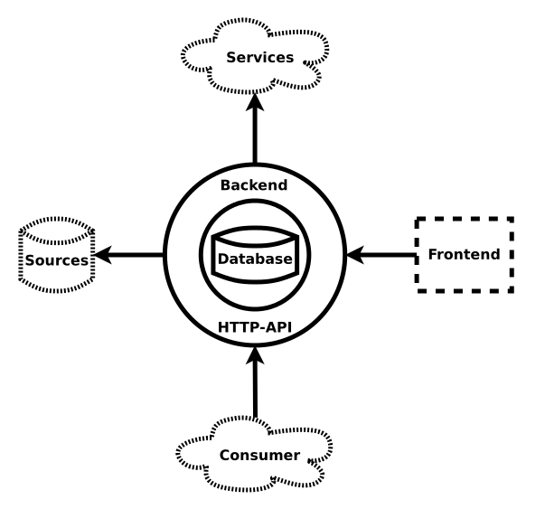

* The database is the core component.
* The backend encapsulates the database and spans the API.
* An optional web frontend uses the API.
* All external and internal communication via HTTP.
* Imports of sources into the database triggered via the backend.
* Exports to services are requested externally.
* Users or downstream services can interact through the API.

### 1.2 Quality Goals

| Quality Goal           | Associated Scenarios
|------------------------|----------------------
| Functional Suitability | [F0](#102-quality-scenarios)
| Transferability        | [T0](#102-quality-scenarios)
| Compatibility          | [C0](#102-quality-scenarios)
| Operability            | [O0](#102-quality-scenarios)
| Maintainability        | [M0](#102-quality-scenarios), [M1](#102-quality-scenarios)

--------------------------------------------------------------------------------

## 2. Constraints

### 2.1 Technical Constraints

| Constraint          | Explanation
|---------------------|-------------
| Cloud Deployability | To integrate into existing infrastructure and operation environments, a containerized service is required.
| Interoperability    | Data pipelining is required to be compatible to existing database interfaces.
| Extensibility       | Components such as metadata schemas, data pipelines, and metadata exports are required to be extensible.

### 2.2 Organizational Constraints

| Constraint | Explanation
| - | -
| [OAI-PMH](http://www.openarchives.org/OAI/2.0/openarchivesprotocol.htm) | Many existing data sources provide an OAI-PMH endpoint which needs to be supported.
| [XML](https://www.w3.org/XML/) | All source metadata is expected to be in XML.
| [S3](https://docs.aws.amazon.com/s3/) | File-based ingest has to be also performed via object storage, particularly [Ceph's S3 API](https://docs.ceph.com/en/quincy/radosgw/s3/).
| [K8s](https://kubernetes.io/) | If possible Kubernetes should be supported (in addition to Compose).

### 2.3 Conventions

#### Technical

| Standard | Function
| - | -
| [JSON](https://www.json.org) | Serialization language for **all** external messages
| [JSON:API](https://jsonapi.org) | External message format standardization
| [JSON Schema](https://json-schema.org) | External message content validation
| [YAML](https://yaml.org) | Internal processor (and prototype frontend) declaration language
| [StrictYAML](https://hitchdev.com/strictyaml) | Preferred declaration language dialect
| [OpenAPI](https://www.openapis.org) | External API definition and documentation format
| [SHA256](https://web.archive.org/web/20130526224224/https://csrc.nist.gov/groups/STM/cavp/documents/shs/sha256-384-512.pdf) | Identifier Hashing and Checksums
| [Base64URL](https://base64.guru/standards/base64url) | Identifier Encoding
| [Naming Things with Hashes](https://datatracker.ietf.org/doc/html/rfc6920) | Identifier Marking
| [Compose](https://www.compose-spec.io) | Deployment and orchestration

#### Content

| Standard | Function
| - | -
| [DataCite](https://schema.datacite.org) | Core metadata vocabulary
| [OpenWEMI](https://www.dublincore.org/specifications/openwemi/specification/) | Entity relationships
| [Fields of Science](https://en.wikipedia.org/wiki/Fields_of_Science_and_Technology) | Scientific classification
| [SPDX License List](https://spdx.org/licenses/) | Software license names
| [Creative Commons](https://creativecommons.org/) | License names
| [RightsStatements.org](https://rightsstatements.org) | Copyright classification
| [ISO 8601](https://en.wikipedia.org/wiki/ISO_8601) | Date and time formatting
| [ISO 639-1](https://iso639-3.sil.org/) | Language name abbreviations
| [DOI](https://doi.org) | Preferred resource identifier
| [ORCID](https://orcid.org) | Preferred creator identifier
| [DublinCore](https://www.dublincore.org/specifications/dublin-core/dces/) | Import format
| [MODS](https://www.loc.gov/standards/mods/) | Import format
| [MARCXML](https://loc.gov/standards/marcxml/) | Import format
| [LIDO](https://lido-schema.org) | Import format
| [BibJSON](https://github.com/rufuspollock-okfn/bibjson) | Export format

#### Documentation

| Standard | Function
| - | -
| [Tech Stack Canvas](https://techstackcanvas.io/) | Product tech stack (see [README](../README.md))
| [Diataxis](https://diataxis.fr/) | Software documentation structure (see [docs](docs.md))
| [arc42](https://docs.arc42.org) | Software architecture documentation (this document)
| [yasql](https://github.com/aryelgois/yasql) | Database schema documentation (can be rendered with PlantUML)

--------------------------------------------------------------------------------

## 3. Context & Scope

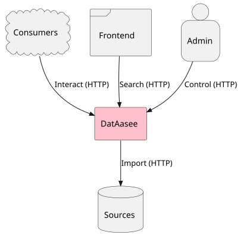

### 3.1 Business Context

| Channel  | Description
|----------|-------------
| Interact | All unprivileged functionality
| Search   | Directly query metadata records (typically privileged)
| Control  | Monitor, trigger ingests and backups (privileged)
| Import   | Ingest metadata records from source system

### 3.2 Technical Context

| Channel  | Description
|----------|-------------
| Interact | Unprivileged `HTTP` API
| Search   | Requested and responded through `HTTP` API
| Control  | Privileged `HTTP` API
| Import   | Pulled via `HTTP`

--------------------------------------------------------------------------------

## 4. Solution Strategy

* Three-tier architecture:
    * HTTP API is the primary presentation layer (part of the backend)
    * Web frontend (exclusively using API) is secondary presentation tier
* Two main components:
    * Database (data tier)
    * Backend (stateless application tier)
* All components are packaged in containers for:
    * Infrastructure compatibility
    * Cloud deployability
* Property graph data model:
    * Metadata records are key-value documents (intra-metadata)
    * Metadata records are interrelated based on permanent identifiers (inter-metadata)
* All messaging happens via HTTP APIs:
    * Internally between components (containers)
    * Externally via endpoints (including frontend)
* Source codes and external messages are in plain text and in standardized formats:
    * External messages are in JSON, formatted as JSON:API, and documented by JSON-Schemas.
    * Declarative sources are in YAML, following StrictYAML.
* Further components are optional:
    * Storage not necessary since only metadata is handled, payload data only referenced
    * Web-frontend uses HTTP API (prototype is included)
* Declarative realization for high level of abstraction via:
    * Internal Queries: [ArcadeDB SQL](https://docs.arcadedb.com/#sql) (external queries may use various query languages)
    * Processes: Configuration-based + [Bloblang](https://docs.redpanda.com/redpanda-connect/guides/bloblang/about/) (data mapping language)

--------------------------------------------------------------------------------

## 5. Building Block View

**DatAasee** uses a [three-tier architecture](https://en.wikipedia.org/wiki/Multitier_architecture#Three-tier_architecture)
with these separately containerized components which are orchestrated by [Compose](https://compose-spec.io):

| Function         | Abstraction                      | Tier                    | Product
|------------------|----------------------------------|-------------------------|----------------------------------
| Metadata Catalog | Multi-Model Database             | Data (Database)         | [ArcadeDB](https://arcadedb.com)
| EtLT Processor   | Declarative Streaming Processor  | Logic (Backend)         | [Benthos](https://github.com/redpanda-data/benthos)
| Web Frontend     | Declarative Web Framework        | Presentation (Frontend) | [Lowdefy](https://lowdefy.com)

### Level 0 (Outside View)

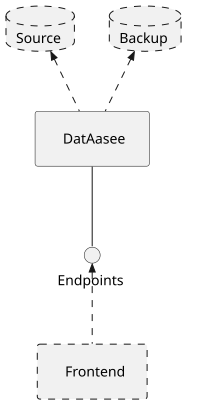

#### DatAasee

* Imports metadata from source systems via pull
* Provides API to interact with metadata via endpoints
* Frontend translates user input to API calls

#### Source Databases (External)

* Known URLs (i.e., service or database endpoints) holding metadata
* Bulk ingested
* Pollable regularly for updates

#### Backup Storage (External)

* Loaded from on service startup
* Database backup on finished ingest
* Database backup on finished interconnect

#### Prototype Web-Frontend (Optional)

* Included prototype frontend
* External to core system
* Template and documentation for a production frontend

### Level 1 (Inside View)

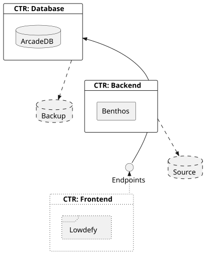

#### Database Container

* Container holding an _ArcadeDB_ database system
* This core component stores and serves all metadata
* A system backup saves its database

#### Backend Container

* Container holding a _Benthos_ stream processor
* This component exposes the external API endpoints and translates between data formats as well as between API and database
* Has no state (except temporary cache, which caches queries and refreshes, as well as ingest status)

#### Frontend Container (Optional)

* Container holding a _Lowdefy_ web-frontend
* This optional component renders a web-based user interface
* Uses API endpoints (but from the internal network, thus the frontend does not use the external port)

### Level 2 (Container View)

#### Database Container Internals

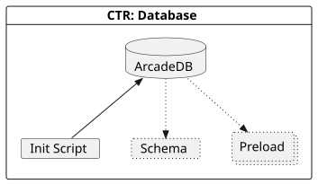

* The native schema is created via SQL (during build)
* Enumerated types are inserted via SQL (during build)
* The initialization script restores the database on start from the latest backup.

#### Backend Container Internals

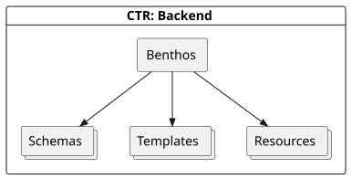

* API schemas are deposited
* Custom configurable components (templates) are defined
* Reusable fixed components (resources) are defined

#### Frontend Container Internals

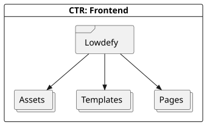

* Pages are defined declaratively
* Reused template blocks are loaded
* Static assets (images and styles) are loaded

--------------------------------------------------------------------------------

## 6. Runtime View

### System Endpoints

#### `/api` Endpoint (Public)

> **NOTE:** This endpoint is implicitly cached, meaning all schema files are opened only once.

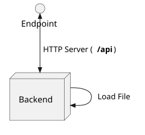

See `api` [endpoint documentation](docs.md#api-endpoint) and [source file](../backend/resources/handler_api.yaml).

---

#### `/ready` Endpoint (Public)

> **NOTE:** This endpoint reports ready if processor **and** database are ready.

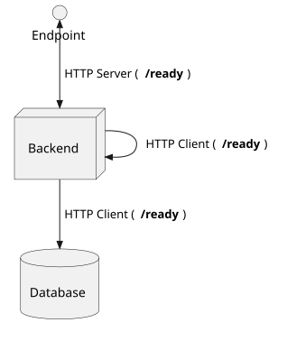

See `ready` [endpoint reference](docs.md#ready-endpoint) and [source file](../backend/resources/handler_ready.yaml).

---

#### `/health` Endpoint (Private)

> **NOTE:** Since the returned information is only useful to an operator, not to a user, this is a private and thus POST endpoint.

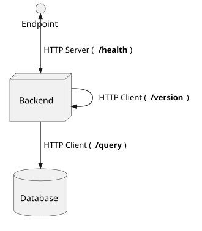

See `health` [endpoint reference](docs.md#health-endpoint) and [source file](../backend/resources/handler_health.yaml).

---

#### `/ingest` Endpoint (Private, External Read)

> **NOTE:** The ingest process is asynchronous; the request returns success if an ingest was started.

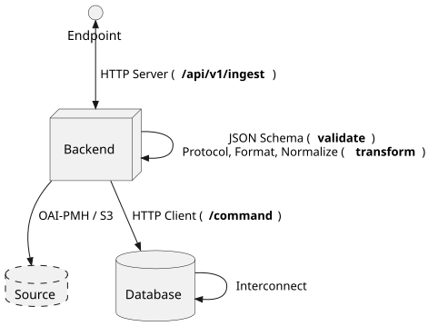

See `ingest` [endpoint reference](docs.md#ingest-endpoint) and [source file](../backend/resources/handler_ingest.yaml).

---

### Support Endpoints

#### `/schema` Endpoint (Public, Cached)

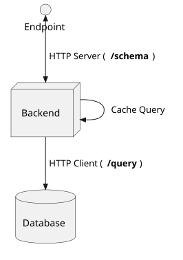

See `schema` [endpoint reference](docs.md#schema-endpoint) and [source file](../backend/resources/handler_schema.yaml).

---

### Data Endpoints

#### `/metadata` Endpoint (Public)

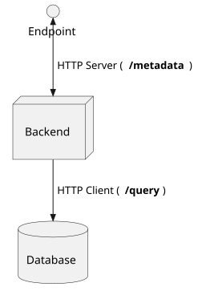

See `metadata` [endpoint reference](docs.md#metadata-endpoint) and [source file](../backend/resources/handler_metadata.yaml).

---

#### `/database` Endpoint (Public)

> **NOTE:** This endpoint allows idempotent read operations since it uses the `query` endpoint of ArcadeDB.

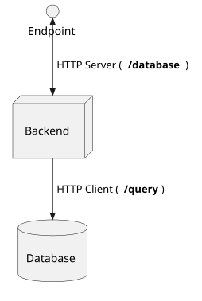

See `database` [endpoint reference](docs.md#database-endpoint) and [source file](../backend/resources/handler_database.yaml).

--------------------------------------------------------------------------------

## 7. Deployment View

### Level 0 (Technical View)

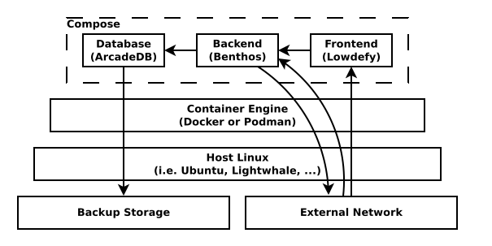

See [`compose.yaml`](../compose.yaml) for deployment details.

### Level 1 (Data-Flow View)

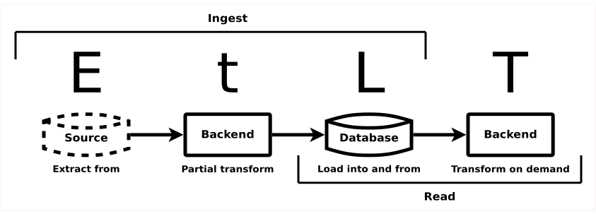

EtLT (Extract-transform-Load-Transform): Ingest vs. Read

--------------------------------------------------------------------------------

## 8. Crosscutting Concepts

### Internal Concepts

* All components are separately containerized.
* All communication between components is performed over HTTP using JSON.
* HTTP and JSON:API conventions are used and parameters, requests, and responses provide JSON schemas.

### Security Concepts

* **Read access** is granted to every user without limitation (expects external rate limits).
* **Write access** (trigger ingest or check health) is only granted to the `admin` user.
* Basic authentication is used by the backend for the "admin" user for private endpoints (expects external TLS termination).

### Development Concepts

* Container images are multi-stage with a generic base stage and a custom development and release stage.
* All images run their own health check.
* The default API base path communicates the API version.

### Operational Concepts

* All components provide (internal) `ready` endpoints and write logs to the standard output.
* Secrets are read (safely) from environment variables on the host and mounted as files inside the containers.
* Logs are written according to the defaults of the employed container engine.

--------------------------------------------------------------------------------

## 9. Architectural Decisions

| Timestamp    | Template
|--------------|----------
| Status       | ...
| Decision     | ...
| Consequences | ...

| 2026-04-17   | Remove backup endpoint
|--------------|------------------------
| Status       | Approved
| Decision     | Remove manual backups since data does not change between ingests
| Consequences | Backup endpoint not needed any more.

| 2026-04-08   | Remove view tracking
|--------------|----------------------
| Status       | Approved
| Decision     | Remove the tracking of record views.
| Consequences | Simpler and faster database, no data loss between ingests.

| 2026-02-20   | No Backup on Shutdown
|--------------|-----------------------
| Status       | Approved
| Decision     | The database shutdown does not trigger a backup, as it takes too long for large databases.
| Consequences | Faster shutdown and simpler database init script; backups after ingest preserve most of state.

| 2026-01-27   | Use NI for record identifiers
|--------------|-------------------------------
| Status       | Approved
| Decision     | Record identifiers are prefixed with the NI URI scheme and use base64url-encoded SHA256 hash.
| Consequences | Frontends can detect record identifiers without parsing the key field.

| 2026-01-22   | Remove Gremlin query language
|--------------|-------------------------------
| Status       | Approved
| Decision     | Remove Gremlin module from ArcadeDB
| Consequences | The Gremlin query language is not supported anymore in DatAasee and hence SPARQL will not be overlaid.

| 2025-12-17   | Streamline HTTP API
|--------------|---------------------
| Status       | Approved
| Decision     | Remove `enums` and `sources` endpoints and integrate their information into `schema` endpoint
| Consequences | More uniform API handling, and less endpoints for easier usability.

| 2025-09-19   | Frontend Container Image
|--------------|--------------------------
| Status       | Approved
| Decision     | Production and development frontend images should be air-gapped after build.
| Consequences | More control over dependencies especially during dynamic rebuilds.

| 2025-04-11   | Post-Processing
|--------------|-----------------
| Status       | Approved
| Decision     | Minimize database response post-processing.
| Consequences | Shift transformation workload to ArcadeDB.

| 2024-10-23   | Container Base Images
|--------------|-----------------------
| Status       | Approved
| Decision     | Base containers for database and backend are the current Ubuntu LTS (ie: 26.04).
| Consequences | Full `libc` support compared to Alpine and obvious release date and support horizon from version number compared to Debian.

| 2024-07-04   | Indirect Processor Dependency Updates
|--------------|---------------------------------------
| Status       | Approved
| Decision     | Indirect processor dependency updates do not cause a (minor) version update.
| Consequences | A release image build (of the current version) can be triggered and processor dependencies are updated in the process.

| 2024-06-03   | API Licensing
|--------------|---------------
| Status       | Approved
| Decision     | The OpenAPI license definition is additionally licensed under CC-BY.
| Consequences | Easier third-party reimplementation of the DatAasee API.

| 2024-02-21   | Use OAI vs Non-OAI metadata format variants
|--------------|---------------------------------------------
| Status       | Approved
| Decision     | Non-OAI variants of the DC and DataCite formats are supported.
| Consequences | More lenient, and less strict with fields configuring ingest.

| 2024-01-17   | Compose-only Deployment
|--------------|-------------------------
| Status       | Approved
| Decision     | Deployment is solely distributed and initiated by the `compose.yaml`.
| Consequences | The compose file and orchestrator have central importance.

| 2023-11-20   | Database Storage
|--------------|------------------
| Status       | Approved
| Decision     | Database uses in-container storage, only backups are stored outside.
| Consequences | Faster database at the price of fixed savepoints.

| 2023-08-24   | Record Identifier
|--------------|-------------------
| Status       | Approved (Superseded)
| Decision     | Use xxhash64 / SHA256 of ingested or inserted raw record.
| Consequences | Identifier is reproducible but not a URL.

| 2023-08-08   | Ingest Modularity
|--------------|-------------------
| Status       | Approved
| Decision     | Ingest sources are passed via API to the backend.
| Consequences | Sources can be maintained outside and appended during runtime.

| 2023-05-16   | Graph Edges
|--------------|-------------
| Status       | Approved
| Decision     | Graph edges are only set by ingest (or other automatic) processes, not by a user.
| Consequences | Edge semantics need to be machine-interpretable.

| 2022-12-07   | Frontend Language
|--------------|-------------------
| Status       | Approved
| Decision     | Use English language only for frontend and metadata labels and comments.
| Consequences | Additional translations (German) are not prepared for now.

| 2022-10-10   | Only Virtual Storage
|--------------|----------------------
| Status       | Approved
| Decision     | No explicit storage component for data, only metadata is managed.
| Consequences | No interface or instance to e.g. Ceph is developed, but URL references (to data storage) are stored.

| 2022-10-05   | API-only Frontend
|--------------|-------------------
| Status       | Approved
| Decision     | The HTTP API is the sole frontend, further frontends are only expressions of the API.
| Consequences | Web frontend can only use the API.

| 2022-10-04   | Declarative First
|--------------|-------------------
| Status       | Approved
| Decision     | Prefer declarative (YAML-based) approaches for defining processes and interfaces to reduce free coding and increase robustness.
| Consequences | Frontrunners Benthos as backend, and Lowdefy (or uteam) as prototype web-frontend.

| 2022-09-16   | Multi-model Database
|--------------|----------------------
| Status       | Approved
| Decision     | Use (property)-graph / document / key-value database as central catalog component for maximal flexible data model.
| Consequences | Frontrunner ArcadeDB (or OrientDB) as database.

--------------------------------------------------------------------------------

## 10. Quality Requirements

### 10.1 Quality Requirements

| Quality Category           | Quality              | ID     | Description
|----------------------------|----------------------|--------|-------------
| **Functional Suitability** | **Appropriateness**  | **F0** | **DatAasee should fulfill the expected overall functionality.**
| Transferability            | Installability       |   T0   | Installation should work in various container-based environments.
| Compatibility              | Interoperability     |   C0   | The available protocols (and format parsers) should fit the most common systems.
| Operability                | Ease of Use          |   O0   | The API should be self-describing, well documented, and following standards and best practices.
| Maintainability            | Modularity           |   M0   | New protocols, format parsers or other pipelines should be implementable without too much effort.
| Maintainability            | Reusability          |   M1   | The protocol and format parser codes serve as sample and documentation.

### 10.2 Quality Scenarios

| ID     | Scenario
|--------|----------
| **F0** | **Stakeholder project evaluation**
|   T0   | Setup of DatAasee by a new operator
|   C0   | Ingesting from a new source system
|   O0   | User and (downstream) developer API Usage
|   M0   | Extending the compatibility to new systems
|   M1   | Development of a follow-up project to DatAasee

--------------------------------------------------------------------------------

## 11. Risks & Technical Debt

| Risk | Description | Mitigation
| - | - | -
| Unsecure deployment | There is no bultin in TLS termination or rate limiting, and the `database` endpoint is not meant for public consumption | Comprehensive documentation with warnings and guidelines.
| DBMS project might cease | [`ArcadeDB`](https://github.com/ArcadeData/arcadedb) is a small project which has small-project risks | However, since SQL is used internally to interact with `ArcadeDB`, in principle RDBMs could be a replacement, but it is a core architectural dependency.
| Processor project might complicate | [`Benthos`](https://github.com/redpanda-data/benthos) was acquired by "Redpanda" who may change its license or licenses of the [connectors](https://github.com/redpanda-data/connect) | Using hard fork [`bento`](https://github.com/warpstreamlabs/bento).

--------------------------------------------------------------------------------

## 12. Glossary

| Term | Acronym | Definition
| - | - | -
| Administrative Metadata | | Metadata about accessibility.
| Application Programming Interface | **API** | Specification and implementation of a way for software to interact (here HTTP API).
| Backend | **BE** | Software component encoding the internal logic.
| Container | **CTR** | Software packaged into standardized unit for operating-system-level virtualization.
| Create-Read-Update-Delete | **CRUD** | Basic operations when interacting with a database (or storage).
| Database | **DB** | Collection of related records.
| Database Management System | **DBMS** | The software running the databases.
| Data Catalog | **DCAT** | Inventory of databases.
| Data-Lake | **DL** | Structured, semi-structured, and unstructured data architecture.
| Declarative Low-Code | | Defining an application only by configuration of components (and minimal explicit transformations).
| Declarative Programming | | Programming style of expressing logic without prescribing control flow ("what", not "how").
| Descriptive Metadata | | Metadata describing the underlying data.
| Domain Specific Language | **DSL** | A formal language designed for a particular application.
| Extract-Load-Transform | **ELT** | A typical ingestion process for unstructured data.
| Extract-Transform-Load | **ETL** | A typical ingestion process for structured data.
| Extract-transform-Load-Transform | **EtLT** | An ingestion process for semi-structured data.
| Frontend | **FE** | (Web-based) software component presenting a user interface.
| Inter-Metadata | | Metadata about data related to the underlying data.
| Intra-Metadata | | Metadata about the underlying data.
| Low-Code | | Functionality assembly using high-level prefabricated components.
| Metadata | **MD** | All statements about a (tangible or digital) information object.
| Metadata Catalog | **MDCAT** | Inventory of metadata databases.
| Metadata-Lake | **MDL** | Structured, semi-structured, and unstructured data architecture for metadata management.
| Metadata-Set | | A record containing metadata.
| Named Identifier | **NI** | Protocol for record identifiers.
| Process Metadata | | Metadata about lineage.
| Social Metadata | | Metadata about usage and discoverability.
| Technical Metadata | | Metadata about format and structure.
