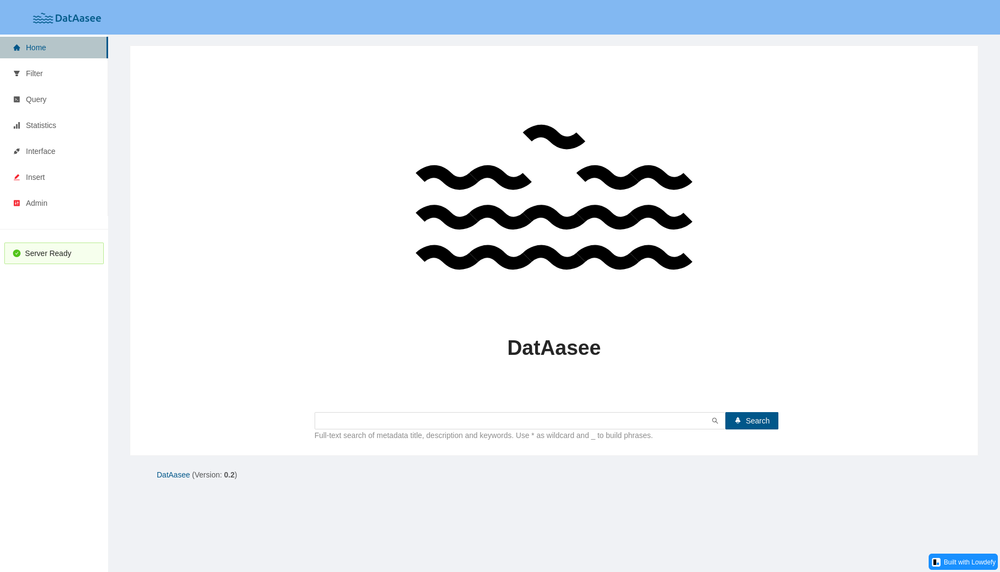
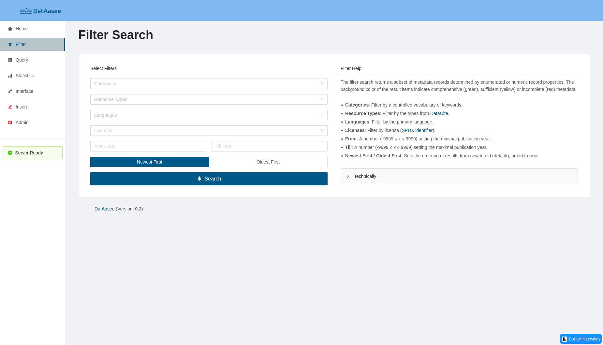
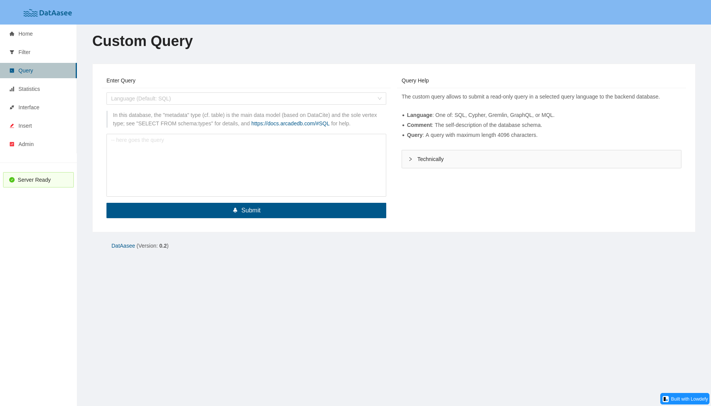
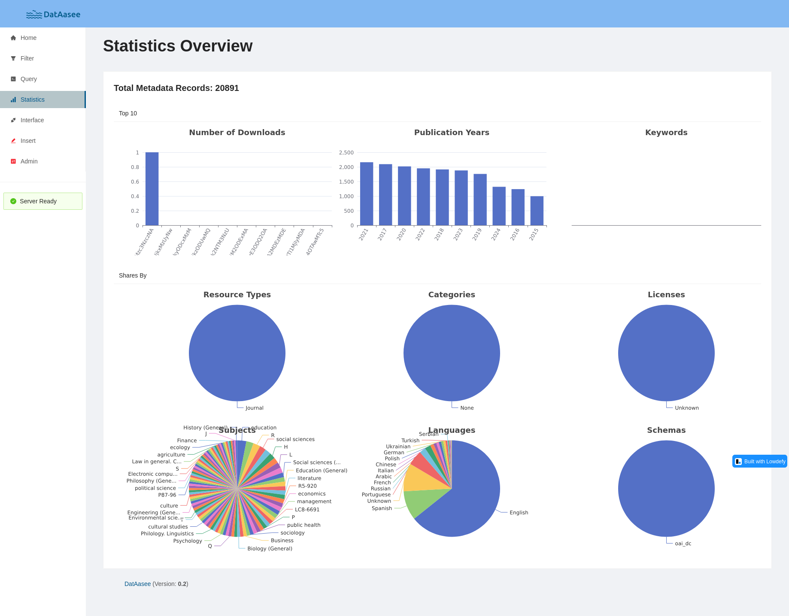
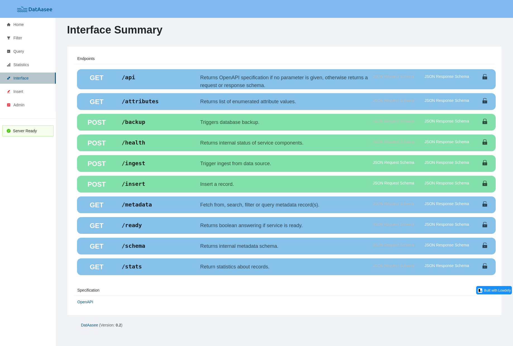
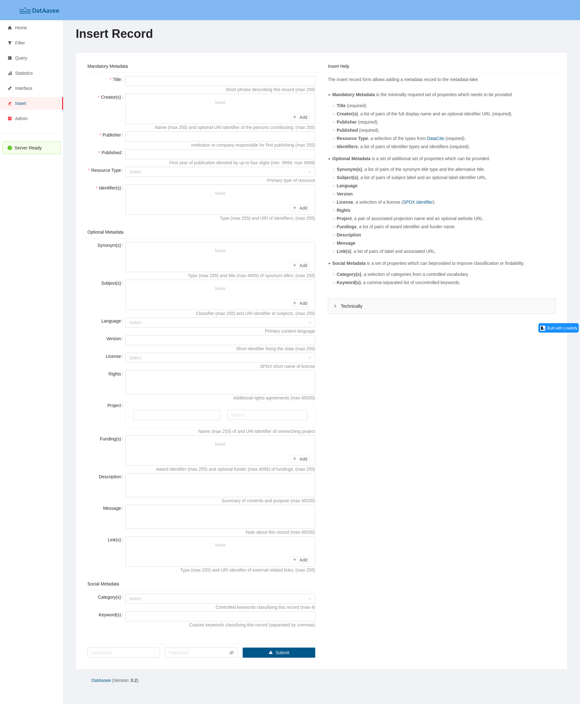
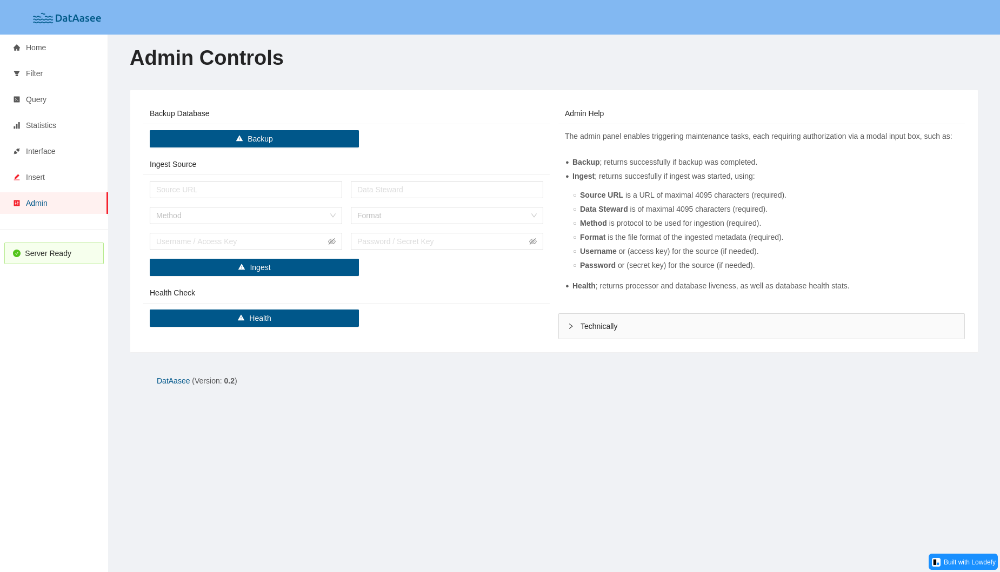

# DatAasee Software Documentation

**Version: 0.2**

**DatAasee** is a [metadata-lake](#about)
for centralizing bibliographic metadata and scientific metadata from various sources,
to increase research data findability and discoverability, as well as metadata availability,
and thus supporting [FAIR](https://www.go-fair.org/fair-principles) research and research reporting
in university libraries, research libraries, academic libraries or scientific libraries.

Particularly, **DatAasee** is developed for and by the [University and State Library of Münster](https://ulb.uni-muenster.de).

**Sections:**

* [Explanations](#explanations)
* [How-Tos](#how-tos)
* [References](#references)
* [Tutorials](#tutorials)
* [Appendix](#appendix)

**Selected Subsections:**

* [How to Deploy](#deploy)
* [HTTP-API Reference](#http-api)
* [Schema Reference](#native-schema)

--------------------------------------------------------------------------------

## Explanations

In this section **understanding-oriented** explanations are collected.

**Overview:**

* [About](#about)
* [Features](#features)
* [Components](#components)
* [Design](#design)
* [Data Model](#data-model)
* [EtLT Process](#etlt-process)
* [Security](#security)

### About

* What is **DatAasee**?
    - DatAasee is a metadata-lake!
* What is a **Metadata-Lake**?
    - A metadata-lake (a.k.a. metalake) is a data-lake restricted to metadata data!
* What is a **Data-Lake**?
    - A data-lake is a data architecture for structured, semi-structured and unstructured data!
* How does a data-lake differ from a **database**?
    - A data-lake includes a database, but requires further components to import and export data!
* How does a data-lake differ from a **data warehouse**?
    - A data warehouse transforms incoming data to fit its schema (cf [ETL](https://en.wikipedia.org/wiki/Extract,_transform,_load)), a data-lake ingests incoming data as-is and transforms it on-demand (cf [ELT](https://en.wikipedia.org/wiki/Extract,_load,_transform))!
* How is data in a data-lake organized?
    - A data lake includes a **metadata catalog** that stores data locations, its metadata, and transformations!
* What makes a metadata-lake special?
    - The metadata-lake's data-lake and metadata catalog coincide, this implies incomig data is partially transformed (cf [EtLT](https://www.oreilly.com/library/view/data-pipelines-pocket/9781492087823/)) to hydrate the catalog aspect of the metadata-lake!
* How does a metadata-lake differ from a **data catalog**?
    - A metadata-lake's data is (textual) metadata while a data catalog's data is databases (and their contents)!
* How is a metadata-lake a **data-lake**?
    - The ingested metadata is stored in raw form in the metadata-lake in addition to the partially transformed catalog metadata,
      and transformations are performed on the raw or catalog metadata upon request.
* How does a metadata-lake relate to a **virtual data-lake**?
    - A metadata-lake can act as a central metadata catalog for a set of distributed data sources and thus define a virtual data-lake.

### Features

* **Search via:** full-text, filter, [SRU]
* **Query by:** `SQL`, `Gremlin`, `Cypher`, `MQL`, `GraphQL`, [SPARQL]
* **Ingest:** `DataCite` (XML), `DC` (XML), `MARC` (XML), `MODS` (XML), [LIDO], [EAD], [DCAT], [RDF]
* **Ingest via:** `OAI-PMH` (HTTP), `S3` (HTTP), [GraphQL], [Postgres], [Self]
* **Deploy via**: `Docker`, `Podman`, [Kubernetes]
* REST-like API with CQRS aspects
* Best-of statistics of enumerated properties
* CRUD frontend for manual interaction and observation.

### Components

**DatAasee** uses a [three-tier architecture](https://en.wikipedia.org/wiki/Multitier_architecture#Three-tier_architecture)
with these separately containered components:

| Function         | Abstraction                      | Tier         | Product
|------------------|----------------------------------|--------------|----------------------------------
| Metadata Catalog | Multi-Model Database             | Data         | [ArcadeDB](https://arcadedb.com)
| EtLT Processor   | Declarative Streaming Processor  | Logic        | [Benthos](https://github.com/redpanda-data/benthos)
| Web Frontend     | Declarative Web Framework        | Presentation | [Lowdefy](https://lowdefy.com)

### Design

* Each component is encapsulated in its own container.
* External access happens through an HTTP API transporting JSON and conforming to [JSON:API](https://jsonapi.org).
* Ingests may happen via compatible protocols, e.g. `OAI-PMH`, `S3`.
* The frontend is optional as it is exclusively using the (external) HTTP-API.
* Internal communication happens via the components' HTTP-APIs.
* Only the database component holds state, the backend (and frontend) are stateless.
* For more details see the [architecture documentation](arc42.md).

### Data Model

The internal data model is based on the one big table (OBT) approach, but with
the exception of linked enumerated dimensions (Look-Up tables) making it
effectively an denormalized wide table with star schema, named `metadata`.

### EtLT Process

Combining the ETL (Extract-Transform-Load / schema-on-write)
and ELT (Extract-Load-Transform / schema-on-read) concepts,
processing is built upon the EtLT approach:

* **E**xtract: Ingest from data source, see [ingest endpoint](#ingest-endpoint).
* **t**ransform: Partial parsing and cleaning.
* **L**oad: Write to database.
* **T**ransform: Parse to export format on-demand.

Particularly, this means "EtL" happens (batch-wise) during ingest, while "T" occurs when requested.

### Security

**Secrets**:

* Two secrets need to be handled: _database_ admin and _datalake_ admin passwords.
* The default _datalake_ admin user name is `admin`, the password can be passed during initial deploy.
* The _database_ admin user name is `root`, the password can be passed during initial deploy.
* The passwords are handled as file-based secrets by the deploying compose file (loaded from a file and provided to containers as a file).
* The database credentials are used by the backend and may be used for manual database access.
* If the secrets are kept on the host, they need to be protected, for example via `openssl`, `SOPS`, or similar tools.

**Infrastructure**:

* Component containers are custom-build and hardened.
* Only `HTTP` and `Basic Authentication` are used, as it is assumed that `HTTPS` is provided by a user-provided proxy-server. 

**Interface**:

* HTTP-API GET requests are idempotent and thus unchallenged.
* HTTP-API POST requests may change the state of the database and thus need to be authorized by the data-lake admin user credentials.
* See the [DatAasee OpenAPI definition](../api/openapi.yaml).

--------------------------------------------------------------------------------

## How-Tos

In this section, **step-by-step guides** for real-world problems are listed.

**Overview:**

* [Prerequisite](#prerequisite)
* [Resources](#resources)
* [Deploy](#deploy)
* [Test](#test)
* [Shutdown](#shutdown)
* [Ingest](#ingest)
* [Backup Manually](#backup-manually)
* [Logs](#logs)
* [Update](#update)
* [Upgrade](#upgrade)
* [Web Interface (Prototype)](#web-interface-prototype)
* [API Indexing](#api-indexing)

### Prerequisite

The (virtual) machine deploying **DatAasee** requires [`docker-compose`](https://docs.docker.com/compose/install/),
or [`podman-compose`](https://github.com/containers/podman-compose).
See also the [container engine compatibility](#container-engines).

### Resources

The compute and memory resources for **DatAasee** can be configured via the `compose.yaml`.
Overall, a bare-metal machine or virtual machine requires:

* _Minimum:_ 2 CPU, 4G RAM
* _Recommended:_ 4 CPU, 8G RAM

So, a Raspberry Pi would be sufficient.
In terms of **DatAasee** components this breaks down to:

* Database:
    * _Minimum:_ 1 CPU, 2G RAM
    * _Recommended:_ 2 CPU, 4G RAM
* Backend:
    * _Minimum:_ 1 CPU, 1G RAM
    * _Recommended:_ 2 CPU, 2G RAM
* Frontend:
    * _Minimum:_ 1 CPU, 1G RAM
    * _Recommended:_ 2 CPU, 2G RAM

Note, that resource and system requirements depend on load,
particularly, database and backend are under heavy load during ingest.
Post ingest, (new) metadata records are interrelated, also causing heavy database loads.
Generally, the _database_ drives the overall performance.
Thus to improve performance, try first to increase memory for the database component (i.e. 4G to 8G).

### Deploy

```shell
$ mkdir -p backup  # or: ln -s /path/to/backup/volume backup
$ wget https://raw.githubusercontent.com/ulbmuenster/dataasee/0.2/compose.yaml
$ echo -n 'password1' > dl_pass && echo -n 'password2' > db_pass && docker compose up -d; rm -f dl_pass db_pass; history -d $(history 1)
```

> **NOTE:** The required secrets are kept temporary in the files `dl_pass` and `db_pass`.

> **NOTE:** Make sure to delete (or encrypt) secret files `dl_pass` and `db_pass` after use!

> **NOTE:** To customize your deploy, use [these environment variables](#runtime-configuration).

> **NOTE:** The runtime configuration environment variables can be stored in an `.env` file.

> **NOTE:** A custom backup location can alternatively also be specified inside the `compose.yaml`.

### Test

```shell
wget -SqO- http://localhost:8343/api/v1/ready
```

> **NOTE:** The default port for the HTTP API is `8343`.

### Shutdown

```shell
$ docker-compose down
```

> **NOTE:** A (database) backup is automatically triggered on every shutdown.

### Ingest

```shell
$ wget -O- http://localhost:8343/api/v1/ingest --user admin --ask-password --post-data \
  '{"source":"https://my.url/to/oai","method":"oai-pmh","format":"mods","steward":"https://my.url/identifying/steward"}'
```

> **NOTE:** A (database) backup is automatically triggered after every ingest.

### Backup Manually

```shell
$ wget -O- http://localhost:8343/api/v1/backup --user admin --ask-password --post-data=''
```

### Logs

```shell
$ docker-compose logs backend
```

### Update

```shell
$ docker compose down
$ docker compose pull
$ echo -n 'password1' > dl_pass && echo -n 'password2' > db_pass && docker compose up -d; rm -f dl_pass db_pass; history -d $(history 1)
```

> **NOTE:** "Update" means: if available, new images of the same DatAasee version but updated dependencies
            will be installed, whereas "Upgrade" means: a new version of DatAasee will be installed.

### Upgrade

```shell
$ docker compose down
$ echo -n 'password1' > dl_pass && echo -n 'password2' > db_pass && DL_VERSION=0.3 docker compose up -d; rm -f dl_pass db_pass; history -d $(history 1)
```

> **NOTE:** `docker-compose restart` cannot be used here because environment
            variables (such as `DL_VERSION`) are not updated when using restart.

> **NOTE:** Make sure to put the `DL_VERSION` variable also into the `.env` file for a permanent upgrade.

### Web Interface (Prototype)

> **NOTE:** The default port for the web frontend is `8000` for development and `80` for deployment.
















### API Indexing

Add the JSON object inside to the `apis` array in your global [`apis.json`](http://apisjson.org) API index.

```json
{
  "name": "DatAasee API",
  "description": "The DatAasee API enables research data search and discovery via metadata",
  "keywords": ["Metadata"],
  "attribution": "DatAasee",
  "baseURL": "http://your-dataasee.url/api/v1",
  "properties": [
    {
      "type": "InterfaceLicense",
      "url": "https://spdx.org/licenses/MIT.html"
    },
    {
      "type": "x-openapi",
      "url": "http://your-dataasee.url/api/v1/api"
    }
  ]
}
```

--------------------------------------------------------------------------------

## References

In this section **technical descriptions** are summarized.

**Overview:**

* [HTTP-API](#http-api)
* [Ingest Protocols](#ingest-protocols)
* [Ingest Encodings](#ingest-encodings)
* [Ingest Formats](#ingest-formats)
* [Native Schema](#native-schema)
* [Interrelation Edges](#interrelation-edges)
* [Ingestable to Native Schema Crosswalk](#ingestable-to-native-schema-crosswalk)
* [Query Languages](#query-languages)
* [Runtime Configuration](#runtime-configuration)

### HTTP-API

The HTTP-API is served under `http://<your-url-here>/api/v1` and provides the following endpoints:

| Method | Endpoint                              | Type     | Summary
|--------|---------------------------------------|----------|---------
| `GET`  | [`/ready`](#ready-endpoint)           | system   | Return service status
| `GET`  | [`/api`](#api-endpoint)               | special  | Return API specification and schemas
| `GET`  | [`/schema`](#schema-endpoint)         | metadata | Return database schema
| `GET`  | [`/attributes`](#attributes-endpoint) | metadata | Return enumerated properties
| `GET`  | [`/stats`](#stats-endpoint)           | data     | Return statistics about records
| `GET`  | [`/metadata`](#metadata-endpoint)     | data     | Return metadata record(s)
| `POST` | [`/insert`](#insert-endpoint)         | data     | Create new record
| `POST` | [`/ingest`](#ingest-endpoint)         | system   | Trigger ingest from source
| `POST` | [`/backup`](#backup-endpoint)         | system   | Trigger database backup
| `POST` | [`/health`](#health-endpoint)         | system   | Return service health
| `GET`  | `/export`                             | data     | TODO:
| `GET`  | `/sru`                                | data     | TODO:
| `POST` | `/forward`                            | system   | TODO:

> **NOTE:** The base path for all endpoints is `/api/v1`.

> **NOTE:** All `GET` requests are unchallenged, all `POST` requests are challenged, which are handled via "Basic Authentication".

> **NOTE:** All request and response bodies have content type `JSON`, and if provided, the `Content-Type` HTTP header must be `application/json`!

> **NOTE:** As the metadata-lake's data is metadata, a type "data" means metadata, and a type "metadata" means metadata about metadata.

> **NOTE:** Responses follow the [JSON:API](https://jsonapi.org) format.

> **NOTE:** The `id` property is the server's [Unix timestamp](https://en.wikipedia.org/wiki/Unix_time).

---

#### `/ready` Endpoint

Returns boolean answering if service is ready.

> **NOTE**: The `ready` endpoint can be used as readiness probe.

* Method: `GET`
* Parameters: None
* Response Schema: [`response/ready.json`](../api/response/ready.json)
* Access: Public
* Process: [see architecture](arc42.md#ready-endpoint)

**Status:**

* [200](https://httpstatuses.io/200) OK
* [406](https://httpstatuses.io/406) Not Acceptable.
* [503](https://httpstatuses.io/503) Service Unavailable.

**Example:**

Get service readiness:
```shell
$ wget -qO- http://localhost:8343/api/v1/ready
```

---

#### `/api` Endpoint

Returns OpenAPI specification if no parameter is given, otherwise returns a request or response schema.

> **NOTE**: In case of a succesful request, the response is NOT in the JSONAPI format, but the requested JSON file directly.

* Method: `GET`
* Parameters:
  * `request` (Optional; if provided, a request schema for the endpoint in the parameter value is returned.)
  * `response` (Optional; if provided, a response schema for the endpoint in the parameter value is returned.)
* Response Schema: [`response/api.json`](../api/response/api.json)
* Access: Public
* Process: [see architecture](arc42.md#api-endpoint)

**Statuses:**

* [200](https://httpstatuses.io/200) OK
* [400](https://httpstatuses.io/400) Parameter value is not an endpoint or has no request schema.
* [406](https://httpstatuses.io/406) Not Acceptable.

**Examples:**

Get OpenAPI definition:
```shell
$ wget -qO- http://localhost:8343/api/v1/api
```

Get `ingest` endpoint request schema:
```shell
$ wget -qO- http://localhost:8343/api/v1/api?request=ingest
```

Get `metadata` endpoint response schema:
```shell
$ wget -qO- http://localhost:8343/api/v1/api?response=metadata
```

---

#### `/schema` Endpoint

Returns internal metadata schema.

* Method: `GET`
* Parameters: None
* Response Body: [`response/schema.json`](../api/response/schema.json)
* Access: Public
* Process: [see architecture](arc42.md#schema-endpoint)

**Statuses:**

* [200](https://httpstatuses.io/200) OK
* [406](https://httpstatuses.io/406) Not Acceptable.
* [500](https://httpstatuses.io/500) Database error.

**Example:**

Get native metadata schema:
```shell
$ wget -qO- http://localhost:8343/api/v1/schema
```

---

#### `/attributes` Endpoint

Returns list of enumerated attribute values.

* Method: `GET`
* Parameters:
    * `type` (Optional; if provided only selected attribute type is returned.)
* Response Schema: [`response/attributes.json`](../api/response/attributes.json)
* Access: Public
* Process: [see architecture](arc42.md#attributes-endpoint)

**Statuses:**

* [200](https://httpstatuses.io/200) OK
* [400](https://httpstatuses.io/400) Invalid request.
* [406](https://httpstatuses.io/406) Not Acceptable.
* [500](https://httpstatuses.io/500) Database error.

**Example:**

Get all enumerated attributes:
```shell
$ wget -qO- http://localhost:8343/api/v1/attributes
```

Get language attributes:
```shell
$ wget -qO- http://localhost:8343/api/v1/attributes?type=languages
```

---

#### `/stats` Endpoint

Return statistics about records.

* Method: `GET`
* Parameters: None
* Response Body: [`response/stats.json`](../api/response/stats.json)
* Access: Public
* Process: [see architecture](arc42.md#stats-endpoint)

**Statuses:**

* [200](https://httpstatuses.io/200) OK
* [406](https://httpstatuses.io/406) Not Acceptable.
* [500](https://httpstatuses.io/500) Database error.

**Example:**

```shell
$ wget -qO- http://localhost:8343/api/v1/stats
```

---

#### `/metadata` Endpoint

Fetch from, search, filter or query metadata record(s).

* Method: `GET`
* Parameters:
    * `id` (Optional; if provided, a metadata-set with this value is returned.)
    * `search` (Optional; if provided, full-text search results for this value are returned.)
    * `query` (Optional; if provided, query results using this value are returned, no `language` parameter implies `sql`.)
    * `language` (Optional; if provided, filter results by `language` are returned, also used to set `query` language.)
    * `resourcetype` (Optional; if provided, filter results by `resourceType` are returned.)
    * `license` (Optional; if provided, filter results by `license` are returned.)
    * `category` (Optional; if provided, filter results by `category` are returned.)
    * `from` (Optional; if provided, filter results greater or equal `publicationYear` are returned.)
    * `till` (Optional; if provided, filter results lesser or equal `publicationYear` are returned.)
    * `skip` (Optional; if provided, this number of results is skipped, use for paging.)
    * `newest` (Optional; if provided, results are sorted new-to-oldest if true (default), or old-to-new if false.)
* Response Body: [`response/metadata.json`](../api/response/metadata.json)
* Access: Public
* Process: [see architecture](arc42.md#metadata-endpoint)

> **NOTE:** Only idem-potent read operations are permitted in custom queries.

> **NOTE:** A full-text search always matches for all argument terms (AND-based) in titles, descriptions and keywords in any order, while accepting `*` as wildcards and `_` to build phrases.

**Statuses:**

* [200](https://httpstatuses.io/200) OK
* [400](https://httpstatuses.io/400) Invalid request.
* [404](https://httpstatuses.io/404) Not found.
* [406](https://httpstatuses.io/406) Not Acceptable.
* [500](https://httpstatuses.io/500) Database error.

**Examples:**

Get record by record identifier:
```shell
$ wget -qO- http://localhost:8343/api/v1/metadata?id=
```

Search records by single filter:
```shell
$ wget -qO- http://localhost:8343/api/v1/metadata?language=chinese
```

Search records by multiple filters:
```shell
$ wget -qO- http://localhost:8343/api/v1/metadata?resourcetype=book&language=german
```

Search records by full-text for word "History":
```shell
$ wget -qO- http://localhost:8343/api/v1/metadata?search=History
```

Search records by full-text and filter, oldest first:
```shell
$ wget -qO- http://localhost:8343/api/v1/metadata?search=Geschichte&resourcetype=book&language=german&newest=false
```

Search records by custom SQL query:
```shell
$ wget -qO- http://localhost:8343/api/v1/metadata?language=sql&query=SELECT%20FROM%20metadata%20LIMIT%2010
```

---

#### `/insert` Endpoint

Inserts and parses, if necessary, a new record into the database.

* Method: `POST`
* Request Body: [`request/insert.json`](../api/request/insert.json)
* Response Body: [`response/insert.json`](../api/response/insert.json)
* Access: Challenged (Basic Authentication)
* Process: [see architecture](arc42.md#insert-endpoint)

> **NOTE:** This endpoint is meant for metadata records that cannot be ingested such as a report of ingested sources or testing;
            general use is discouraged. For details on the request body, see the associated [JSON schema](../api/request/insert.json).

**Status:**

* [201](https://httpstatuses.io/200) OK
* [400](https://httpstatuses.io/400) Invalid request.
* [403](https://httpstatuses.io/403) Invalid credentials.
* [406](https://httpstatuses.io/406) Not Acceptable.
* [500](https://httpstatuses.io/500) Database error.

**Example:**

Insert record with given fields: TODO:
```shell
$ wget -qO- http://localhost:8343/api/v1/insert --user admin --ask-password --post-file=myinsert.json
```

---

#### `/ingest` Endpoint

Trigger ingest from data source.

* Method: `POST`
* Request Body: [`request/ingest.json`](../api/request/ingest.json)
    * `source` must be an URL
    * `method` can be `oai-pmh` or `s3`
    * `format` can be `datacite`, `oai_datacite`, `dc`, `oai_dc`, `marc21`, `marcxml`, `mods`, or `rawmods`
    * `steward` should be an URL or email address.
* Response Body: [`response/ingest.json`](../api/response/ingest.json)
* Access: Challenged (Basic Authentication)
* Process: [see architecture](arc42.md#ingest-endpoint)

> **NOTE:** To test if the server is busy, send an empty (POST) body to this endpoint.
            HTTP status `400` means available, status `503` means currently ingesting.

> **NOTE:** The `method` and `format` are case-sensitive.

**Status:**

* [202](https://httpstatuses.io/202) Accepted.
* [400](https://httpstatuses.io/400) Invalid request.
* [403](https://httpstatuses.io/403) Invalid credentials.
* [406](https://httpstatuses.io/406) Not Acceptable.
* [503](https://httpstatuses.io/503) Already ingesting.

**Example:**

Start ingest from a given source:
```shell
$ wget -qO- http://localhost:8343/api/v1/ingest --user admin --ask-password --post-data='{"source":"https://datastore.uni-muenster.de/oai", "method":"oai-pmh", "format":"datacite", "steward":"forschungsdaten@uni-muenster.de"}'
```

---

#### `/backup` Endpoint

Trigger database backup.

* Method: `POST`
* Request Body: None
* Response Schema: [`response/backup.json`](../api/response/backup.json)
* Access: Challenged (Basic Authentication)
* Process: [see architecture](arc42.md#backup-endpoint)

**Status:**

* [200](https://httpstatuses.io/200) OK
* [403](https://httpstatuses.io/403) Invalid credentials.
* [406](https://httpstatuses.io/406) Not Acceptable.
* [500](https://httpstatuses.io/500) Database error.

**Example:**

```shell
$ wget -qO- http://localhost:8343/api/v1/backup --user admin --ask-password --post-data=''
```

---

#### `/health` Endpoint

Returns internal status of service components.

> **NOTE**: The `health` endpoint can be used as liveness probe.

* Method: `POST`
* Parameters: None
* Response Schema: [`response/health.json`](../api/response/health.json)
* Access: Public
* Process: [see architecture](arc42.md#health-endpoint)

**Status:**

* [200](https://httpstatuses.io/200) OK
* [403](https://httpstatuses.io/403) Invalid credentials.
* [406](https://httpstatuses.io/406) Not Acceptable.
* [500](https://httpstatuses.io/500) Internal Server Error.

**Example:**

Get service health:
```shell
$ wget -qO- http://localhost:8343/api/v1/health --user admin --ask-password --post-data=''
```

---

#### `/export` Endpoint

TODO:

#### `/sru` Endpoint

TODO:

#### `/forward` Endpoint

TODO:

### Ingest Protocols

* [OAI-PMH](http://www.openarchives.org/OAI/openarchivesprotocol.html) (Open Archives Initiative Protocol for Metadata Harvesting)
  * Supported Versions: `2.0`
* [S3](https://docs.aws.amazon.com/AmazonS3/latest/API) (Simple Storage Service)
  * Supported Versions: `2006-03-01`

### Ingest Encodings

Currently, [XML](https://www.w3.org/XML) (eXtensible Markup Language) is the sole encoding for ingested metadata.

### Ingest Formats

* [DataCite](https://datacite.org/)
  * Supported Versions: `4.4`, `4.5`
  * [Format Specification](https://support.datacite.org/docs/datacite-metadata-schema-v44-properties-overview)
* [DC](https://www.dublincore.org/) (Dublin Core)
  * Supported Versions: `1.1`
  * [Format Specification](https://www.dublincore.org/specifications/dublin-core/dces/)
* [MARC](https://www.loc.gov/marc/) (MAchine-Readable Cataloging)
  * Supported Versions: `1.1`
  * [Format Specification](https://www.loc.gov/marc/bibliographic/)
* [MODS](http://www.loc.gov/mods/) (Metadata Object Description Schema)
  * Supported Versions: `3.7`, `3.8`
  * [Format Specification](https://www.loc.gov/standards/mods/userguide/generalapp.html)
* TODO: RDF

### Native Schema

| Key               | Class       | Entry     | Type                | Constraints
|-------------------|-------------|-----------|---------------------|-------------
| `schemaVersion`   | Process     | Automatic | Integer             | min 0
| `recordId`        | Process     | Automatic | String              | max 31
| `metadataQuality` | Process     | Automatic | String              | max 255
| `dataSteward`     | process     | Automatic | String              | max 4095
| `source`          | Process     | Automatic | String              | max 4095
| `createdAt`       | Process     | Automatic | Datetime            |
| `updatedAt`       | Process     | Automatic | Datetime            |
|||||
| `sizeBytes`       | Technical   | Automatic | Integer             | min 0
| `fileFormat`      | Technical   | Automatic | String              | max 255
| `dataLocation`    | Technical   | Automatic | String              | max 4095, regexp
|||||
| `numberDownloads` | Social      | Automatic | Integer             | min 0
| `keywords`        | Social      | Optional  | String              | max 255
| `categories`      | Social      | Optional  | List(String)        | max 4
|||||
| `name`            | Descriptive | Mandatory | String              | max 255
| `creators`        | Descriptive | Mandatory | List(pair)          | max 255
| `publisher`       | Descriptive | Mandatory | String              | min 1, max 255
| `publicationYear` | Descriptive | Mandatory | Integer             | min -9999, max 9999
| `resourceType`    | Descriptive | Mandatory | Link(attribute)     | resourceTypes
| `identifiers`     | Descriptive | Mandatory | List(pair)          | max 255
|||||
| `synonyms`        | Descriptive | Optional  | List(pair)          | max 255
| `language`        | Descriptive | Optional  | Link(attribute)     | languages
| `subjects`        | Descriptive | Optional  | List(pair)          | max 255
| `version`         | Descriptive | Optional  | String              | max 255
| `license`         | Descriptive | Optional  | Link(pair)          | licenses
| `rights`          | Descriptive | Optional  | String              | max 65535
| `project`         | Descriptive | Optional  | Embedded(pair)      |
| `fundings`        | Descriptive | Optional  | List(pair)          | max 255
| `description`     | Descriptive | Optional  | String              | max 65535
| `message`         | Descriptive | Optional  | String              | max 65535
| `externalItems`   | Descriptive | Optional  | List(pair)          | max 255
|||||
| `rawType`         | Raw         | Optional  | String              | max 255
| `raw`             | Raw         | Optional  | String              | max 1048575
| `rawChecksum`     | Raw         | Optional  | String              | max 255

> **NOTE:** See also the schema diagram: [schema.md](schema.md)

> **NOTE**: The preloaded set of `categories` (see [preload.sql](../database/preload.sql)) is highly opinionated.

#### Helper types

##### `attributes`

| Property | Type         | Constraints
|----------|--------------|------------
| `name`   | String       | min 3, max 255
| `also`   | List(String) |

##### `pair`

| Property | Type   | Constraints
|----------|--------|------------
| `name`   | String | max 255
| `data`   | String | max 4095, regexp

#### Global Metadata

Each schema property has a `label`, additionally the descriptive properties have
a `comment` property.

| Key        | Type    | Comment
|------------|---------|---------
| `label`    | String  | For UI labels
| `comment`  | String  | For UI helper texts

### Interrelation Edges

| Type                    | Comment
|-------------------------|---------
| `isRelatedTo`           | Base edge type
| `isNewVersionOf`        | Derived from `isRelatedTo`
| `isDerivedFrom`         | Derived from `isRelatedTo`
| `isPartOf`              | Derived from `isRelatedTo`
| `isSameExpressionAs`    | Derived from `isRelatedTo`
| `isSameManifestationAs` | Derived from `isRelatedTo`

### Ingestable to Native Schema Crosswalk

TODO: Add sub elements

| DatAasee                | DataCite                             | DC                       | MARC                                     | MODS
|------------------------:|:------------------------------------:|:------------------------:|:----------------------------------------:|:-----:
| `name`                  | `titles`                             | `title`                  | `245`, `130`                             | `titleInfo`, `part`
| `creators`              | `creators`, `contributors`           | `creator`, `contributor` | `100`, `700`                             | `name`, `relatedItem`
| `publisher`             | `publisher`                          | `publisher`              | `260`, `264`                             | `originInfo`
| `publicationYear`       | `publicationYear`                    | `date`                   | `260`, `264`                             | `originInfo`, `part`, `recordInfo`
| `resourceType`          | `resourceType`                       | `type`                   | `007`,                                   | `genre`
| `identifiers`           | `identifier`, `alternateIdentifiers` | `identifier`             | `001`, `020`, `856`                      | `identifier`, `recordInfo`
| `synonyms`              | `titles`                             | `title`                  | `210`, `222`, `240`, `242`, `246`, `247` | `titleInfo`
| `language`              | `language`                           | `language`               | `008`, `041`                             | `language`
| `subjects`              | `subjects`                           | `subjects`               | `655`, `689`                             | `subject`
| `version`               | `version`                            |                          | `250`                                    |
| `license`               | `rights`                             |                          |                                          | `accessCondition`
| `rights`                |                                      | `rights`                 | `506`, `540`                             |
| `project`               |                                      |                          |                                          |
| `fundings`              | `fundingReferences`                  |                          |                                          |
| `description`           | `description`                        | `description`            | `520`                                    |
| `message`               |                                      | `format`                 | `500`                                    | `note`
| `externalItems`         | `relatedIdentifiers`                 | `identifier`             |                                          | `identifier`
|||||
| `isRelatedTo`           | `relatedItems`, `relatedIdentifiers` | `related`                | `773`                                    | `relatedItem`
| `isNewVersionOf`        | `relatedItems`, `relatedIdentifiers` |                          |                                          | `relatedItem`
| `isDerivedFrom`         | `relatedItems`, `relatedIdentifiers` |                          |                                          | `relatedItem`
| `isPartOf`              | `relatedItems`, `relatedIdentifiers` |                          |                                          | `relatedItem`
| `isSameExpressionAs`    |                                      |                          |                                          | `relatedItem`
| `isSameManifestationAs` |                                      |                          |                                          | `recordInfo`

### Query Languages

| Language | Identifier | Documentation
|----------|------------|---------------
| SQL      | `sql`      | [ArcadeDB SQL](https://docs.arcadedb.com/#SQL)
| Cypher   | `cypher`   | [Neo4J Cypher](https://neo4j.com/docs/cypher-manual/current/)
| GraphQL  | `graphql`  | [GraphQL Spec](https://spec.graphql.org/)
| Gremlin  | `gremlin`  | [Tinkerpop Gremlin](https://kelvinlawrence.net/book/PracticalGremlin.html)
| MQL      | `mongo`    | [Mongo MQL](https://www.mongodb.com/docs/manual/tutorial/query-documents/)
|||
| SPARQL   | `sparql`   | [SPARQL](https://www.w3.org/TR/sparql11-query/) (WIP)

### Runtime Configuration

The following environment variables affect **DatAasee** if set before starting.

| Symbol       | Value                     | Meaning
|--------------|---------------------------|---------
| `TZ`         | `CET` (Default)           | Timezone of server
| `DL_VERSION` | `0.2` (Example)           | Requested DatAasee version
| `DL_BACKUP`  | `$PWD/backup` (Default)   | Path to backup folder
| `DL_USER`    | `admin` (Default)         | DatAasee admin username
| `DL_BASE`    | `http://my.url` (Example) | Outward DatAasee base URL (including protocol and port, no trailing slash)
| `DL_PORT`    | `8343` (Default)          | DatAasee API port
| `FE_PORT`    | `8000` (Default)          | Web Frontend port (Development)

--------------------------------------------------------------------------------

## Tutorials

In this section **learning-oriented** lessons for new-comers are given.

**Overview:**

* [Getting Started](#getting-started)
* [Example Ingest](#example-ingest)
* [Container Engines](#container-engines)
* [Container Probes](#container-probes)
* [Custom Queries](#custom-queries)
* [Custom Frontend](#custom-frontend)

### Getting Started

0. Setup [compatible compose](#container-engines) orchestrator
1. Download **DatAasee** release
    ```shell
    $ wget https://raw.githubusercontent.com/ulbmuenster/dataasee/0.2/compose.yaml
    ```
    or:
    ```shell
    $ curl https://raw.githubusercontent.com/ulbmuenster/dataasee/0.2/compose.yaml
    ```
2. Unpack `compose.yaml`
    ```shell
    $ tar -xf dataasee-0.2.tar.gz
    ```
    and:
    ```shell
    $ cd dataasee-0.2
    ```
3. Create or mount folder for backups (assuming your backup volume is mounted under `/backup`)
    ```shell
    $ mkdir -p backup
    ```
    or:
    ```shell
    $ ln -s /backup backup
    ```
4. Create **DatAasee** API and database admin passwords. The spaces before `echo` prevent these commands from being added to the history. `echo -n` is used to create the password files as most editors add a newline at the end of a file.
    ```shell
    $  echo -n 'password1' > dl_pass
    ```
      and:
    ```shell
    $  echo -n 'password2' > db_pass
    ```
5. Start **DatAasee** service
    ```shell
    $ docker-compose up -d
    ```
      or:
    ```shell
    $ podman-compose up -d
    ```

Now, if started locally point a browser to `http://localhost:8000` to use the web frontend,
or send requests to `http://localhost:8343/api/v1/` to use the HTTP API directly.

### Example Ingest

For demonstration purposes the collection of the "Directory of Open Access Journals" (DOAJ) is ingested.
An ingest has four phases: First, the administrator needs to collect the necessary information of the metadata source,
i.e. URL, protocol, format, and data steward.
Second, the ingest is triggered via the HTTP-API.
Third, the backend ingests the metadata records from the source to the database.
Fourth and lastly, the ingested data is interconnected inside the database.

1. Check the documentation of DOAJ:
    ```http
    https://doaj.org/docs
    ```
   The `oai-pmh` protocol is available.

2. Check the documentation about OAI-PMH:
    ```http
    https://doaj.org/docs/oai-pmh/
    ```
   The OAI-PMH endpoint URL is: `https://doaj.org/oai`.

3. Check the OAI-PMH for available metadata formats:
    ```http
    https://doaj.org/oai?verb=ListMetadataFormats
    ```
   A compatible metadata format is `oai_dc`.

4. Start an ingest:
    ```shell
    $ wget -qO- http://localhost:8343/api/v1/ingest --user admin --ask-password --post-data='{"source":"https://doaj.org/oai", "method":"oai-pmh", "format":"oai_dc", "steward":"helpdesk@doaj.org"}'
    ```
   A status `202` confirms the start of the ingest.
   Here, no steward is listed in the DOAJ documentation, thus a general contact is set.
   Alternatively, the "Ingest" form of the "Admin" page in the web frontend can be used.

5. DatAasee reports the start of the ingest in the backend logs:
    ```shell
    $ docker logs dataasee-backend-1
    ```
   with a message akin to: `Starting ingest from https://doaj.org/oai via oai-pmh as oai_dc.`.

6. DatAasee reports completion of the ingest in the backend logs:
    ```shell
    $ docker logs dataasee-backend-1
    ```
   with a message akin to: `Completed ingest of 20812 records from https://doaj.org/oai after 0.05h.`.

7. DatAasee starts interconnecting the ingested metadata records:
    ```shell
    $ docker logs dataasee-database-1
    ```
   with a message akin to: `Interconnect Started!`.

8. DatAasee finishes interconnecting the ingested metadata records:
    ```shell
    $ docker logs dataasee-database-1
    ```
   with a message akin to: `Interconnect Completed!`.

> **NOTE:** The interconnection is a potentially long-running, asynchronous operation, whose status is only reported in the database logs.

### Container Engines

**DatAasee** is deployed via a `compose.yaml` (see [How to deploy](#deploy)),
which is compatible to the following orchestration tools:

* [`docker-compose`](https://docs.docker.com/compose/)
* [`podman-compose`](https://github.com/containers/podman-compose)
* Kubernetes / Minikube via [`kompose`](https://kompose.io)

#### Docker-Compose

* docker
* docker-compose >= 2

Installation see: [docs.docker.com/compose/install/](https://docs.docker.com/compose/install/)

```shell
$ docker-compose up -d
```

```shell
$ docker-compose ps
```

```shell
$ docker-compose down
```

#### Docker-Compose (with Podman)

* podman
* podman-docker
* docker-compose

Installation see: [docs.docker.com/compose/install/](https://docs.docker.com/compose/install/)

> **NOTE:** This tutorial assumes a Debian-based Linux host like Ubuntu.

```shell
$ sudo apt-get -y install dnsmasq podman-plugins containernetworking-plugins podman-docker
```

```shell
$ docker-compose up -d
```

```shell
$ docker-compose ps
```

```shell
$ docker-compose down
```

#### Podman-Compose

* podman >= 4.6.2
* podman-compose >= 1.0.6

> **NOTE:** This tutorial assumes a Debian-based Linux host like Ubuntu.

Additionally:
```shell
$ sudo apt-get -y install dnsmasq podman-plugins containernetworking-plugins python3-pip
$ pip3 install podman-compose
```

```shell
$ podman-compose up -d
```

```shell
$ podman-compose ps
```

```shell
$ podman-compose down
```

#### Kompose (Minikube)

* minikube
* kubectl
* kompose

Installation see: [kompose.io/installation/](https://kompose.io/installation/)

Prepare `compose.yaml`:

* Add port to database service:
    ```yaml
    services:
      database:
        ports:  # value changed from []
          - "2480:2480"
    ```

```shell
$ kompose -f compose.yaml convert
```

Particularly, for `kompose` in version **1.33.0** and **1.34.0** the following manual changes need to be made in:

* `database-deployment.yaml`:
    ```yaml
    spec:
      template:
        spec:
          containers:
            - env:
                volumeMounts:
                  - name: "database"
                    mountPath: "/run/secrets/database"  # value changed from "/run/secrets"
    ```
* `backend-deployment.yaml`:
    ```yaml
    spec:
      template:
        spec:
          containers:
            - env:
                volumeMounts:
                  - name: "database"
                    mountPath: "/run/secrets/database"  # value changed from "/run/secrets"
                  - name: "datalake"
                    mountPath: "/run/secrets/datalake"  # value changed from "/run/secrets"
    ```

```shell
$ rm compose.yaml
```

```shell
$ minikube start
```

```shell
$ kubectl apply -f .
```

```shell
$ kubectl port-forward service/backend 8343:8343  # now the backend can be accessed via `http://localhost:8343/api/v1`
```

```shell
$ minikube stop
```

### Container Probes

The following endpoints are available for monitoring the respective containers;
here the `compose.yaml` host names (service names) are used.
Logs are written to the standard output.

#### Backend

**Ready**:
```http
http://backend:4195/ready
```
returns HTTP status `200` if ready, see also [Benthos `ready`](https://docs.redpanda.com/redpanda-connect/components/http/about/#endpoints).

**Liveness**:
```http
http://backend:4195/ping
```
returns HTTP status `200` if live, see also [Benthos `ping`](https://docs.redpanda.com/redpanda-connect/components/http/about/#endpoints).

**Metrics**:
```http
http://backend:4195/metrics
```
allows [Prometheus](https://prometheus.io) scraping, see also [Connect `prometheus`](https://docs.redpanda.com/redpanda-connect/components/metrics/prometheus/).

#### Database

**Ready:**
```http
http://database:2480/api/v1/ready
```
returns HTTP status `204` if ready, see also [ArcadeDB `ready`](https://docs.arcadedb.com/#HTTP-CheckReady).

#### Frontend

**Ready:**
```http
http://frontend:3000
```
returns HTTP status `200` if ready.


### Custom Queries

> **NOTE:** All custom query results are limited to 100 items.

#### SQL

**DatAasee** uses the [ArcadeDB SQL dialect](https://docs.arcadedb.com/#SQL).
For custom SQL queries, only single, read-only queries are admissible,
meaning:

* [`SELECT`](https://docs.arcadedb.com/#SQL-Select)
* [`MATCH`](https://docs.arcadedb.com/#SQL-Match)
* [`TRAVERSE`](https://docs.arcadedb.com/#SQL-Traverse)

The vertex type (cf. table) holding the metadata records is named `metadata`.

**Examples:**

Get the schema:
```sql
SELECT FROM schema:types
```

Get one-hundred metadata record titles:
```sql
SELECT name FROM metadata
```

#### Gremlin

TODO:

Get one-hundred metadata record titles:
```gremlin
g.V().hasLabel("metadata")
```

#### Cypher

**DatAasee** supports a subset of [OpenCypher](https://docs.arcadedb.com/#Open-Cypher).
For custom Cypher queries, only read-queries are admissible,
meaning:

* `MATCH`
* `OPTIONAL MATCH`
* `RETURN`

**Examples:**

Get labels:
```cypher
MATCH (n) RETURN DISTINCT labels(n)
```

Get one-hundred metadata record titles:
```cypher
MATCH (m:metadata) RETURN m
```

#### MQL

TODO:

#### GraphQL

TODO:

#### SPARQL

TODO:

### Custom Frontend

#### Remove Prototype Frontend

Remove the YAML object `"frontend"` in the `compose.yaml` (all lines below `## Frontend # ...`).

--------------------------------------------------------------------------------

## Appendix

In this section **development-related** guidelines are gathered.

**Overview:**

* [Development Decision Rationales](#development-decision-rationales)
* [Development Workflows](#development-workflows)

### Development Decision Rationales:

#### Infrastructure

* What versioning scheme is used?
    * DatAasee uses [SimVer](https://simver.org) versioning, with the addition, that the minor
      version starts with one for the first release of a major version (`X.1`), so during the
      development of a major version the minor version will be zero (`X.0`).

* How stable is the upgrade to a release?
    * During the development releases (`0.X`) every release will likely be breaking, particularly
      with respect to backend API and database schema. Once a version 1.0 is released, breaking
      changes will only occur between major versions.

* What are the three `compose` files for?
    * The `compose.develop.yaml` is only for the development environment,
    * The `compose.package.yaml` is only for building the release container images,
    * The `compose.yaml` is the only file making up a release.

* Why does a release consist only of the `compose.yaml`?
    * The compose configuration acts as a installation script and deploy recipe. Given access to a
      repository with DatAasee, all containers are set up on-the-fly by pulling. No other files are
      needed.

* Why is **Ubuntu 24.04** used as base image for database and backend?
    * Overall, the calendar based version together with the 5 year support policy for Ubuntu LTS
      makes keeping current easier. Generally, `glibc` is used, and specifically for the database,
      OpenJDK is supported, as opposed to Alpine.

* Why does building the backend Docker image fail?
    * This is likely a timeout when downloading Go module packages. Multiple retries maybe necessary
      to complete a build.

#### Database

* Why is an `init.sh` script used instead of a plain command in the database container?
    * This is a security measure; the script is designed to hide secrets which need to be passed on
      start up. A secondary use is the set up of the database schema in case the container is
      freshly created.

#### Backend

* Why are the main processing components part of the **input** and not a separate **pipeline**?
    * Since the ingests may take very long, it is only triggered and the sucessful triggering is
      reported in the response while the ingest keeps on running. This async behavior is only
      possible with a `buffer` which has to be directly after the input and after `sync_response`
      of the trigger, thus the input post-pressing processors are used as main pipeline.

* Why is the content type `application/json` used for responses and not `application/vnd.api+json`?
    * Using the official JSON MIME-type makes a response more compatible and states what it is in
      more general terms. Requested content types on the other hand may be either empty, `*/*`,
      `application/json`, or `application/vnd.api+json`.

#### Frontend

* Why is the frontend a prototype?
    * The frontend is not meant for direct production use but serves as system testing device,
      a proof-of-concept, living documentation, and simplification for manual testing. Thus it has
      the layout of an internal tool. Nonetheless, it can be used as a basis or template for a
      production frontend.

* Why is there custom JS defined?
    * This is necessary to enable triggering the submit button when pressing the "Enter" key.

* Why does the frontend container use the `backend` name explicitly and not the host loopback, i.e.
  `extra_hosts: [host.docker.internal:host-gateway]`?
    * Because `podman` does not seem to support it yet.

### Development Workflows

#### Development Setup

1. `git clone https://github.com/ulbmuenster/dataasee && cd dataasee` (clone repository)
2. `make setup` (builds container images locally)
3. `make start` (starts development setup)

#### Dependency Updates

1. [Dependency documentation](deps.md)
2. [Dependency versions](../.env)
3. [Version verification](../frontend/lowdefy.yaml) (Frontend only)

#### Schema Changes

1. [Schema definition](schema.md)
2. [Schema documentation](#native-schema)
3. [Schema implementation](../database/schema.sql)

#### API Changes

1. [API definition](../api/openapi.yaml)
2. [API architecture](arc42.md)
3. [API documentation](#http-api)
4. [API implementation](../backend/dataasee.yaml)
5. [API testing](../tests)

#### Coding Standards

* YAML and SQL files must have a comment header line containing: dialect, project, license, author.
* YAML should be restricted to [StrictYAML](https://hitchdev.com/strictyaml/) (except `github-ci` and `compose`).
* SQL commands should be all-caps.
