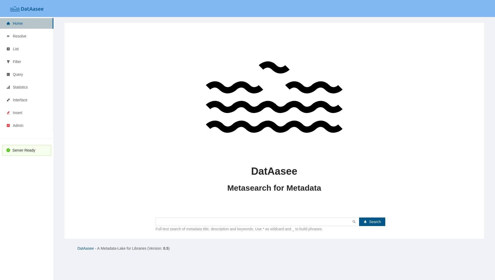
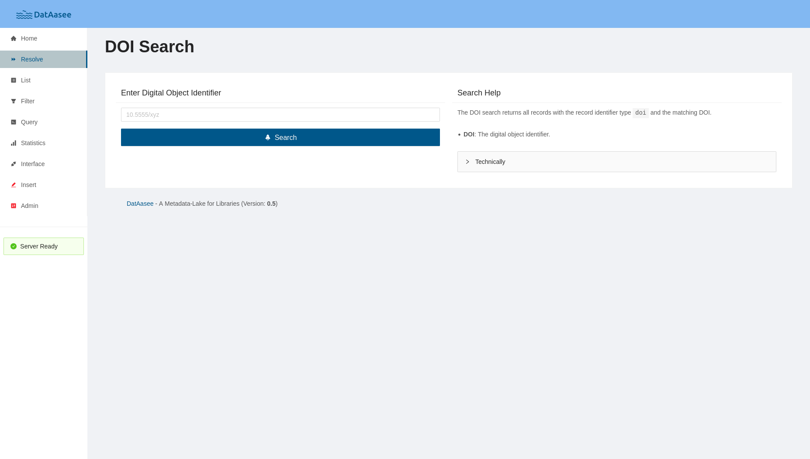
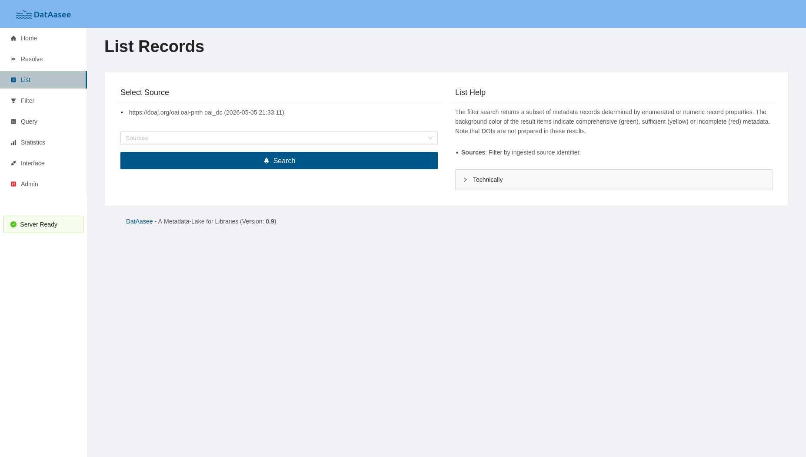
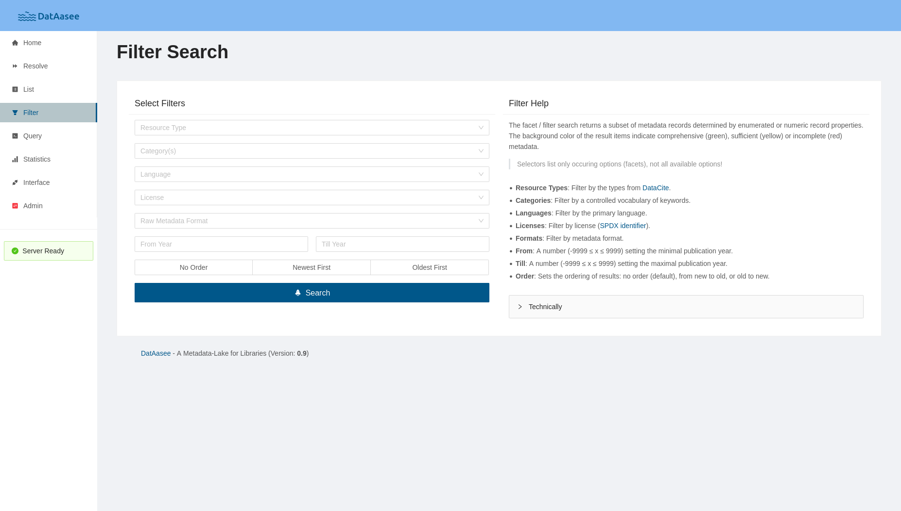
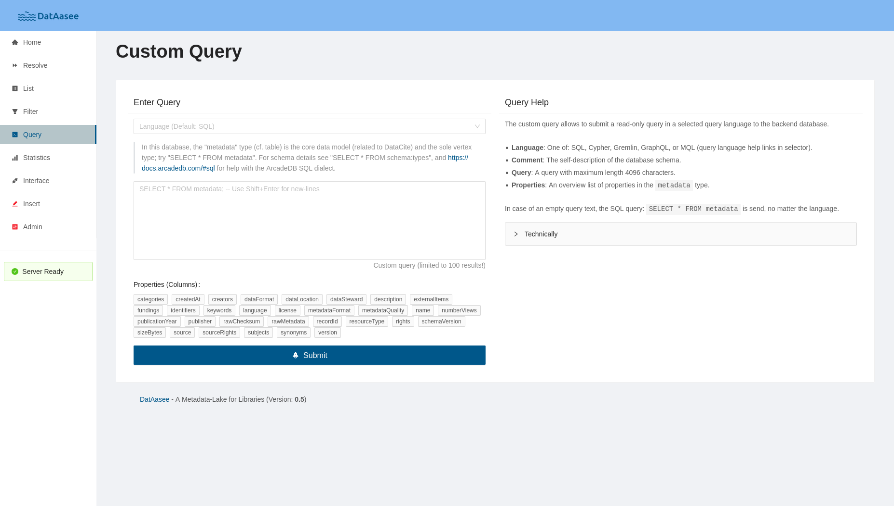
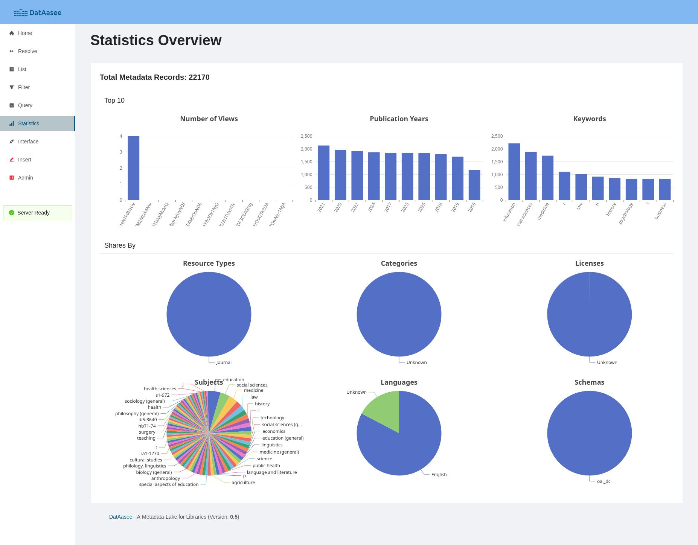
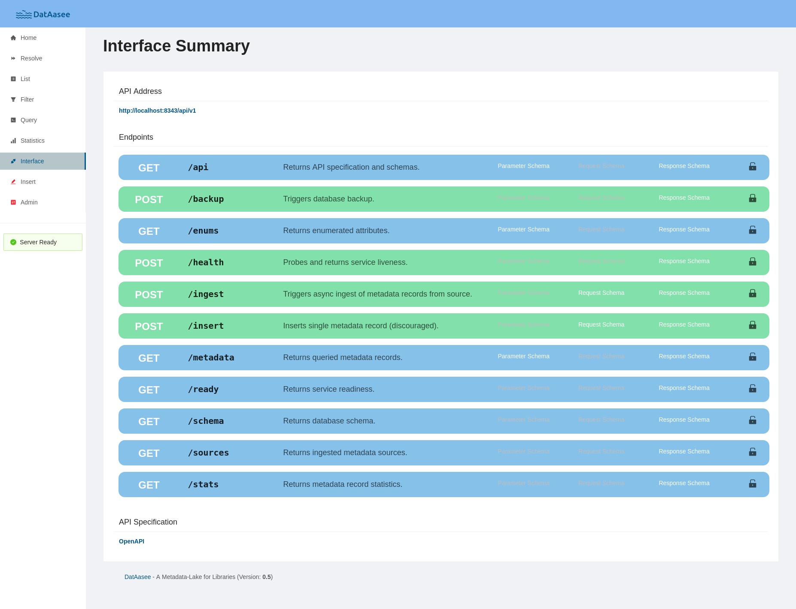
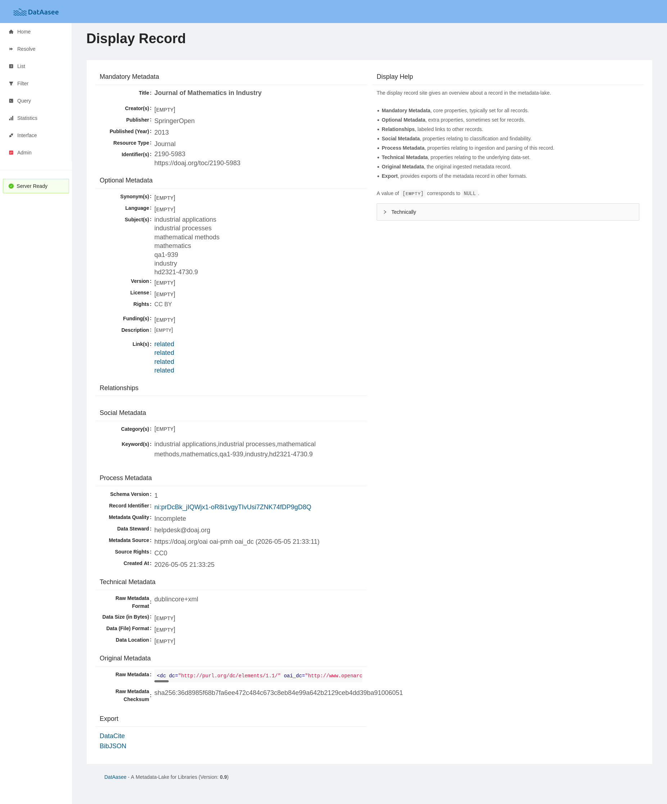
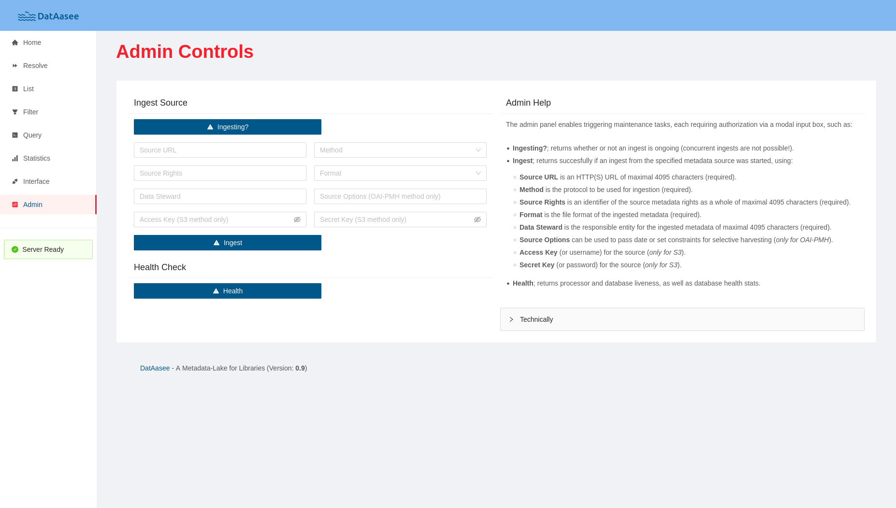

# DatAasee Software Documentation

**Version: 0.9**

The [metadata-lake](#about) **DatAasee** centralizes bibliographic data as well
as metadata of research data from distributed sources to increase metadata
availability and research data discoverability, hence supporting
[FAIR](https://www.go-fair.org/fair-principles) research in university
libraries, research libraries, academic libraries, or scientific libraries.

**DatAasee** is developed for and by the
[University and State Library of Münster](https://ulb.uni-muenster.de),
and available openly under a free and open-source license.

**Table of Contents:**

1. [Explanations](#1-explanations) (understanding-oriented)
2. [How-Tos](#2-how-tos) (goal-oriented)
3. [References](#3-references) (information-oriented)
4. [Tutorials](#4-tutorials) (learning-oriented)
5. [Appendix](#5-appendix) (development-oriented)

**Selected Subsections:**

* [How to Deploy](#deploy)
* [Runtime Configuration](#runtime-configuration)
* [HTTP API Reference](#http-api)
* [Schema Reference](#native-schema)
* [Development FAQ](#development-decision-rationales)

--------------------------------------------------------------------------------

## 1. Explanations

In this section in-depth explanations and backgrounds are collected.

**Overview:**

* [About](#about)
* [Features](#features)
* [Design](#design)
* [Data Model](#data-model)
* [Persistence](#persistence)
* [Security](#security)

### About

* What problem is **DatAasee** solving?
    - DatAasee provides a single, unified, and uniform access to distributed sources of bibliographic and research metadata.
* What does **DatAasee** do?
    - DatAasee centralizes, indexes, and serves metadata after ingesting, partially transforming, and interconnecting it.
* What is **DatAasee** technically?
    - DatAasee is a metadata-lake.
* What is a **Metadata-Lake**?
    - A metadata-lake (a.k.a. metalake) is a data-lake restricted to metadata data.
* What is a **Data-Lake**?
    - A data-lake is a data architecture for structured, semi-structured and unstructured data.
* How does a data-lake differ from a **database**?
    - A data-lake includes a database, but requires further components to import and export data.
* How does a data-lake differ from a **data warehouse**?
    - A data warehouse transforms incoming data to fit its schema (cf. [ETL](https://en.wikipedia.org/wiki/Extract,_transform,_load)), a data-lake ingests incoming data as-is and transforms it on-demand (cf. [ELT](https://en.wikipedia.org/wiki/Extract,_load,_transform)).
* How is data in a data-lake organized?
    - A data-lake includes a **metadata catalog** that stores data locations, their metadata, and transformations.
* What makes a metadata-lake special?
    - In a metadata-lake, the data-lake and metadata catalog coincide; this implies incoming metadata records are partially transformed (cf. [EtLT](https://www.oreilly.com/library/view/data-pipelines-pocket/9781492087823/)) to hydrate the catalog aspect.
* How does a metadata-lake differ from a **data catalog**?
    - A metadata-lake stores textual metadata records, whereas a data catalog typically indexes databases and their structural contents.
* How is a metadata-lake a **data-lake**?
    - The ingested metadata is stored in raw form in the metadata-lake in addition to the partially transformed catalog metadata,
      and transformations are performed on the raw or catalog metadata upon request.
* How does a metadata-lake relate to a **virtual data-lake**?
    - A metadata-lake can act as a central metadata catalog for a set of distributed data sources and thus define a virtual data-lake, given data locations as part of the metadata.
* How does a metadata-lake relate to **data spaces**?
    - A data space is a set of (meta)data sources, their interrelations, best-effort interpretation, as-needed integration, and a uniform interface for access.
      In this sense the metadata-lake DatAasee spans a data space.
* How does the DatAasee metadata-lake relate to a **search engine**?
    - DatAasee can conceptually be seen as a metasearch-engine for metadata.
* What is an executive summary of **DatAasee**?
    - DatAasee is a metadata hub for organizations with many different data and metadata sources.

### Features

Brackets [` `] mean: under construction.

* **Deploy via:** `Docker`, `Podman`, [`Kubernetes`]
* **Ingest:** `DataCite` (XML), `DC` (XML), `LIDO` (XML), `MARC` (XML), `MODS` (XML)
* **Ingest via:** `OAI-PMH` (HTTP), `S3` (HTTP), `GET` (HTTP), `DatAasee` (HTTP), [`GraphQL` (HTTP)]
* **Search via:** filter/facet, full-text, source, `DOI`
* **Query by:** `SQL`, `Cypher`, `MQL`, `GraphQL`, `Redis`
* **Export as:** `DataCite` (JSON), `BibJSON` (JSON), [`KDSF` (JSON)]
* **Interact via:** `JSON`-`HTTP` API
* Prototype web frontend as template for manual interaction and observation

### Design

* Encapsulated as a composition of component containers.
* External access is provided through an HTTP API accepting and responding only in JSON with [JSON:API](https://jsonapi.org) formatting.
* Ingests may happen via compatible (pull) protocols, e.g. `OAI-PMH`, `S3`, `HTTP-GET` (Ingests are intended as periodic bulk operations, e.g. quarterly or semi-annually)
* Only the database component holds permanent state.
* The included frontend is optional as it is exclusively using the HTTP API.
* For more details see the [architecture documentation](arc42.md).

### Data Model

A graph database is used with a central node (vertex) type (cf. table) named `Metadata`.
The node properties are based on [DataCite](https://schema.datacite.org) metadata schema for the _descriptive_ metadata.
For further information see the [schema](#native-schema).

### Persistence

**Backup and Restore:**

* The database component holds all permanent state of the DatAasee service.
* After a successful ingest, a backup is triggered.
* After a successful interconnect, a backup is triggered.
* Outside of ingest and interconnect no data is changed.
* When starting the DatAasee service, the latest backup in the specified backup location is restored.

### Security

**Secrets:**

* Two secrets need to be handled: _datalake_ admin password and _database_ admin password.
* The default _datalake_ admin username is `admin`, the password (`DL_PASS`) can be passed during initial deployment; there is no default password.
* The _database_ admin username is `root`, the password (`DB_PASS`) can be passed during initial deployment; there is no default password.
* These passwords are handled as secrets by the deploying Compose-file (loaded from an environment variable and provided to containers as a file).
* The database credentials are used by the backend and may also be used for manual database access.
* If the secrets are kept on the host, they need to be protected, see [Secret Management](#secret-management).

**Database:**

* The database server hosts only the `metadatalake` database; the `root` account is scoped to this server instance and has no cross-system privileges.
* When deployed, the database is only directly accessible through the [console](https://docs.arcadedb.com/#console) from inside the database container.
* During development, the database can be directly accessed via its web [studio](https://docs.arcadedb.com/#studio).

**Infrastructure:**

* Component containers are custom-built and hardened.
* Only `HTTP` and `Basic Authentication` are used, as it is assumed that `HTTPS` is provided by an operator-provided HTTPS / TLS terminating proxy server.
* There is no session data as all interactions are per-request.

**Interface:**

* HTTP API `GET` requests are read-only idempotent and are unauthenticated.
* HTTP API `POST` requests may change the state of the database and thus require authentication by the _datalake_ admin.
* See the [DatAasee OpenAPI definition](../api/openapi.yaml).

--------------------------------------------------------------------------------

## 2. How-Tos

In this section, brief guides for typical tasks are compiled.

**Overview:**

* [Prerequisite](#prerequisite)
* [Resources](#resources)
* [Using DatAasee](#using-dataasee)
* [Production Checklist](#production-checklist)
* [Deploy](#deploy)
* [Logs](#logs)
* [Shutdown](#shutdown)
* [Probe](#probe)
* [Ingest](#ingest)
* [Update](#update)
* [Upgrade](#upgrade)
* [Reset](#reset)
* [Database Console](#database-console)
* [Web Interface (Prototype)](#web-interface-prototype)
* [API Indexing](#api-indexing)

### Prerequisite

The (virtual) machine deploying **DatAasee** requires [`docker compose`](https://docs.docker.com/compose/install/) (>=2.37)
on top of `docker` or `podman`, see also [container engine compatibility](#container-engines).

### Resources

The compute and memory resources for **DatAasee** can be configured via the [`compose.yaml`](../compose.yaml).
To run, a bare-metal machine or virtual machine requires:

* _Minimum:_ 4 CPU, 8G RAM (a _Raspberry Pi_ 4 would be sufficient)
* _Recommended:_ 8 CPU, 32G RAM

In terms of **DatAasee** components this breaks down to:

* Database:
    * _Minimum:_ 2 CPU, 4G RAM
    * _Recommended:_ 4 CPU, 24G RAM
* Backend:
    * _Minimum:_ 1 CPU, 2G RAM
    * _Recommended:_ 2 CPU, 4G RAM
* Frontend:
    * _Minimum:_ 1 CPU, 2G RAM
    * _Recommended:_ 2 CPU, 4G RAM

Note, that resource and system requirements depend on load;
especially the database is under heavy load during ingest.
Post ingest, (new) metadata records are interrelated, also causing heavy database loads.
Generally, the _database_ drives the overall performance.
Thus, to improve performance, try first to increase the memory `limits` (in the `compose.yaml`)
for the database component (i.e., from 4G to 24G).

> **NOTE:** Practically, the memory required by database roughly corresponds to its size,
            which is reported on startup (in case a backup is restored), or after completing a backup.
            As a rough estimate for resource planning expect 6G RAM per million records, and 1G disk per million records for backups.

### Using DatAasee

In this section the terms "operator" and "user" are used,
where "operator" refers to the party installing, serving and maintaining DatAasee,
and "user" refers to the individuals or services reading from DatAasee.

**Operator Activities**

* Monitoring DatAasee
* Updating DatAasee
* Ingesting from external sources

**User Activities**

* Schema queries (support)
* Metadata queries (data)
* Custom queries (read-only)

This means the user can only use the `GET` API endpoints, while the operator typically uses the `POST` API endpoints.

For details about the HTTP API calls, see the [API reference](#http-api).

> **NOTE:** In the following, a leading space (symbolized by "␣") is used with commands containing passwords to omit them from the shell history.
            This is **not** safe for production, as this mechanism depends on the shell implementation and its configuration.
            Use this only for local testing; for production, see [safer methods for passing secrets](#secret-management).

### Production Checklist

* Store and access secrets securely, see [Secret Management](#secret-management)
* Size database memory limits, see [Resources](#resources)
* Monitor `/ready` and `/health` probes, see [HTTP API](#http-api)
* Put DatAasee behind a TLS termination proxy for `HTTPS`, see [Infrastructure FAQ](#infrastructure-faq)
* Block or restrict `POST` endpoints for public access via proxy
* Disable `/database` endpoint via `DL_SAFE` or block for public access via proxy
* Rate limit public endpoints


### Deploy

Deploy DatAasee via (Docker) Compose by providing the two secrets:

* `DL_PASS` is for authorizing day-to-day operator actions in the backend, like _health_ checks or _ingest_;
* `DB_PASS` is used by the backend itself, and exceptionally by the operator, to interact with the database directly;

for further details, see the [Getting Started tutorial](#getting-started) as well as the [compose.yaml](../compose.yaml) and the Docker [Compose file reference](https://docs.docker.com/reference/compose-file/).

> **WARNING:** DatAasee must not be exposed directly to the public Internet!
               Put it behind a TLS-terminating reverse proxy and block the database endpoint.
               See [compose.proxy.yaml](../compose.proxy.yaml) for an example.

```shell
$ mkdir -p backup  # or: ln -s /path/to/backup/volume backup
```

```shell
$ wget https://raw.githubusercontent.com/ulbmuenster/dataasee/0.9/compose.yaml
```

```shell
$ ␣DL_PASS=password1 DB_PASS=password2 docker compose up -d
```

> **NOTE:** The backup folder (or mount) needs permissions to read from, and write into by the _root_
            (actually by the database container's user, but root can represent them on the host).
            Thus, a change of ownership `sudo chown root backup` is typically required.
            For testing purposes `chmod o+w backup` is fine, but not recommended for production.

> **NOTE:** To further customize your deploy, use [environment variables](#runtime-configuration).
            The runtime configuration environment variables can be stored in an `.env` file.

> **WARNING:** Do not put secrets into the `.env` file!

### Logs

```shell
$ docker compose logs backend --no-log-prefix
```

> **NOTE**: The default Docker logging driver `local` is used.

### Shutdown

```shell
$ docker compose down
```

> **NOTE:** No (database) backup is automatically triggered on shutdown!

### Probe

For further details see [`/ready` endpoint](#ready-endpoint) API reference entry (assuming this is done on the hosting machine).

```shell
wget -SqO- http://localhost:8343/api/v1/ready
```

### Ingest

For further details see [`/ingest` endpoint](#ingest-endpoint) API reference entry (assuming this is done on the hosting machine).

```shell
$ wget -qO- http://localhost:8343/api/v1/ingest --user admin --ask-password --post-data \
  '{"source":"https://example.invalid/oai","method":"oai-pmh","format":"mods","rights":"CC0","steward":"steward@example.invalid"}'
```

> **NOTE:** This is an async action, progress and completion is only noted in the (backend) logs.
            If the backend is ingesting can be checked via the [`/ingest` endpoint](#ingest-endpoint) or the [`/health` endpoint](#health-endpoint).

### Update

```shell
$ docker compose pull
```

```shell
$ ␣DL_PASS=password1 DB_PASS=password2 docker compose up -d
```

> **NOTE:** "Update" means: if available, new images of the same DatAasee version but with updated dependencies
            will be installed, whereas "Upgrade" means: a new version of DatAasee will be installed.

> **NOTE:** An update terminates an ongoing ingest or interconnect process.

### Upgrade

```shell
$ docker compose down
```

```shell
$ ␣DL_PASS=password1 DB_PASS=password2 DL_VERSION=0.9 docker compose up -d
```

> **NOTE:** `docker compose restart` cannot be used to upgrade because environment variables (such as `DL_VERSION`) are not updated when using restart.

> **NOTE:** Make sure to put the `DL_VERSION` variable into an `.env` file for a permanent upgrade or edit the compose file accordingly.

### Reset

```shell
$ docker compose restart
```

> **NOTE:** A reset may be necessary if the backend crashes during an ingest.

### Database Console

```shell
$ ␣docker exec -it dataasee-database-1 bin/console.sh 'CONNECT remote:localhost/metadatalake root <db_pass>'
```

> **NOTE:** This is for emergency use only and not needed in day-to-day operations.

### Web Interface (Prototype)

All frontend pages show a menu on the left side listing all other pages, as well as an indicator if the backend server is ready.

> **NOTE:** The default port for the web frontend is `8000`, e.g. `http://localhost:8000`, and can be adapted in the `compose.yaml`.

---



The home page has a full-text search input.

---



The "DOI Search" page takes a DOI and returns the associated metadata record.

---



The "List Records" page allows to list all metadata records from a selected source.

---



The "Filter Search" page allows to filter for a subset of metadata records by _categories_, _resource types_, _languages_, _licenses_, or _publication year_.

---



The "Custom Query" page allows to enter a query via _sql_, _opencypher_, _mql_, _graphql_, or _redis_.

---



The "Statistics Overview" page shows top-10 bar graphs for _number of views_, _publication years_, and _keywords_, as well as top-100 pie charts for _resource types_, _categories_, _licenses_, _subjects_, _languages_, and metadata _schemas_.

---



The "Interface Summary" page lists the backend API endpoints and provides links to _parameter_, _request_, and _response_ schemas.

---



The "Display Record" page presents a single metadata record.

---



The "Admin Controls" page allows to trigger actions in the backend like _ingest source_, or _health check_.

### API Indexing

Add the JSON object below to the `apis` array in your global [`apis.json`](http://apisjson.org):

```json
{
  "name": "DatAasee API",
  "description": "The DatAasee API enables research data search and discovery via metadata",
  "keywords": ["Metadata"],
  "attribution": "DatAasee",
  "baseURL": "http://your-dataasee.url/api/v1",
  "properties": [
    {
      "type": "InterfaceLicense",
      "url": "https://creativecommons.org/licenses/by/4.0/"
    },
    {
      "type": "x-openapi",
      "url": "http://your-dataasee.url/api/v1/api"
    }
  ]
}
```

For [api-catalog](https://www.rfc-editor.org/rfc/rfc9727.html) / [FAIRiCat](https://signposting.org/FAIRiCat/),
add the JSON object below to the `linkset` array:

```json
{
  "anchor": "http://your-dataasee.url/api/v1",
  "service-doc": [
    {
      "href": "http://your-dataasee.url/api/v1/api",
      "type": "application/json",
      "title": "DatAasee API"
    }
  ]
}
```

--------------------------------------------------------------------------------

## 3. References

In this section technical descriptions are summarized.

**Overview:**

* [Runtime Configuration](#runtime-configuration)
* [HTTP API](#http-api)
* [Ingest Protocols](#ingest-protocols)
* [Ingest Encodings](#ingest-encodings)
* [Ingest Formats](#ingest-formats)
* [Native Schema](#native-schema)
* [Interrelation Edges](#interrelation-edges)
* [Native Schema Crosswalk](#native-schema-crosswalk)
* [Query Languages](#query-languages)

### Runtime Configuration

The following environment variables affect **DatAasee** if set before starting:

| Symbol       | Value                         | Meaning
|--------------|-------------------------------|---------
| `TZ`         | `Europe/Berlin` (Default)     | Timezone of all component servers
| `DL_PASS`    | `password1` (Example)         | DatAasee password (**use only command-local!**)
| `DB_PASS`    | `password2` (Example)         | Database password (**use only command-local!**)
| `DB_OPTS`    |                               | Custom database server options, see: https://docs.arcadedb.com/#arcadedb-settings
| `DL_VERSION` | `0.9` (Example)               | Requested DatAasee version
| `DL_BACKUP`  | `$PWD/backup` (Default)       | Path to backup folder
| `DL_USER`    | `admin` (Default)             | DatAasee admin username
| `DL_BASE`    | `your-dataasee.url` (Example) | Outward DatAasee host name
| `DL_SAFE`    | `false` (Default)             | Disables the `/database` endpoint if `true`
| `DL_PORT`    | `8343` (Default)              | DatAasee API port
| `FE_PORT`    | `8000` (Default)              | Web Frontend port

#### Default Ports

* `8343` DatAasee API
* `8000` Web Frontend
* `2480` Database API (Development Container Images Only)
* `9999` Database JMX (Development Container Images Only)

### HTTP API

The HTTP API is served under `http://<your-base-url>:port/api/v1` by default (see [`DL_PORT` and `DL_BASE`](#runtime-configuration)),
aimed at human as well as machine clients and consumers, is self-documenting, and provides the following endpoints:

| Method | Endpoint                          | Type     | Summary
|--------|-----------------------------------|----------|---------
| `GET`  | [`/ready`](#ready-endpoint)       | system   | Returns service readiness.
| `GET`  | [`/api`](#api-endpoint)           | system   | Returns API specification and schemas.
| `GET`  | [`/schema`](#schema-endpoint)     | support  | Returns database schema.
| `GET`  | [`/metadata`](#metadata-endpoint) | **data** | Returns metadata record(s).
| `GET`  | [`/database`](#database-endpoint) | data     | Returns metadata queries.
| `POST` | [`/health`](#health-endpoint)     | system   | Returns service liveness.
| `POST` | [`/ingest`](#ingest-endpoint)     | system   | Triggers async ingest of metadata records from source.

For more details see also the associated [OpenAPI definition](../api/openapi.yaml).
Furthermore, parameters, request and response bodies are specified as JSON-Schemas, which are linked in the respective endpoint entries below.

All `GET` requests are unchallenged; all `POST` requests are challenged and handled via "Basic Authentication",
where the username is `admin` (by default, or was set via `DL_USER`), and the password was set via `DL_PASS`.
A `POST` request without `Authorization` HTTP header is answered with status `401` and `WWW-Authenticate` header,
whereas a `POST` request with `Authorization` HTTP header is answered with status `403` for missing or invalid credentials.

All response bodies have content type `JSON`; thus, if provided, the `Accept` HTTP header can only be `application/json` or `application/vnd.api+json`!
Responses follow the [JSON:API](https://jsonapi.org) format, with the exception of the `/api` endpoint, which returns JSON files directly.
All error messages, which means `4XX` and `5XX` HTTP status responses, follow the JSON:API specification as well, see the [error response JSON schema](../api/response/error.json).

For the `metadata` endpoint, the `id` property in a response's `data` element corresponds to the native `recordId`,
for all other (non-resource) endpoints, the `id` property is the server's [Unix timestamp](https://en.wikipedia.org/wiki/Unix_time).

---

#### `/ready` Endpoint

Returns a boolean answering whether the service is ready.

This endpoint is meant for readiness probes by an orchestrator, monitoring or in a frontend.

* HTTP Method: `GET`
* Authentication: None
* Request Parameters: None
* Response Body: [`response/ready.json`](../api/response/ready.json)
* Internal Process: [see architecture](arc42.md#ready-endpoint-public)

> **NOTE:** Internally, the overall readiness consists of the backend server [AND](https://en.wikipedia.org/wiki/Logical_conjunction) database server readiness.

**Statuses**

* [200](https://httpstatuses.io/200) OK
* [406](https://httpstatuses.io/406) Not Acceptable
* [413](https://httpstatuses.io/413) Payload Too Large
* [414](https://httpstatuses.io/414) Request-URI Too Long
* [503](https://httpstatuses.io/503) Service Unavailable

**Examples**

Get service readiness:

```shell
$ wget -qO- "http://localhost:8343/api/v1/ready"
```

---

#### `/api` Endpoint

Returns OpenAPI specification without parameters, or parameter, request and response schemas (for the respective endpoint).

This endpoint documents the HTTP API as a whole as well as parameter, request, and response JSON schemas for all endpoints,
and helps navigating the API for humans and machines.

* HTTP Method: `GET`
* Authentication: None
* Request Parameters: [`params/api.json`](../api/params/api.json)
  * `params`  (optional; if provided, a parameter schema for the endpoint in the parameter value is returned.)
  * `request` (optional; if provided, a request schema for the endpoint in the parameter value is returned.)
  * `response` (optional; if provided, a response schema for the endpoint in the parameter value is returned.)
* Response Body: [`response/api.json`](../api/response/api.json)
* Internal Process: [see architecture](arc42.md#api-endpoint-public)

> **NOTE:** In case of a successful request, the response is _NOT_ in the `JSON:API` format, but the requested OpenAPI or Schema JSON-file directly.

> **NOTE:** At most one parameter can be used per request.

**Statuses**

* [200](https://httpstatuses.io/200) OK
* [404](https://httpstatuses.io/404) Not Found
* [406](https://httpstatuses.io/406) Not Acceptable
* [413](https://httpstatuses.io/413) Payload Too Large
* [414](https://httpstatuses.io/414) Request-URI Too Long
* [500](https://httpstatuses.io/500) Internal Server Error

**Examples**

Get OpenAPI definition:

```shell
$ wget -qO- "http://localhost:8343/api/v1/api"
```

Get `schema` endpoint parameter schema:

```shell
$ wget -qO- "http://localhost:8343/api/v1/api?params=schema"
```

Get `ingest` endpoint request schema:

```shell
$ wget -qO- "http://localhost:8343/api/v1/api?request=ingest"
```

Get `metadata` endpoint response schema:

```shell
$ wget -qO- "http://localhost:8343/api/v1/api?response=metadata"
```

---

#### `/schema` Endpoint

Returns the native metadata schema.

This endpoint provides the hierarchy of the data model, labels and descriptions
for all properties as well as values and facets for enumerated properties, and
is meant for labels, selectors, hints or tooltips in a frontend.

* HTTP Method: `GET`
* Authentication: None
* Request Parameters: [`params/schema.json`](../api/params/schema.json)
    * `prop` (optional; if provided, only selected property is returned.)
* Response Body: [`response/schema.json`](../api/response/schema.json)
* Internal Process: [see architecture](arc42.md#schema-endpoint-public-cached)

> **NOTE:** Keys prefixed with `@` refer to meta information (schema `version`, type `comment`, or relations).

> **NOTE:** Values for `prop` are case-sensitive: for example, use `prop=resourceType`, not `prop=resourcetype`.

> **NOTE:** The response is cached and refreshed every 5 minutes.

**Statuses**

* [200](https://httpstatuses.io/200) OK
* [406](https://httpstatuses.io/406) Not Acceptable
* [413](https://httpstatuses.io/413) Payload Too Large
* [414](https://httpstatuses.io/414) Request-URI Too Long
* [500](https://httpstatuses.io/500) Internal Server Error

**Examples**

Get native full metadata schema:

```shell
$ wget -qO- "http://localhost:8343/api/v1/schema"
```

Get native metadata schema's `title` property:

```shell
$ wget -qO- "http://localhost:8343/api/v1/schema?prop=title"
```

Get native metadata schema's enumerated `language` property:

```shell
$ wget -qO- "http://localhost:8343/api/v1/schema?prop=language"
```

Get native metadata schema's `isRelatedTo` relation:

```shell
$ wget -qO- "http://localhost:8343/api/v1/schema?prop=@isRelatedTo"
```

---

#### `/metadata` Endpoint

Fetches, lists, or searches and filters metadata record(s).
Three distinct modes of operation are available (in order of precedence):

* If `id` is given, a record with this `recordId` is returned if it exists (a `recordId` starts with `ni:`), and optionally transformed if an export `format` is given;
* if `source` is given, records are filtered by source identifier, which are reported by the [`/schema` endpoint](#schema-endpoint) (the timestamp can be omitted);
* if no `id` or `source` is given, a combined full-text search via `search`, and filter search for `doi`, `language`, `resourcetype`, `license`, `category`, `format`, `from`, `till` is performed.

This endpoint's responses can include pagination where appropriate.
Paging via `page` is one-based (meaning the first page is `1`) for the combined full-text / filter search, as well as sorting via `newest`;
for `source` listings paging is cursor-based, where the cursor is passed also via `page`.
For requests with `id` at most one result is returned,
for requests with `source` at most one-hundred results are returned per page,
search/filter requests return at most twenty results per page.

This is the main endpoint serving the metadata data of the DatAasee database similar to a resource.

* HTTP Method: `GET`
* Authentication: None
* Request Parameters: [`params/metadata.json`](../api/params/metadata.json)
    * `id` (optional; if provided, a metadata record with this `recordId` is returned)
        * together with `id`, `format` can be `datacite` or `bibjson`
    * `source` (optional; if provided, metadata records from this `source` are returned)
    * `language` (optional; if provided, filter results by `language` are returned)
    * `search` (optional; if provided, full-text search results for this value are returned)
    * `resourcetype` (optional; if provided, filter results by `resourceType` are returned)
    * `license` (optional; if provided, filter results by `license` are returned)
    * `category` (optional; if provided, filter results by `category` are returned)
    * `format` (optional; if provided, filter results by `rawFormat` are returned; also used to set export format)
    * `doi` (optional; if provided, filter results by `identifiers.data` are returned for `identifiers.name = 'doi'`)
    * `from` (optional; if provided, filter results greater or equal `publicationYear` are returned)
    * `till` (optional; if provided, filter results less or equal `publicationYear` are returned)
    * `page` (optional; if provided, the n-th page of results is returned)
        * together with `source` a cursor (string) is expected for paging, which is returned in the "next" link.
        * without `source` an integer (number) between 1 and 50 is expected for paging.
    * `newest` (optional; if provided, results are sorted new-to-old if true, or old-to-new if false, by default, no sorting)
* Response Body: [`response/metadata.json`](../api/response/metadata.json)
* Internal Process: [see architecture](arc42.md#metadata-endpoint-public)

> **NOTE:** Export formats are a convenience feature without round-trip guarantees.

> **NOTE:** An explicitly empty `source` parameter (i.e., `source=`) implies all sources.

> **NOTE:** A full-text search always matches for all query terms (AND-based) in titles, synonyms, descriptions and keywords in any order,
            while accepting `*` as wildcards and `_` to build phrases, for example: `I_*_a_dream`.

> **NOTE:** A response includes paginated links `first`, `prev`, and `next` if applicable.

> **NOTE:** The `type` in a `BibJSON` export is renamed `entrytype` due to a collision with [JSON:API rules](https://jsonapi.org/format/1.1/#document-resource-object-fields).

> **NOTE:** The `id=ni:dataasee` is a special record, see [Example Record](#example-record), which can be returned by `id`, but not searched or filtered.

**Statuses**

* [200](https://httpstatuses.io/200) OK
* [400](https://httpstatuses.io/400) Bad Request
* [404](https://httpstatuses.io/404) Not Found
* [406](https://httpstatuses.io/406) Not Acceptable
* [413](https://httpstatuses.io/413) Payload Too Large
* [414](https://httpstatuses.io/414) Request-URI Too Long
* [500](https://httpstatuses.io/500) Internal Server Error

**Examples**

Get record by record identifier:

```shell
$ wget -qO- "http://localhost:8343/api/v1/metadata?id=ni:dataasee"
```

Get record(s) by DOI:

```shell
$ wget -qO- "http://localhost:8343/api/v1/metadata?doi=10.5281/zenodo.13734194"
```

Export record in given format:

```shell
$ wget -qO- "http://localhost:8343/api/v1/metadata?id=ni:dataasee&format=datacite"
```

Search records by single filter:

```shell
$ wget -qO- "http://localhost:8343/api/v1/metadata?language=chinese"
```

Search records by multiple filters:

```shell
$ wget -qO- "http://localhost:8343/api/v1/metadata?resourcetype=book&language=german"
```

Search records by full-text for word "History":

```shell
$ wget -qO- "http://localhost:8343/api/v1/metadata?search=History"
```

Search records by full-text and filter, oldest first:

```shell
$ wget -qO- "http://localhost:8343/api/v1/metadata?search=Geschichte&resourcetype=book&language=german&newest=false"
```

List records from all sources:

```shell
$ wget -qO- "http://localhost:8343/api/v1/metadata?source="
```

---

#### `/database` Endpoint

Returns the results of queries directly against the database.

This endpoint is meant for custom queries and intended for trusted internal
clients only. For public deployments, set `DL_SAFE=true` or block this endpoint
at a reverse proxy.

* HTTP Method: `GET`
* Authentication: None
* Request Parameters: [`params/database.json`](../api/params/database.json)
    * `language` (optional; if provided, sets the `query` language, can be `sql`, `opencypher`, `mongo`, `graphql`, or `redis`, by default SQL is assumed.)
    * `query` (required; the query.)
* Response Body: [`response/database.json`](../api/response/database.json)
* Internal Process: [see architecture](arc42.md#database-endpoint-public)

> **NOTE:** Only idempotent read-only operations are permitted.

> **WARNING:** Queries can potentially cause high loads on the database.
               If deployed publicly, this endpoint should be blocked via setting the environment variable `DL_SAFE` to `true`.

**Statuses**

* [200](https://httpstatuses.io/200) OK
* [400](https://httpstatuses.io/400) Bad Request
* [406](https://httpstatuses.io/406) Not Acceptable
* [413](https://httpstatuses.io/413) Payload Too Large
* [414](https://httpstatuses.io/414) Request-URI Too Long

**Examples**

Search records by custom SQL query:

```shell
$ wget -qO- "http://localhost:8343/api/v1/database?language=sql&query=SELECT+FROM+Metadata+LIMIT+10"
```

---

#### `/health` Endpoint

Returns internal status and versions of service components.

This endpoint is meant for liveness checks by an orchestrator, observability,
or for manually inspecting the database and processor health and status.
In particular the ingest and interconnect status of the processor and database
respectively is reported.

* HTTP Method: `POST`
* Authentication: Basic
* Request Body: None
* Response Body: [`response/health.json`](../api/response/health.json)
* Internal Process: [see architecture](arc42.md#health-endpoint-private)

**Statuses**

* [200](https://httpstatuses.io/200) OK
* [401](https://httpstatuses.io/401) Unauthorized
* [403](https://httpstatuses.io/403) Invalid Credentials
* [406](https://httpstatuses.io/406) Not Acceptable
* [413](https://httpstatuses.io/413) Payload Too Large
* [414](https://httpstatuses.io/414) Request-URI Too Long
* [500](https://httpstatuses.io/500) Internal Server Error

**Examples**

Get service health:

```shell
$ wget -qO- "http://localhost:8343/api/v1/health" --user admin --ask-password --post-data=''
```

---

#### `/ingest` Endpoint

Triggers an asynchronous ingest of metadata records from a source, followed by an interconnect of records.

An ingest is a two-stage process: First, the backend forwards records from an external source
to the database; second the database interconnects all new records based on identified relations.

* HTTP Method: `POST`
* Authentication: Basic
* Request Body: [`request/ingest.json`](../api/request/ingest.json)
    * `source` must be an HTTP(S) URL
    * `method` must be one of `oai-pmh`, `s3`, `get`, `dataasee` (from another DatAasee instance)
    * `format` must be one of `datacite`, `oai_datacite`, `dc`, `oai_dc`, `lido`, `marc21`, `marcxml`, `mods`, `rawmods`, or `dataasee`
    * `steward` should be a URL or email address, but can be any description of the source's data steward
    * `rights` should be a rights or license identifier, but can be any description of the source's use restrictions
    * `options` (optional) ampersand separated selective harvesting options (_currently only for OAI-PMH_)
    * `username` (optional) a username or access key for the source (_currently only for S3_)
    * `password` (optional) a password or secret key for the source (_currently only for S3_)
* Response Body: [`response/ingest.json`](../api/response/ingest.json)
* Internal Process: [see architecture](arc42.md#ingest-endpoint-private-external-read)

> **NOTE:** The request body can be JSON or `application/x-www-form-urlencoded`.

> **NOTE:** This is an asynchronous action, so the response just reports if an ingest was started.
            Completion is noted in the backend logs and the subsequent interconnect in the database logs.
            The current ingest and interconnect status is also reported by the `/health` endpoint.

> **NOTE:** Only one ingest at a time can happen which is enforced with a backend lock and a database lock.
            To check if the server is currently ingesting, send an empty body to this endpoint.

> **NOTE:** The `method` and `format` properties are case-sensitive.

> **NOTE:** The `options` field follows the [selective harvesting in OAI-PMH](https://www.openarchives.org/OAI/openarchivesprotocol.html#SelectiveHarvesting),
            For example, incremental harvesting is possible using `from=2000-01-01` or `set=institution&from=2000-01-01`

> **NOTE:** Since the record identifier is a [hash of metadata properties](../backend/resources/process.yaml),
            records are not duplicated but updated (`UPSERT`ed) if the hash coincides.

**Statuses**

* [200](https://httpstatuses.io/200) OK
* [202](https://httpstatuses.io/202) Accepted
* [400](https://httpstatuses.io/400) Bad Request
* [401](https://httpstatuses.io/401) Unauthorized
* [403](https://httpstatuses.io/403) Invalid Credentials
* [406](https://httpstatuses.io/406) Not Acceptable
* [413](https://httpstatuses.io/413) Payload Too Large
* [414](https://httpstatuses.io/414) Request-URI Too Long
* [503](https://httpstatuses.io/503) Service Unavailable

**Examples**

Check if the server is busy ingesting:

```shell
$ wget -qO- "http://localhost:8343/api/v1/ingest" --user admin --ask-password --post-data=''
```

Start ingest from a given source:

```shell
$ wget -qO- "http://localhost:8343/api/v1/ingest" --user admin --ask-password --post-data \
  '{"source":"https://datastore.uni-muenster.de/oai2d","method":"oai-pmh","format":"datacite","rights":"CC0","steward":"fdm@uni-muenster"}'
```

---

### Ingest Protocols

* [OAI-PMH](http://www.openarchives.org/OAI/openarchivesprotocol.html) (Open Archives Initiative Protocol for Metadata Harvesting)
  * Identifier: `oai-pmh`
  * Supported Versions: `2.0`
  * List available metadata formats via `http://url.to/oai?verb=ListMetadataFormats`
* [S3](https://docs.aws.amazon.com/AmazonS3/latest/API) (Simple Storage Service)
  * Identifier: `s3`
  * Supported Versions: `2006-03-01`
  * Expects a bucket of files **in the same format** which is ingested entirely file by file
* [GET](https://httpwg.org/specs/rfc9110.html#GET) (Plain HTTP GET)
  * Identifier: `get`
  * Expects a single `.xml` file
  * The file's contents require an XML root-element (of any name).
* [DatAasee](https://github.com/ulbmuenster/dataasee)
  * Identifier: `dataasee`
  * Supported Versions: `0.9`
  * Ingest all contents from another DatAasee instance, the associated `format` parameter should be set to `dataasee`.

### Ingest Encodings

Currently, [XML](https://www.w3.org/XML) (eXtensible Markup Language) is the only encoding for
ingested metadata, with the exception of ingesting via the `dataasee` protocol, which uses JSON.

### Ingest Formats

* [DataCite](https://schema.datacite.org/)
  * Identifiers: `datacite`, `oai_datacite`
  * Supported Versions: `4.5`, `4.6`, `4.7`
  * [Format Specification](https://datacite-metadata-schema.readthedocs.io/en/4.7/properties/)
* [DC](https://www.dublincore.org/) (Dublin Core)
  * Identifiers: `dc`, `oai_dc`
  * Supported Versions: `1.1`
  * [Format Specification](https://www.dublincore.org/specifications/dublin-core/dces/)
* [LIDO](https://lido-schema.org) (Lightweight Information Describing Objects)
  * Identifiers: `lido`
  * Supported Versions: `1.0`
  * [Format Specification](https://cidoc.mini.icom.museum/working-groups/lido/lido-overview/lido-schema/)
* [MARC](https://www.loc.gov/standards/marcxml/) (MAchine-Readable Cataloging)
  * Identifier: `marc21`, `marcxml`
  * Supported Versions: `1.1` (XML)
  * [Format Specification](https://www.loc.gov/marc/bibliographic/)
* [MODS](https://www.loc.gov/standards/mods/) (Metadata Object Description Schema)
  * Identifiers: `mods`, `rawmods`
  * Supported Versions: `3.7`, `3.8`
  * [Format Specification](https://www.loc.gov/standards/mods/userguide/generalapp.html)

### Native Schema

The underlying DBMS (ArcadeDB) is a property-graph database of nodes (vertexes) and edges being documents (similar to JSON files).
The graph nature is utilized by interconnecting records (vertex documents) via identifiers (i.e., DOI) during ingest,
given a set of predefined [relations](#interrelation-edges).

Conceptually, the data model for metadata records has five sections:

* **Process** - documenting information generated and assigned during ingest process
* **Technical** - information about the underlying data's appearance
* **Social** - discoverability information of the metadata record
* **Descriptive** - information about the underlying data's content
* **Raw** - originally ingested metadata

The central type of the `metadatalake` database is the `Metadata` vertex type, with the following properties:

| Key               | Section     | Entry     | Internal Type | Constraints         | Comment
|-------------------|-------------|-----------|---------------|---------------------|---------
| `schemaVersion`   | Process     | Automatic | Integer       | =1                  |
| `recordId`        | Process     | Automatic | String        | max 47              | base64url-encoded sha256 hash of: source, format, source record identifier (or publisher), publicationYear, title; with prefix `"ni:"`
| `metadataQuality` | Process     | Automatic | String        | max 255             | Currently one of: `"Incomplete"`, `"OK"`
| `dataSteward`     | Process     | Automatic | String        | max 4095            |
| `source`          | Process     | Automatic | Link(Pair)    | sources             |
| `sourceRights`    | Process     | Automatic | String        | max 4095            |
| `createdAt`       | Process     | Automatic | Datetime      |                     |
||||||
| `sizeBytes`       | Technical   | Optional  | Integer       | min 0               |
| `dataFormat`      | Technical   | Optional  | String        | max 255             |
| `dataLocation`    | Technical   | Optional  | String        | max 4095, URL regex |
||||||
| `categories`      | Social      | Automatic | List(Link)    | max 3               | Pass array of strings to API, returned as array of strings from API
| `keywords`        | Social      | Optional  | List(String)  | max 15              | Full-text indexed
||||||
| `title`           | Descriptive | Mandatory | String        | max 255             | Full-text indexed (Longer titles are truncated, but stored in full in `synonyms`)
| `creators`        | Descriptive | Mandatory | List(Pair)    | max 255             | Pass array of [Pair](#pair-documents) objects (name:fullname, data:identifier) to API
| `publisher`       | Descriptive | Mandatory | String        | max 255             |
| `publicationYear` | Descriptive | Mandatory | Integer       | min -9999, max 9999 |
| `resourceType`    | Descriptive | Mandatory | Link(Pair)    | resourceTypes       | Pass string to API, returned as string from API
| `identifiers`     | Descriptive | Mandatory | List(Pair)    | max 255             | Pass array of [Pair](#pair-documents) objects (name:identifier, data:type) to API
||||||
| `synonyms`        | Descriptive | Optional  | List(Pair)    | max 255             | Pass array of [Pair](#pair-documents) objects (name:title, data:type) to API, name full-text indexed
| `language`        | Descriptive | Optional  | Link(Pair)    | languages           | Pass string to API, returned as string from API
| `subjects`        | Descriptive | Optional  | List(Pair)    | max 255             | Pass array of [Pair](#pair-documents) objects (name:name, data:identifier) to API
| `version`         | Descriptive | Optional  | String        | max 255             |
| `license`         | Descriptive | Optional  | Link(Pair)    | licenses            | Pass string to API, returned as string from API
| `rights`          | Descriptive | Optional  | String        | max 65535           |
| `fundings`        | Descriptive | Optional  | List(Pair)    | max 255             | Pass array of [Pair](#pair-documents) objects (name:funder, data:identifier) to API
| `description`     | Descriptive | Optional  | String        | max 65535           | Full-text indexed
| `relatedItems`    | Descriptive | Optional  | List(Pair)    | max 255             | Pass array of [Pair](#pair-documents) objects (name:type, data:URL) to API
||||||
| `rawMetadata`     | Raw         | Automatic | Link(Raw)     |                     |
| `rawFormat`       | Raw         | Automatic | Link(Pair)    | schemas             |
| `rawChecksum`     | Raw         | Automatic | String        | max 255             | SHA256 hash of `rawMetadata`

> **NOTE:** See also the [custom queries](#custom-queries) section and the schema diagram: [schema.md](schema.md).

> **NOTE:** The `recordId` property is DatAasee specific identifier and should not be treated as a public web identifier.

> **NOTE:** The properties `related`, `visited` are only for internal purposes and hence not listed here.

> **NOTE:** The preloaded set of `Categories` (see [categories.csv](../database/preload/categories.csv)) is based on the OECD [Fields of Science and Technology](https://en.wikipedia.org/wiki/Fields_of_Science_and_Technology).

#### Global Metadata

The `Metadata` type has the custom metadata fields:

| Key       | Type    | Comment
|-----------|---------|---------
| `version` | Integer | Internal schema version (to compare against the `schemaVersion` property)
| `comment` | String  | Database comment

#### Property Metadata

Each schema property has a `label`, additionally, the descriptive properties
have a `comment` property, and enumerated properties hold the associated
document type name holding all admissible values in `enum`.

| Key       | Type   | Comment
|-----------|--------|---------
| `label`   | String | For UI labels
| `comment` | String | For UI helper texts
| `enum`    | String |

> **NOTE:** The `/schema` endpoint response provides all admissible values for enumerated properties in `enum` directly not the type name,
            and additionally a `facets` lists which is not part of the schema, but view refreshed after ingests.

#### `Pair` Documents

A helper document type used for `source`, `creators`, `identifiers`, `synonyms`, `language`, `subjects`, `license`, `fundings`, `relatedItems` link targets or list elements.

| Property | Type   | Constraints
|----------|--------|-------------
| `name`   | String | min 1, max 255
| `data`   | String | max 4095, URL regex

> **NOTE:** The URL regex is based on [stephenhay](https://mathiasbynens.be/demo/url-regex)'s pattern.

#### `Raw` Documents

A helper document type for `rawMetadata`.

| Property | Type   | Constraints
|----------|--------|-------------
| `value`  | String |

### Interrelation Edges

| Type                    | Domain     | Range      | Comment
|-------------------------|------------|------------|---------
| `isRelatedTo`           | `Metadata` | `Metadata` | Generic catch-all edge type and base type for all other edge types
| `isNewVersionOf`        | `Metadata` | `Metadata` | See [DataCite](https://datacite-metadata-schema.readthedocs.io/en/4.6/appendices/appendix-1/relationType/)
| `isDerivedFrom`         | `Metadata` | `Metadata` | See [DataCite](https://datacite-metadata-schema.readthedocs.io/en/4.6/appendices/appendix-1/relationType/)
| `hasPart`               | `Metadata` | `Metadata` | See [DataCite](https://datacite-metadata-schema.readthedocs.io/en/4.6/appendices/appendix-1/relationType/)
| `isPartOf`              | `Metadata` | `Metadata` | See [DataCite](https://datacite-metadata-schema.readthedocs.io/en/4.6/appendices/appendix-1/relationType/)
| `isDescribedBy`         | `Metadata` | `Metadata` | See [DataCite](https://datacite-metadata-schema.readthedocs.io/en/4.6/appendices/appendix-1/relationType/)
| `commonExpression`      | `Metadata` | `Metadata` | See [OpenWEMI](https://www.dublincore.org/specifications/openwemi/specification/)
| `commonManifestation`   | `Metadata` | `Metadata` | See [OpenWEMI](https://www.dublincore.org/specifications/openwemi/specification/)

> **NOTE:** The graph is directed, so the edge names have a direction. By default, the edge name refers to the outbound direction.

#### Edge Metadata

| Key         | Type    | Comment
|-------------|---------|---------
| `label_in`  | String  | For UI labels (outbound edge)
| `label_out` | String  | For UI labels (incoming edge)

### Native Schema Crosswalk

| DatAasee              | DataCite                                                           | DC            | LIDO                                                                                                                                              | MARC                                            | MODS
|----------------------:|:------------------------------------------------------------------:|:-------------:|:-------------------------------------------------------------------------------------------------------------------------------------------------:|:-----------------------------------------------:|:----:
| `title`               | `titles.title`                                                     | `title`       | `descriptiveMetadata.objectIdentificationWrap.titleWrap.titleSet`                                                                                 | `245`, `130`                                    | `titleInfo`, `part`
| `creators`            | `creators.creator`                                                 | `creator`     | `descriptiveMetadata.eventWrap.eventSet`                                                                                                          | `100`, `700`                                    | `name`, `relatedItem`
| `publisher`           | `publisher`                                                        | `publisher`   | `descriptiveMetadata.objectIdentificationWrap.repositoryWrap.repositorySet`                                                                       | `260`, `264`                                    | `originInfo`
| `publicationYear`     | `publicationYear`                                                  | `date`        | `descriptiveMetadata.eventWrap.eventSet`                                                                                                          | `260`, `264`                                    | `originInfo`, `part`
| `resourceType`        | `resourceType`                                                     | `type`        | `category`                                                                                                                                        | `007`, `337`                                    | `genre`, `typeOfResource`
| `identifiers`         | `identifier`, `alternateIdentifiers.alternateIdentifier`           | `identifier`  | `lidoRecID`, `objectPublishedID`                                                                                                                  | `001`, `003`, `020`, `024`, `856`               | `identifier`, `recordInfo`
| `synonyms`            | `titles.title`                                                     | `title`       | `descriptiveMetadata.objectIdentificationWrap.titleWrap.titleSet`                                                                                 | `210`, `222`, `240`, `242`, `243`, `246`, `247` | `titleInfo`
| `language`            | `language`                                                         | `language`    | `descriptiveMetadata.objectClassificationWrap.classificationWrap.classification`                                                                  | `008`, `041`                                    | `language`
| `subjects`            | `subjects.subject`                                                 | `subject`     | `descriptiveMetadata.objectRelationWrap.subjectWrap.subjectSet`, `descriptiveMetadata.objectClassificationWrap.classificationWrap.classification` | `655`, `689`                                    | `subject`, `classification`
| `version`             | `version`                                                          |               | `descriptiveMetadata.objectIdentificationWrap.displayStateEditionWrap.displayEdition`                                                             | `250`                                           | `originInfo`
| `license`             | `rightsList.rights`                                                |               | `administrativeMetadata.rightsWorkWrap.rightsWorkSet`                                                                                             | `506`, `540`                                    | `accessCondition`
| `rights`              | `rightsList.rights`                                                | `rights`      | `administrativeMetadata.rightsWorkWrap.rightsWorkSet`                                                                                             | `506`, `540`                                    | `accessCondition`
| `fundings`            | `fundingReferences.fundingReference`                               |               |                                                                                                                                                   |                                                 |
| `description`         | `descriptions.description`                                         | `description` | `descriptiveMetadata.objectIdentificationWrap.objectDescriptionWrap.objectDescriptionSet`                                                         | `500`, `520`                                    | `abstract`
| `relatedItems`        | `relatedIdentifiers.relatedIdentifier`                             | `related`     | `descriptiveMetadata.objectRelationWrap.relatedWorksWrap.relatedWorkSet`                                                                          | `856`                                           | `relatedItem`
||||||
| `keywords`            | `subjects.subject`                                                 | `subject`     | `descriptiveMetadata.objectIdentificationWrap.objectDescriptionWrap.objectDescriptionSet`                                                         | `653`                                           | `subject`, `classification`
||||||
| `dataLocation`        | `identifier`                                                       |               |                                                                                                                                                   | `856`                                           | `location`
| `dataFormat`          | `formats.format`                                                   | `format`      |                                                                                                                                                   |                                                 |
| `sizeBytes`           |                                                                    |               |                                                                                                                                                   |                                                 |
||||||
| `isRelatedTo`         | `relatedItems.relatedItem`, `relatedIdentifiers.relatedIdentifier` | `related`     | `descriptiveMetadata.objectRelationWrap.relatedWorksWrap.relatedWorkSet`                                                                          | `780`, `785`, `786`, `787`                      | `relatedItem`
| `isNewVersionOf`      | `relatedItems.relatedItem`, `relatedIdentifiers.relatedIdentifier` |               |                                                                                                                                                   |                                                 | `relatedItem`
| `isDerivedFrom`       | `relatedItems.relatedItem`, `relatedIdentifiers.relatedIdentifier` |               |                                                                                                                                                   |                                                 | `relatedItem`
| `isPartOf`            | `relatedItems.relatedItem`, `relatedIdentifiers.relatedIdentifier` |               |                                                                                                                                                   | `773`                                           | `relatedItem`
| `hasPart`             | `relatedItems.relatedItem`, `relatedIdentifiers.relatedIdentifier` |               |                                                                                                                                                   |                                                 | `relatedItem`
| `isDescribedBy`       |                                                                    |               |                                                                                                                                                   |                                                 |
| `commonExpression`    |                                                                    |               |                                                                                                                                                   |                                                 | `relatedItem`
| `commonManifestation` | `identifier`, `alternateIdentifiers.alternateIdentifier`           | `identifier`  | `lidoRecID`, `objectPublishedID`                                                                                                                  | `001`, `003`, `020`, `024`, `856`               | `identifier`, `recordInfo`

### Query Languages

| Language | Identifier   | Mini Tutorial       | Documentation
|----------|--------------|---------------------|---------------
| SQL      | `sql`        | [here](#sql)        | [ArcadeDB SQL](https://docs.arcadedb.com/#sql)
| Cypher   | `opencypher` | [here](#opencypher) | [OpenCypher](https://s3.amazonaws.com/artifacts.opencypher.org/openCypher9.pdf)
| MQL      | `mongo`      | [here](#mql)        | [Mongo MQL](https://www.mongodb.com/docs/manual/tutorial/query-documents/)
| GraphQL  | `graphql`    | [here](#graphql)    | [GraphQL Spec](https://spec.graphql.org/)
| Redis    | `redis`      | [here](#redis)      | [Redis Commands](https://docs.arcadedb.com/#redis-query-language)

--------------------------------------------------------------------------------

## 4. Tutorials

In this section lessons for newcomers are given.

**Overview:**

* [Getting Started](#getting-started)
* [Example Ingest](#example-ingest)
* [Example Harvest](#example-harvest)
* [Secret Management](#secret-management)
* [Container Engines](#container-engines)
* [Container Probes](#container-probes)
* [Custom Queries](#custom-queries)

### Getting Started

0. Setup [compatible compose](#container-engines) orchestrator
1. Download **DatAasee** release:

   ```shell
   $ wget "https://raw.githubusercontent.com/ulbmuenster/dataasee/0.9/compose.yaml"
   ```

   or:

   ```shell
   $ curl -O "https://raw.githubusercontent.com/ulbmuenster/dataasee/0.9/compose.yaml"
   ```

2. Create or mount a folder for backups (assuming the backup volume is mounted under `/backup` on the host in case of mount)

   ```shell
   $ mkdir -p backup
   ```

   or:

   ```shell
   $ ln -s /backup backup
   ```

3. Ensure the backup location has the necessary permissions:

   ```shell
   $ chmod o+w backup  # For testing
   ```

   or:

   ```shell
   $ sudo chown root backup  # For deploying
   ```

4. Start the **DatAasee** service:

   ```shell
   $ ␣DL_PASS=password1 DB_PASS=password2 docker compose up -d
   ```

   or:

   ```shell
   $ ␣DL_PASS=password1 DB_PASS=password2 podman compose up -d
   ```

Now, if started locally, point a browser to [`http://localhost:8000`](http://localhost:8000) to use the web frontend,
or send requests to [`http://localhost:8343/api/v1/`](http://localhost:8343/api/v1/) to use the HTTP API directly, for example via `wget`, `curl`.

### Example Ingest

For demonstration purposes the collection of the "Directory of Open Access Journals" (DOAJ) is ingested.
An ingest has four steps: First, the operator needs to collect the necessary information of the metadata source,
i.e. URL, protocol, format, and data steward.
Second, the ingest is triggered via the HTTP API.
Third, the backend ingests the metadata records from the source to the database.
Fourth and last, the ingested data is interconnected inside the database.

1. Check the "Directory of Open Access Journals" (in a browser) for a compatible ingest method:

   ```http
   https://doaj.org
   ```

   The `oai-pmh` protocol is available.

2. Check the documentation about OAI-PMH for the corresponding endpoint:

   ```http
   https://doaj.org/docs/oai-pmh/
   ```

   The OAI-PMH endpoint URL is: `https://doaj.org/oai`.

3. Check the OAI-PMH endpoint for available metadata formats (for example, in a browser):

   ```http
   https://doaj.org/oai?verb=ListMetadataFormats
   ```

   A [compatible metadata format](#ingest-formats) is `oai_dc`.

4. Trigger the ingest:

   ```shell
   $ wget -qO- "http://localhost:8343/api/v1/ingest" --user admin --ask-password --post-data \
     '{"source":"https://doaj.org/oai", "method":"oai-pmh", "format":"oai_dc", "rights":"CC0", "steward":"helpdesk@doaj.org"}'
   ```

   HTTP status `202` confirms the start of the ingest.
   There is no steward listed in the DOAJ documentation, thus a general contact is set.
   Alternatively, the "Ingest" form of the "Admin" page in the web frontend can be used.

5. DatAasee reports the start of the ingest in the backend logs:

   ```shell
   $ docker logs dataasee-backend-1
   ```

   with a message such as: `Ingest started from https://doaj.org/oai via oai-pmh as oai_dc.`.

6. DatAasee reports completion of the ingest in the backend logs:

   ```shell
   $ docker logs dataasee-backend-1
   ```

   with a message such as: `Ingest completed from https://doaj.org/oai of 21319 records (of which 0 failed) after 0.1h.`.

7. DatAasee starts interconnecting the ingested metadata records:

   ```shell
   $ docker logs dataasee-database-1
   ```

   with the message: `Interconnect Started!`.

8. DatAasee finishes interconnecting the ingested metadata records:

   ```shell
   $ docker logs dataasee-database-1
   ```

   with the message: `Interconnect Completed!`.

> **NOTE:** The interconnect is an asynchronous operation, whose status is reported in the database logs or via the `/health` endpoint.

> **NOTE:** Generally, the ingest methods `OAI-PMH` for suitable sources, `S3` for multi-file sources, and `GET` for single-file sources should be used.

### Example Harvest

A typical use-case for DatAasee is to forward all metadata records from a specific source.
To demonstrate this, the previous [Example Ingest](#example-ingest) is assumed to have happened.

1. Check the ingested sources

   ```shell
   $ wget -qO- "http://localhost:8343/api/v1/schema?prop=source"
   ```

2. Request the first set of metadata records from source `https://doaj.org/oai` (the source needs to be [URL encoded](https://en.wikipedia.org/wiki/Percent-encoding)):

   ```shell
   $ wget -qO- "http://localhost:8343/api/v1/metadata?source=https%3A%2F%2Fdoaj.org%2Foai"
   ```

   At most 100 records are returned.

3. Request the next set of metadata records (A `next` link is given in the `meta` object of the previous response):

   ```shell
   $ wget -qO- "http://localhost:8343/api/v1/metadata?source=https%3A%2F%2Fdoaj.org%2Foai&page=IzE3OjQxMTY"
   ```

   The last page can contain less than 100 records, all pages before contain 100 records.

> **NOTE:** Using the `source` filter, the **full** record is returned, instead of a search result when used without, see [`/metadata`](#metadata-endpoint)

> **NOTE:** No stable ordering of returned records is guaranteed.

### Secret Management

Two secrets need to be managed for DatAasee, the database root password and the backend admin password.
To protect these secrets on a host running docker(-compose), for example, the following tools can be used:

#### [sops](https://getsops.io)

```shell
$ gpg --quick-generate-key --batch --passphrase '' sops  # For testing
```

```shell
$ export SOPS_PGP_FP=$(gpg --with-colons --fingerprint sops | grep '^fpr:' | cut -d':' -f10 | head -n1)
```

```shell
$ printf "DL_PASS=password1\nDB_PASS=password2" > secrets.env
```

```shell
$ sops encrypt -i secrets.env
```

```shell
$ sops exec-env secrets.env 'docker compose up -d'
```

#### consul & [envconsul](https://github.com/hashicorp/envconsul)

```shell
$ consul agent -dev  # For testing
```

```shell
$ consul kv put dataasee/DL_PASS password1
```

```shell
$ consul kv put dataasee/DB_PASS password2
```

```shell
$ envconsul -prefix dataasee docker compose up -d
```

#### [env-vault](https://github.com/romantomjak/env-vault)

```shell
$ EDITOR=nano env-vault create secrets.env
```

* Enter a password protecting the secrets,
* in the editor (here `nano`), enter the secrets line-by-line, for example: `DL_PASS=password1`, `DB_PASS=password2`;
* save and exit the editor.

```shell
$ env-vault secrets.env docker compose -- up -d
```

#### `openssl`

```shell
$  printf "DL_PASS=password1\nDB_PASS=password2" | openssl aes-256-cbc -e -a -salt -pbkdf2 -in - -out secrets.enc
```

```shell
$ (openssl aes-256-cbc -d -a -pbkdf2 -in secrets.enc -out secrets.env; docker compose --env-file .env --env-file secrets.env up -d; rm secrets.env)
```

### Container Engines

**DatAasee** is deployed via a `compose.yaml` (see [How to deploy](#deploy)),
which is compatible with the following container and orchestration tools:

* Docker / Podman via [`docker compose`](https://docs.docker.com/compose/)
* Kubernetes / Minikube via [`kompose`](https://kompose.io)

#### Docker Compose (Docker)

* docker
* docker compose >= 2.37

Installation see: [docs.docker.com/compose/install/](https://docs.docker.com/compose/install/)

```shell
$ ␣DB_PASS=password1 DL_PASS=password2 docker compose up -d
```

```shell
$ docker compose ps
```

```shell
$ docker compose down
```

#### Docker Compose (Podman)

* podman
* docker compose >= 2.37

Installation see: [podman-desktop.io/docs/compose/setting-up-compose](https://podman-desktop.io/docs/compose/setting-up-compose)

> **NOTE:** See also the [`podman compose` manpage](https://docs.podman.io/en/latest/markdown/podman-compose.1.html).

> **NOTE:** Alternatively the package `podman-docker` (on Ubuntu) can be used to emulate docker through podman.

> **NOTE:** The compose implementation `podman-compose` is not compatible at the moment.

```shell
$ ␣DB_PASS=password1 DL_PASS=password2 podman compose up -d
```

```shell
$ podman compose ps
```

```shell
$ podman compose down
```

#### Kompose (Minikube)

* minikube
* kubectl
* kompose

Installation see: [kompose.io/installation/](https://kompose.io/installation/)

Rename the `compose.yaml` to `compose.txt` (so `kubectl` ignores it) and run:

```shell
$ kompose -f compose.txt convert --secrets-as-files
```

```shell
$ minikube start
```

```shell
$ kubectl create secret generic datalake --from-literal=datalake=password1
```

```shell
$ kubectl create secret generic database --from-literal=database=password2
```

```shell
$ kubectl apply -f .
```

```shell
$ kubectl get pods
```

```shell
$ kubectl port-forward service/backend 8343:8343  # now the backend can be accessed via `http://localhost:8343/api/v1`
```

```shell
$ kubectl port-forward service/frontend 8000:8000  # now the frontend can be accessed via `http://localhost:8000`
```

```shell
$ minikube stop
```

### Container Probes

The following endpoints are available for monitoring the respective containers;
here the `compose.yaml` host names (service names) are used.
Logs are written to the standard output.

#### Backend

**Ready:**

```http
http://backend:4195/ready
```

returns HTTP status `200` if ready, see also [Connect `/ready`](https://docs.redpanda.com/redpanda-connect/components/http/about/#endpoints).

**Liveness:**

```http
http://backend:4195/ping
```

returns HTTP status `200` if live, see also [Connect `/ping`](https://docs.redpanda.com/redpanda-connect/components/http/about/#endpoints).

#### Database

**Ready:**

```http
http://database:2480/api/v1/ready
```

returns HTTP status `204` if ready, see also [ArcadeDB `/ready`](https://docs.arcadedb.com/#http-checkready).

**Liveness:**

```http
http://database:2480/api/v1/exists/metadatalake
```

returns HTTP status `200` if live, see also [ArcadeDB `/exists`](https://docs.arcadedb.com/#http-databaseexists).

> **NOTE:** This endpoint needs database credentials.

#### Frontend

**Ready:**

```http
http://frontend:8000
```

returns HTTP status `200` if ready.

### Custom Queries

Custom queries are meant for downstream services to customize recurring data access.
A usage example for a custom query is to get a subset of metadata records or their contents for which filters are too generic;
a practical example is the [statistics query in the prototype frontend](../frontend/pages/stats.yaml).
Overall, the DatAasee database schema is based around the `Metadata` vertex type,
of which its properties correspond to a star schema in relational terms.
See the [schema reference](#native-schema) as well as the [schema overview](schema.md) for the data model.

> **NOTE:** All custom query results are limited to 100 items per request; use a paging mechanism if needed.

> **NOTE:** A good learning resource for SQL, Cypher, and MQL is "[SQL and NoSQL Databases](https://doi.org/10.1007/978-3-031-27908-9)".

#### SQL

**DatAasee** uses the [ArcadeDB SQL dialect](https://docs.arcadedb.com/#sql) (via language `sql`).
For custom SQL queries, only single, read-only queries are admissible,
meaning:

* [`SELECT`](https://docs.arcadedb.com/#sql-select)
* [`MATCH`](https://docs.arcadedb.com/#sql-match)
* [`TRAVERSE`](https://docs.arcadedb.com/#sql-traverse)

The vertex type (cf. table) holding the metadata records is named `Metadata`.

**Examples:**

Get the schema:

```sql
SELECT FROM schema:types
```

Get (at most) the first one-hundred metadata record titles:

```sql
SELECT title FROM Metadata
```

#### OpenCypher

**DatAasee** supports a subset of [OpenCypher](https://docs.arcadedb.com/#open-cypher) (via language `opencypher`).
For custom Cypher queries, only read-queries are admissible, meaning:

* `MATCH`
* `OPTIONAL MATCH`
* `RETURN`

**Examples:**

Get labels:

```cypher
MATCH (n) RETURN DISTINCT labels(n)
```

Get one-hundred metadata record titles:

```cypher
MATCH (m:Metadata) RETURN m
```

#### MQL

**DatAasee** supports a subset of a [MQL](https://docs.arcadedb.com/#mongodb-query-language) (via language `mongo`) as JSON queries.

**Examples:**

Get (at most) the first one-hundred metadata record titles:

```json
{ "collection": "Metadata", "query": { } }
```

#### GraphQL

**DatAasee** supports a subset of [GraphQL](https://docs.arcadedb.com/#graphql) (via language `graphql`).
GraphQL use requires some prior setup:

1. A corresponding GraphQL type for the native `Metadata` type needs to be defined:

   ```graphql
   type Metadata { recordId: ID! }
   ```

2. Some GraphQL query needs to be defined, for example named `getMetadata`:

   ```graphql
   type Query { getMetadata(recordId: ID!): [Metadata!]! }
   ```

Since GraphQL type and query declarations are ephemeral,
declarations and query execution should be sent together.

**Examples**

Get (at most) the first one-hundred metadata record titles:

```graphql
type Metadata { recordId: ID! }

type Query { getMetadata(recordId: ID!): [Metadata!]! }

{ getMetadata }
```

#### Redis

**DatAasee** supports a subset of [Redis commands](https://docs.arcadedb.com/#redis-query-language) (via language `redis`)

**Examples**

Get record with a `recordId`:

```redis
HGET Metadata[recordId] "ni:6g8aa2ARLuJ-8L1Uhjnf-dBN2Q-X1pC0Iqfuw7_yKec"
```

--------------------------------------------------------------------------------

## 5. Appendix

In this section development-related guidelines are gathered.

**Overview:**

* [Support Matrix](#support-matrix)
* [Reference Links](#reference-links)
* [Dependency Docs](#dependency-docs)
* [Development Decision Rationales](#development-decision-rationales)
* [Example Record](#example-record)
* [Development Workflows](#development-workflows)

### Support Matrix

| Component          | Status    | Intention
|--------------------|-----------|-----------
| Database Schema    | Supported | Pilot, breaking changes possible until 1.1
| Backend API        | Supported | Pilot, breaking changes possible until 1.1
| Compose Deployment | Reference | Pilot and evaluation
| Frontend Container | Prototype | Testing and template

### Reference Links

* [`DatAasee`: A Metadata-Lake as Metadata Catalog for a Virtual Data-Lake](https://arxiv.org/abs/2409.05512)
* [The Rise of the Metadata-Lake](https://towardsdatascience.com/the-rise-of-the-metadata-lake-1e95127594de)
* [Implementing the Metadata Lake](https://medium.com/@ganandg/implementing-the-metadata-lake-7676f9dadb89)
* [ELT is dead, and EtLT will be the end of modern data processing architecture](https://blog.devgenius.io/elt-is-dead-and-etlt-will-be-the-end-of-modern-data-processing-architecture-154b87c1cce0)
* [Dataspace](https://en.wikipedia.org/wiki/Dataspace)

#### Dependency Docs

* [Docker Compose Docs](https://docs.docker.com/compose/)
* [ArcadeDB Docs](https://docs.arcadedb.com)
* [Benthos Docs](https://docs.redpanda.com/redpanda-connect/home/) (via Redpanda Connect)
* [Lowdefy Docs](https://docs.lowdefy.com)
* [GNU Make Docs](https://www.gnu.org/software/make/manual/make.html)

### Development Decision Rationales

#### User Privacy

* What user data is collected (cf. GDPR)?
    * No personal data is collected by DatAasee. DatAasee also does not have user accounts.

#### Infrastructure FAQ

* What versioning scheme is used?
    * DatAasee uses [SimVer](https://simver.org) versioning, with the addition, that the minor
      version starts with one for the first release of a major version (`X.1`), so during the
      development of a major version the minor version will be zero (`X.0`). Version `1.1` will
      be the first stable, production-ready release!

* How stable is the upgrade to a new release?
    * During the development releases (`0.X`) every release will likely be breaking, particularly
      with respect to backend API and database schema. Once a version `1.1` is released, breaking
      changes will only occur between major versions.

* What are the four `compose` files for?
    * The `compose.develop.yaml` is only for the development environment (dev-only),
    * The `compose.package.yaml` is only for building the release container images (dev-only),
    * The `compose.yaml` is the sole file representing a release (!),
    * The `compose.proxy.yaml` is an extension to the `compose.yaml` adding a side-car proxy.

* Why does a release consist only of the `compose.yaml`?
    * The compose configuration acts as an installation script and deploy recipe.
      All containers are set up on-the-fly by pulling.
      No other files are needed.

* Why is **Ubuntu 26.04** used as base image for database and backend?
    * Overall, the [calendar based version together with the 5 year support policy for Ubuntu LTS](https://ubuntu.com/about/release-cycle)
      makes keeping current easier. Generally, `glibc` is used, and specifically for the database,
      OpenJDK is supported, as opposed to Alpine.

* Why does DatAasee delegate security (i.e., `http` not `https`, `basic auth` not `digest`, no rate limiter)?
    * DatAasee is a backend service supposed to run behind a proxy or API gateway, which provides
      `https` (then `basic auth` is not too problematic) as well as a rate limiter.
      In case such infrastructure is not provided, as a starting point [`compose.proxy.yaml`](../compose.proxy.yaml),
      via `DB_PASS=password DL_PASS=password docker compose -f compose.yaml -f compose.proxy.yaml up -d`,
      illustrates how a minimal proxy can be set up via `caddy`.

* Why does the testing setup require `busybox` and `wget`, isn't `wget` part of `busybox`?
    * `busybox` is used for its onboard HTTP server; and while a `wget` is part of `busybox`, this
      is a slimmed down variant, specifically the flags `--content-on-error`, `--post-data`, and
      `--post-file` are not supported.

* Why do (ingest) tests say the (busybox) `httpd` was not found even though `busybox` is installed?
    * In some distributions an extra package (i.e. `busybox-extras` in Alpine) needs to be installed.

* Why are there permission conflicts when using `docker` and `podman` with the same volume?
    * Each container engine manages this mount internally, meaning a `docker volume` or `podman volume`
      is created and attached to the local `backup` folder. To switch engines run `make empty`
      which will delete all data stored in `backup` and the associated volume.

* Why is the database container crashing?
    * If it happens, this is likely due to running _out-of-memory_; check the size of the database, for example,
      via the logs if restored from a backup and ensure the database container has sufficient memory
      available. At best more than the database size.

* What to expect and what to do in case of a crash?
    * Restart the complete service. If a crash occurs during an ingest, the already ingested records
      are lost, since a backup is only performed after a complete ingest (including the subsequent interconnect).

* Why does the `/api` endpoint not respond with JSON:API format?
    * This is for practical reasons: The payload is expected as JSON and known format (OpenAPI or JSON-Schema),
      thus wrapping these JSON payloads in JSON:API would add unnecessary complexity.

#### Data Model FAQ

* What is the data model based on?
    * The descriptive metadata in the native data model largely corresponds to the DataCite metadata
      schema. The remaining properties (process, technical, social, raw) are typical data-lake or
      data-warehouse metadata attributes.

* Why are `Pair`s used?
    * The `Pair` document type is a standardized universal product type for a label (`name`) and
      detail (`data`), with the extra constraint that if the detail starts with `http://` or
      `https://` then it must be a valid URL. This helper type is used whenever an identifier
      (or URL) with a human-readable name is stored.

* How is the record identifier (`recordId`) created?
    * The record id is a hash of metadata source, format, source record identifier or publisher,
      publication year and title. See [`process.yaml`](../backend/resources/process.yaml) for details.
      This means a recurring ingest from a source where for example a typo in a record's title is fixed
      creates a new record. The old one remains as a tombstone and is related to the new one during the interconnect.

* What happens when a source record misses mandatory properties?
    * Missing or invalid properties in a source record result in an explicit `null` value for mandatory properties.
      The `metadataQuality` property will then note `Incomplete`.

#### Database FAQ

* How to fix the database if a `/health` report has issues?
    * First of all, this should be a rare occurrence, if not please report an
      [issue](https://github.com/ulbmuenster/dataasee/issues). A fix can be attempted by starting
      a shell in the database container, see [Database Console](#database-console), and run the
      commands: `CHECK DATABASE FIX` and `REBUILD INDEX *`. Infos on ArcadeDB's console can be found
      in the [ArcadeDB Docs](https://docs.arcadedb.com/#console).

* How are enumerated properties filled?
    * Enumerated types, and also suggestions for free text fields, are stored in CSV files in the
      `preload` sub-folder. These files contain at least one column with the label (first line)
      "name" and optionally a second column with the label "data".

* Why is the database using the internal storage and no volume for the database?
    * First, a storage volume mounted into the container, could itself be mounted on the host,
      and assuming it could be a remote (or just slow) resource, this would severely impact
      database performance.

* When and how should backups be made?
    * Automatic backups are made after a successful ingest as well as after a successful interconnect.
      Outside ingest and interconnect no data is altered so no additional backups are needed.

* How can a backup be made to an S3 bucket?
    * Currently, the best option is to mount a bucket on the host machine via `s3fs` and forward
      this mount as backup location for the database service in the Compose file. Alternatively,
      a Docker plugin like `rexray/s3fs` could be used to create an S3 Docker volume.

* Why does deleting backups on the host require super-user privileges?
    * The user running the database inside the container has a user id and group id mismatching
      the user running the container service via Compose on the host causing a mismatch leading
      to requiring privileges. This has a safety facet: backups cannot accidentally be deleted,
      in case backups need to be deleted this can be done from inside the database container,
      e.g. `docker compose run --rm database rm -rf /backup/metadatalake/*`.

* What are the internal properties `related`, `visited` in the schema for?
    * Both are used only for the [interconnect](../backend/resources/interconnect.yaml) process:
      `related` is a map of list of related identifiers created during normalization;
      `visited` logs if an interconnect process connected this record to the graph already.

#### Backend FAQ

* Why are the main processing components part of the **input** and not a separate **pipeline**?
    * Since the ingests may take a long time, it is only triggered and the successful triggering is
      reported in the response while the ingest keeps on running. This async behavior is only
      possible with a `buffer` which has to be directly after the input and after `sync_response`
      of the trigger, therefore the input post-processing processors are used as main pipeline.

* Why is the content type `application/json` used for responses and not `application/vnd.api+json`?
    * Using the official JSON MIME-type makes a response more compatible and states what it is in
      more general terms. Requested content types on the other hand may be either empty, `*/*`,
      `application/json`, or `application/vnd.api+json`.

* Why are there limits for requests and their bodies and what are they?
    * This is an additional defense against exhaustion attacks. A parsed request header together
      with its URL may not exceed 8192 Bytes, similarly the request body may not exceed 12288 Bytes.

* How could a rate limiter be added directly?
    * A `local` rate limit resource can be added to the `http_server` input component,
      see https://docs.redpanda.com/redpanda-connect/components/rate_limits/about/ .

* Why are namespaces not preserved in the raw metadata?
    * This is an issue in a Go library used by `Connect`; this is reported, see:
      https://github.com/redpanda-data/connect/issues/3928 .

#### Frontend FAQ

* Why is the frontend a prototype?
    * The frontend is **not** meant for production use but serves as system testing device,
      a proof-of-concept, living documentation, and simplification for manual testing. Thus it has
      the layout of an internal tool. Nonetheless, it can be used as a basis or template for a
      production frontend.

* Why is there custom JS defined?
    * This is necessary to enable triggering the submit button when pressing the "Enter" key.

* Why does the frontend container use the `backend` name explicitly and not the host loopback, e.g.
  `extra_hosts: [host.docker.internal:host-gateway]`?
    * Because `podman` does not seem to support it (yet).

* Why is there an `index.html` in addition to the included frontend?
    * The static `index.html` is supposed to be opened locally in your browser and is not served.
      It serves two purposes: First, lightweight manual testing, and second as a plain vanilla
      implementation example (all in one file in about 400 lines). Note, that on the
      `index.html` site, the API base address can be set, and hence also non-local DatAasee
      instances can be tested or used.

* How can the frontend be removed?
    * Remove the YAML object `"frontend"` in the `compose.yaml` (all lines below `## Frontend # ...`).

### Example Record

Following is a minimal test record stored in the processor (not the database),
accessible via the special record identifier (aka `recordId`): `ni:dataasee`.

```json
{
  "createdAt": "2026-04-07 13:16:08",
  "creators": [
    {
      "name": "C. Himpe"
    }
  ],
  "dataSteward": "dataasee",
  "identifiers": [
    {
      "data": "doi",
      "name": "10.5281/zenodo.13734194"
    }
  ],
  "metadataQuality": null,
  "publicationYear": null,
  "publisher": "ULB Münster",
  "rawChecksum": null,
  "rawFormat": "dataasee",
  "recordId": "ni:dataasee",
  "relatedItems": [
    {
      "data": "https://github.com/ulbmuenster/dataasee",
      "name": "repository"
    }
  ],
  "resourceType": "Software",
  "schemaVersion": 1,
  "source": "dataasee",
  "title": "DatAasee",
  "version": "0.9"
}
```

### Development Workflows

#### Development Setup

1. `git clone https://github.com/ulbmuenster/dataasee && cd dataasee` (clone repository)
2. `make setup` (builds container images locally)
3. `make start` (starts development setup)

### Testing

* `make test` (automatic testing, requires running development setup)
* [Dev Frontend](../index.html) (manual testing)
* [Prototype Frontend](http://localhost:8000) (manual testing)

#### Release Builds

* `make build`
* The environment variable `REGISTRY` sets the registry of the container images (default is `localhost.localhost`)
* The repository name is `dataasee` and the image name is the service name (`database`, `backend`, `frontend`)
* The environment variable `DL_VERSION` sets the tag of the container image (by default read from `.env`)
* Altogether this gives `$REGISTRY/dataasee/{database,backend,frontend}:$DL_VERSION`

#### Compose Setup

* `make xxx` (uses `docker compose`)
* `make xxx COMPOSE="docker compose"` (uses `docker compose`)
* `make xxx COMPOSE="podman compose"` (uses `podman compose`)

#### Dependency Updates

1. [Dependency listing](deps.md)
2. [Dependency versions](../.env)
3. [Version verification](../frontend/lowdefy.yaml) (Frontend only)

#### Schema Changes

1. [Schema definition](schema.md)
2. [Schema documentation](#native-schema)
3. [Schema implementation](../database/schema.sql)

#### API Changes

1. [API rendering](../api/openapi.yaml)
2. [API schema](../api/abc/xyz.json)
3. [API architecture](arc42.md)
4. [API documentation](#http-api)
5. [API testing](../tests/Makefile)
6. [API implementation](../backend/resources/handler_xyz.yaml)

#### Dev Monitoring

* Use [`lazydocker`](https://github.com/jesseduffield/lazydocker) (select tabs via `[` and `]`)

#### Coding Standards

* YAML and SQL files must have a comment header line containing: dialect, project, license, author.
* YAML should be restricted to [StrictYAML](https://hitchdev.com/strictyaml/) (except `.gitlab-ci.yml`).
* SQL statements should be all-caps.

#### Release Management

* Each release is marked by a tag.
* The latest section of the [CHANGELOG](../CHANGELOG.md) becomes its description.
* For each tag, a branch named after the version is created.
