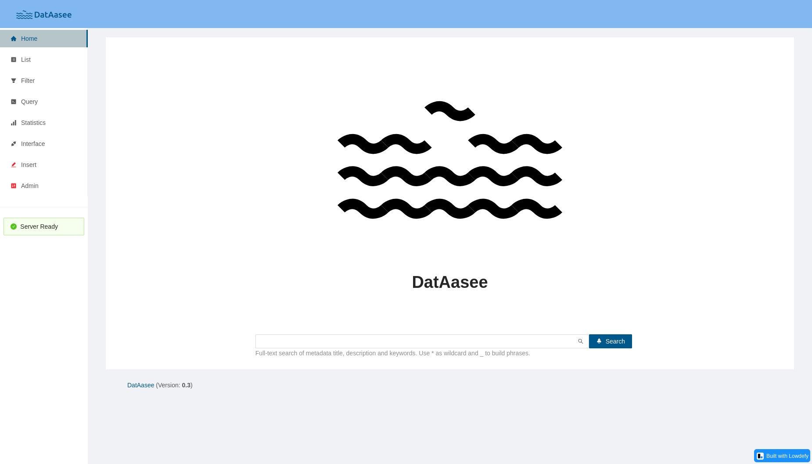
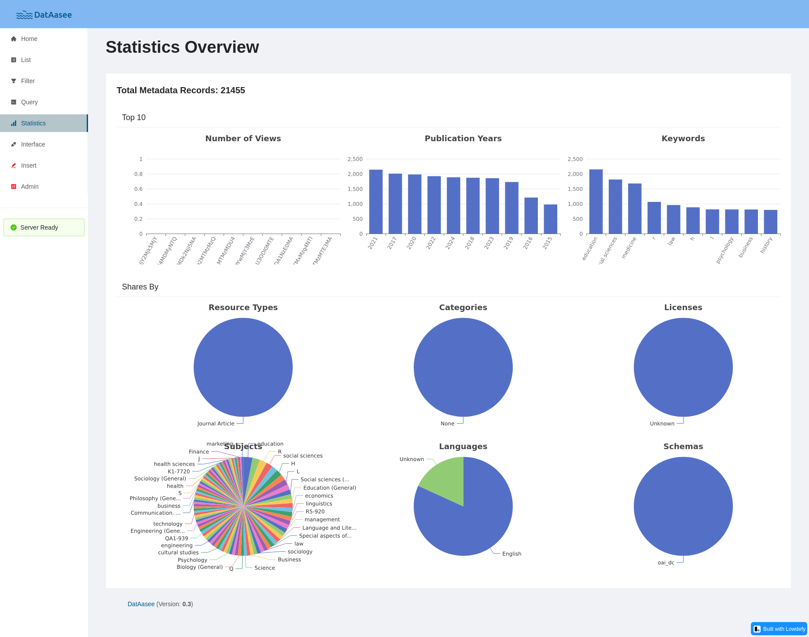

# DatAasee Software Documentation

**Version: 0.3**

**DatAasee** is a [metadata-lake](#about)
for centralizing bibliographic metadata and scientific metadata from various sources,
to increase research data findability and discoverability, as well as metadata availability,
and thus supporting [FAIR](https://www.go-fair.org/fair-principles) research and research reporting
in university libraries, research libraries, academic libraries or scientific libraries.

Particularly, **DatAasee** is developed for and by the [University and State Library of Münster](https://ulb.uni-muenster.de),
but available openly under an free and open-source license.

**Table of Contents:**

* [Explanations](#explanations)
* [How-Tos](#how-tos)
* [References](#references)
* [Tutorials](#tutorials)
* [Appendix](#appendix)

**Selected Subsections:**

* [How to Deploy](#deploy)
* [HTTP-API Reference](#http-api)
* [Schema Reference](#native-schema)
* [Runtime Configuration](#runtime-configuration)
* [Development FAQ](#development-decision-rationales)

--------------------------------------------------------------------------------

## Explanations

In this section **understanding-oriented** explanations are collected.

**Overview:**

* [About](#about)
* [Features](#features)
* [Components](#components)
* [Design](#design)
* [Data Model](#data-model)
* [EtLT Process](#etlt-process)
* [Security](#security)

### About

* What is **DatAasee**?
    - DatAasee is a metadata-lake!
* What is a **Metadata-Lake**?
    - A metadata-lake (a.k.a. metalake) is a data-lake restricted to metadata data!
* What is a **Data-Lake**?
    - A data-lake is a data architecture for structured, semi-structured and unstructured data!
* How does a data-lake differ from a **database**?
    - A data-lake includes a database, but requires further components to import and export data!
* How does a data-lake differ from a **data warehouse**?
    - A data warehouse transforms incoming data to fit its schema (cf [ETL](https://en.wikipedia.org/wiki/Extract,_transform,_load)), a data-lake ingests incoming data as-is and transforms it on-demand (cf [ELT](https://en.wikipedia.org/wiki/Extract,_load,_transform))!
* How is data in a data-lake organized?
    - A data lake includes a **metadata catalog** that stores data locations, its metadata, and transformations!
* What makes a metadata-lake special?
    - The metadata-lake's data-lake and metadata catalog coincide, this implies incomig data is partially transformed (cf [EtLT](https://www.oreilly.com/library/view/data-pipelines-pocket/9781492087823/)) to hydrate the catalog aspect of the metadata-lake!
* How does a metadata-lake differ from a **data catalog**?
    - A metadata-lake's data is (textual) metadata while a data catalog's data is databases (and their contents)!
* How is a metadata-lake a **data-lake**?
    - The ingested metadata is stored in raw form in the metadata-lake in addition to the partially transformed catalog metadata,
      and transformations are performed on the raw or catalog metadata upon request.
* How does a metadata-lake relate to a **virtual data-lake**?
    - A metadata-lake can act as a central metadata catalog for a set of distributed data sources and thus define a virtual data-lake.
* How does a metadata-lake relate to **data spaces**?
    - A data space is a set of (meta)data sources, their interrelations, best-effort interpretation, as-needed integration, and a uniform interface for access.
      In this sense the metadata-lake DatAasee can span a data space.

### Features

* **Search via:** full-text, facet-filter
* **Query by:** `SQL`, `Gremlin`, `Cypher`, `MQL`, [`GraphQL`], [`SPARQL`]
* **Ingest:** `DataCite` (XML), `DC` (XML), `LIDO` (XML), `MARC` (XML), `MODS` (XML)
* **Ingest via:** `OAI-PMH` (HTTP), `S3` (HTTP), `GET` (HTTP), Self (HTTP), [`GraphQL` (HTTP)]
* **Deploy via**: `Docker`, `Podman`, `Kubernetes`
<!-- **Export as:** [`BibJSON` (JSON)] -->
* REST-like API with CQRS aspects
* Best-of statistics of enumerated properties
* CRUD frontend for manual interaction and observation.

### Components

**DatAasee** uses a [three-tier architecture](https://en.wikipedia.org/wiki/Multitier_architecture#Three-tier_architecture)
with these separately containered components and orchestrated by [Compose](https://compose-spec.io):

| Function         | Abstraction                      | Tier                    | Product
|------------------|----------------------------------|-------------------------|----------------------------------
| Metadata Catalog | Multi-Model Database             | Data (Database)         | [ArcadeDB](https://arcadedb.com)
| EtLT Processor   | Declarative Streaming Processor  | Logic (Backend)         | [Benthos](https://github.com/redpanda-data/benthos)
| Web Frontend     | Declarative Web Framework        | Presentation (Frontend) | [Lowdefy](https://lowdefy.com)

### Design

* Each component is encapsulated in its own container.
* External access is provided through an HTTP API transporting JSON and conforming to [JSON:API](https://jsonapi.org).
* Ingests may happen via compatible protocols, e.g. `OAI-PMH`, `S3`, `HTTP-GET`.
* The frontend is optional as it is exclusively using the (backend) HTTP-API.
* Internal communication happens via the components' HTTP-APIs.
* Only the database component holds state, the backend (and frontend) are stateless.
* For more details see the [architecture documentation](arc42.md).

### Data Model

The internal data model is based on the one big table (OBT) approach, but with
the exception of linked enumerated dimensions (Look-Up tables) making it
effectively a denormalized wide table with star schema.
Specifically, the type (table) is named `metadata`.

### EtLT Process

Combining the **ETL** (Extract-Transform-Load / schema-on-write)
and **ELT** (Extract-Load-Transform / schema-on-read) concepts,
processing is built upon the **EtLT** approach:

* **E**xtract: Ingest from data source, see [ingest endpoint](#ingest-endpoint).
* **t**ransform: Partial parsing and cleaning of ingested data.
* **L**oad: Write raw and transformed data to database.
* **T**ransform: Export to format on-demand.

Particularly, this means "EtL" happens (batch-wise) during ingest, while "T" occurs when requested.

### Security

**Secrets**:

* Two secrets need to be handled: _database_ admin and _datalake_ admin passwords.
* The default _datalake_ admin user name is `admin`, the password can be passed during initial deploy, there is no default password.
* The _database_ admin user name is `root`, the password can be passed during initial deploy, there is no default password.
* These passwords are handled as secrets by the deploying compose file (loaded from an environment variable and provided to containers as a file).
* The database credentials are used by the backend and may also be used for manual database access.
* If the secrets are kept on the host, they need to be protected, see [Secret Management](#secret-management).

**Infrastructure**:

* Component containers are custom-build and hardened.
* Only `HTTP` and `Basic Authentication` are used, as it is assumed that `HTTPS` is provided by an operator-provided proxy-server. 

**Interface**:

* HTTP-API GET requests are idempotent and thus unchallenged.
* HTTP-API POST requests may change the state of the database and thus need to be authorized by the data-lake admin user credentials.
* See the [DatAasee OpenAPI definition](../api/openapi.yaml).

--------------------------------------------------------------------------------

## How-Tos

In this section, **step-by-step guides** for real-world problems are listed.

**Overview:**

* [Prerequisite](#prerequisite)
* [Resources](#resources)
* [Using DatAasee](#using-dataasee)
* [Deploy](#deploy)
* [Probe](#probe)
* [Shutdown](#shutdown)
* [Ingest](#ingest)
* [Backup Manually](#backup-manually)
* [Logs](#logs)
* [Update](#update)
* [Upgrade](#upgrade)
* [Web Interface (Prototype)](#web-interface-prototype)
* [API Indexing](#api-indexing)

### Prerequisite

The (virtual) machine deploying **DatAasee** requires [`docker-compose`](https://docs.docker.com/compose/install/)
on top of `docker` or `podman`, see also the [container engine compatibility](#container-engines).

### Resources

The compute and memory resources for **DatAasee** can be configured via the `compose.yaml`.
Overall, a bare-metal machine or virtual machine requires:

* _Minimum:_ 4 CPU, 4G RAM
* _Recommended:_ 4 CPU, 8G RAM

So, a Raspberry Pi would be sufficient.
In terms of **DatAasee** components this breaks down to:

* Database:
    * _Minimum:_ 1 CPU, 2G RAM
    * _Recommended:_ 2 CPU, 4G RAM
* Backend:
    * _Minimum:_ 1 CPU, 1G RAM
    * _Recommended:_ 2 CPU, 2G RAM
* Frontend:
    * _Minimum:_ 1 CPU, 1G RAM
    * _Recommended:_ 2 CPU, 2G RAM

Note, that resource and system requirements depend on load,
particularly, database and backend are under heavy load during ingest.
Post ingest, (new) metadata records are interrelated, also causing heavy database loads.
Generally, the _database_ drives the overall performance.
Thus, to improve performance, try first to increase the memory `limits` (in the `compose.yaml`)
for the database component (i.e. from 4G to 6G).

### Using DatAasee

In this section the terms "operator" and "user" are utilized,
where "operator" refers to the party installing, serving and maintaining DatAasee,
and "user" refers to the individuals reading from DatAasee.

**Operator Activities**

* Updating DatAasee
* Ingesting from external sources
* Database Backups

**User Activities**

* Metadata queries (schema, enumeration)
* Data queries (data)
* Custom queries

This means the user can only use the `GET` API endpoints, while the operator also uses the `POST` API endpoints.


### Deploy

```shell
$ mkdir -p backup  # or: ln -s /path/to/backup/volume backup
$ wget https://raw.githubusercontent.com/ulbmuenster/dataasee/0.3/compose.yaml
$  DB_PASS=password1 DL_PASS=password2 docker compose up -d
```

> **NOTE:** The required secrets are kept in the temporary environment variables `DL_PASS` and `DB_PASS`,
            the leading space in the line starting docker compose omits this command from the history.

> **NOTE:** To further customize your deploy, use [these environment variables](#runtime-configuration).
            The runtime configuration environment variables can be stored in an `.env` file.

> **WARNING**: Do not put secrets into the `.env` file!

### Probe

```shell
wget -SqO- http://localhost:8343/api/v1/ready
```

> **NOTE:** The default port for the HTTP API is `8343`.

### Shutdown

```shell
$ docker compose down
```

> **NOTE:** A (database) backup is automatically triggered on every shutdown.

### Ingest

```shell
$ wget -qO- http://localhost:8343/api/v1/ingest --user admin --ask-password --post-data \
  '{"source":"https://my.url/to/oai","method":"oai-pmh","format":"mods","steward":"https://my.url/identifying/steward"}'
```

> **NOTE:** A (database) backup is automatically triggered after every ingest.

### Backup Manually

```shell
$ wget -qO- http://localhost:8343/api/v1/backup --user admin --ask-password --post-data=
```

> **NOTE:** A custom backup location can alternatively also be specified inside the `compose.yaml`.

### Logs

```shell
$ docker compose logs backend --no-log-prefix
```

> **NOTE:** For better readability the log output can be piped through `grep -E --color '^([^\s]*)\s|$` highlighting the text before the first whitespace, which corresponds to the log-level in the DatAasee logs.

### Update

```shell
$ docker compose pull
$  DB_PASS=password1 DL_PASS=password2 docker compose up -d
```

> **NOTE:** "Update" means: if available, new images of the same DatAasee version but updated dependencies
            will be installed, whereas "Upgrade" means: a new version of DatAasee will be installed.

### Upgrade

```shell
$ docker compose down
$  DB_PASS=password1 DL_PASS=password2 DL_VERSION=0.3 docker compose up -d
```

> **NOTE:** `docker compose restart` cannot be used here because environment
            variables (such as `DL_VERSION`) are not updated when using restart.

> **NOTE:** Make sure to put the `DL_VERSION` variable also into the `.env` file for a permanent upgrade.

### Reset

```shell
$ docker compose restart
```

> **NOTE**: A reset may become necessary if, for example, the backend crashes during an ingest; a database backup is created during a reset, too.

### Web Interface (Prototype)

> **NOTE:** The default port for the web frontend is `80` for a production deployment and `8000` in the development environment.







### API Indexing

Add the JSON object below to the `apis` array in your global [`apis.json`](http://apisjson.org):

```json
{
  "name": "DatAasee API",
  "description": "The DatAasee API enables research data search and discovery via metadata",
  "keywords": ["Metadata"],
  "attribution": "DatAasee",
  "baseURL": "http://your-dataasee.url/api/v1",
  "properties": [
    {
      "type": "InterfaceLicense",
      "url": "https://creativecommons.org/licenses/by/4.0/"
    },
    {
      "type": "x-openapi",
      "url": "http://your-dataasee.url/api/v1/api"
    }
  ]
}
```

For [FAIRiCat](https://signposting.org/FAIRiCat/), add the JSON object below to the `linkset` array:

```json
{
  "anchor": "http://your-dataasee.url/api/v1",
  "service-doc": [
    {
      "href": "http://your-dataasee.url/api/v1/api",
      "type": "application/json",
      "title": "DatAasee API"
    }
  ]
}
```

--------------------------------------------------------------------------------

## References

In this section **technical descriptions** are summarized.

**Overview:**

* [HTTP-API](#http-api)
* [Ingest Protocols](#ingest-protocols)
* [Ingest Encodings](#ingest-encodings)
* [Ingest Formats](#ingest-formats)
* [Native Schema](#native-schema)
* [Interrelation Edges](#interrelation-edges)
* [Ingestable to Native Schema Crosswalk](#ingestable-to-native-schema-crosswalk)
* [Query Languages](#query-languages)
* [Runtime Configuration](#runtime-configuration)

### HTTP-API

The HTTP-API is served under `http://<your-url-here>/api/v1` (see [`DL_BASE`](#runtime-configuration)) and provides the following endpoints:

| Method | Endpoint                              | Type     | Summary
|--------|---------------------------------------|----------|---------
| `GET`  | [`/ready`](#ready-endpoint)           | system   | Returns service readiness
| `GET`  | [`/api`](#api-endpoint)               | system   | Returns API specification and schemas
| `GET`  | [`/schema`](#schema-endpoint)         | metadata | Returns database schema
| `GET`  | [`/attributes`](#attributes-endpoint) | metadata | Returns enumerated attributes
| `GET`  | [`/stats`](#stats-endpoint)           | data     | Returns metadata record statistics
| `GET`  | [`/sources`](#sources-endpoint)       | data     | Returns ingested metadata sources
| `GET`  | [`/metadata`](#metadata-endpoint)     | data     | Returns queried metadata record(s)
| `POST` | [`/insert`](#insert-endpoint)         | data     | Inserts single metadata record
| `POST` | [`/ingest`](#ingest-endpoint)         | system   | Triggers ingest from metsadata source
| `POST` | [`/backup`](#backup-endpoint)         | system   | Triggers database backup
| `POST` | [`/health`](#health-endpoint)         | system   | Returns service liveness
| `GET`  | `/export`                             | data     | TODO:

For details see the associated [OpenAPI definition](../api/openapi.yaml) and [api.csv](../api/api.csv).

> **NOTE:** The base path for all endpoints is `/api/v1`.

> **NOTE:** All `GET` requests are unchallenged, all `POST` requests are challenged, which are handled via "Basic Authentication".

> **NOTE:** All request and response bodies have content type `JSON`, and if provided, the `Content-Type` HTTP header must be `application/json` or `application/vnd.api+json`!

> **NOTE:** As the metadata-lake's data is metadata, a type "data" means metadata, and a type "metadata" means metadata about metadata (global metadata).

> **NOTE:** Responses follow the [JSON:API](https://jsonapi.org) format.

> **NOTE:** The `id` property is the server's [Unix timestamp](https://en.wikipedia.org/wiki/Unix_time).

---

#### `/ready` Endpoint

Returns boolean answering if service is ready.

* HTTP Method: `GET`
* Request Parameters: None
* Response Body: [`response/ready.json`](../api/response/ready.json)
* Cached Response: No
* Access: Public
* Process: [see architecture](arc42.md#ready-endpoint-public)

> **NOTE**: The `ready` endpoint can be used as readiness probe.

**Status:**

* [200](https://httpstatuses.io/200) OK
* [406](https://httpstatuses.io/406) Not Acceptable
* [413](https://httpstatuses.io/413) Payload Too Large
* [414](https://httpstatuses.io/414) Request-URI Too Long
* [503](https://httpstatuses.io/503) Service Unavailable

**Example:**

Get service readiness:
```shell
$ wget -qO- http://localhost:8343/api/v1/ready
```

---

#### `/api` Endpoint

Returns OpenAPI specification (without parameters), or request and response schema.

* HTTP Method: `GET`
* Request Parameters: [`params/api.json`](../api/params/api.json)
  * `request` (Optional; if provided, a request schema for the endpoint in the parameter value is returned.)
  * `response` (Optional; if provided, a response schema for the endpoint in the parameter value is returned.)
* Response Body: [`response/api.json`](../api/response/api.json)
* Cached Response: Yes
* Access: Public
* Process: [see architecture](arc42.md#api-endpoint-public)

> **NOTE**: In case of a successful request, the response is _NOT_ in the `JSON:API` format, but the requested JSON file directly.

**Statuses:**

* [200](https://httpstatuses.io/200) OK
* [404](https://httpstatuses.io/404) Not Found
* [406](https://httpstatuses.io/406) Not Acceptable
* [413](https://httpstatuses.io/413) Payload Too Large
* [414](https://httpstatuses.io/414) Request-URI Too Long
* [500](https://httpstatuses.io/500) Internal Server Error

**Examples:**

Get OpenAPI definition:
```shell
$ wget -qO- http://localhost:8343/api/v1/api
```

Get `ingest` endpoint request schema:
```shell
$ wget -qO- http://localhost:8343/api/v1/api?request=ingest
```

Get `metadata` endpoint response schema:
```shell
$ wget -qO- http://localhost:8343/api/v1/api?response=metadata
```

---

#### `/schema` Endpoint

Returns internal metadata schema.

* HTTP Method: `GET`
* Request Parameters: None
* Response Body: [`response/schema.json`](../api/response/schema.json)
* Cached Response: Yes
* Access: Public
* Process: [see architecture](arc42.md#schema-endpoint-public-cached)

**Statuses:**

* [200](https://httpstatuses.io/200) OK
* [406](https://httpstatuses.io/406) Not Acceptable
* [413](https://httpstatuses.io/413) Payload Too Large
* [414](https://httpstatuses.io/414) Request-URI Too Long
* [500](https://httpstatuses.io/500) Internal Server Error

**Example:**

Get native metadata schema:
```shell
$ wget -qO- http://localhost:8343/api/v1/schema
```

---

#### `/attributes` Endpoint

Returns list of enumerated attribute values.

* HTTP Method: `GET`
* Request Parameters: [`params/attributes.json`](../api/params/attributes.json)
    * `type` (Optional; if provided only selected attribute type is returned.)
* Response Body: [`response/attributes.json`](../api/response/attributes.json)
* Cached Response: Yes
* Access: Public
* Process: [see architecture](arc42.md#attributes-endpoint-public-cached)

**Statuses:**

* [200](https://httpstatuses.io/200) OK
* [404](https://httpstatuses.io/404) Not Found
* [406](https://httpstatuses.io/406) Not Acceptable
* [413](https://httpstatuses.io/413) Payload Too Large
* [414](https://httpstatuses.io/414) Request-URI Too Long
* [500](https://httpstatuses.io/500) Internal Server Error

**Example:**

Get all enumerated attributes:
```shell
$ wget -qO- http://localhost:8343/api/v1/attributes
```

Get "languages" enumerated attributes:
```shell
$ wget -qO- http://localhost:8343/api/v1/attributes?type=languages
```

---

#### `/stats` Endpoint

Return statistics about records.

* HTTP Method: `GET`
* Request Parameters: None
* Response Body: [`response/stats.json`](../api/response/stats.json)
* Cached Response: Yes
* Access: Public
* Process: [see architecture](arc42.md#stats-endpoint-public-cached)

**Statuses:**

* [200](https://httpstatuses.io/200) OK
* [406](https://httpstatuses.io/406) Not Acceptable
* [413](https://httpstatuses.io/413) Payload Too Large
* [414](https://httpstatuses.io/414) Request-URI Too Long
* [500](https://httpstatuses.io/500) Internal Server Error

**Example:**

```shell
$ wget -qO- http://localhost:8343/api/v1/stats
```

---

#### `/sources` Endpoint

Return ingested sources.

* HTTP Method: `GET`
* Request Parameters: None
* Response Body: [`response/sources.json`](../api/response/sources.json)
* Cached Response: Yes
* Access: Public
* Process: [see architecture](arc42.md#sources-endpoint-public-cached)

**Statuses:**

* [200](https://httpstatuses.io/200) OK
* [406](https://httpstatuses.io/406) Not Acceptable
* [413](https://httpstatuses.io/413) Payload Too Large
* [414](https://httpstatuses.io/414) Request-URI Too Long
* [500](https://httpstatuses.io/500) Internal Server Error

**Example:**

```shell
$ wget -qO- http://localhost:8343/api/v1/sources
```

---

#### `/metadata` Endpoint

Fetch from, search, filter or query metadata record(s).
Four modes of operation are available:

* If `id` is given, a record with this `recordId` is returned if it exists;
* if `query` and `language` are given, a custom query is send;
* if `source` and optionally `format` are given a source query is send;
* if no `id` or `source` is given and the `language` is not a compatible query language,
  a combined full-text search of `search` and faceted search of `language`, `resourcetype`, `license`, `category`, `format`, `from`, `till` is performed.

Paging via `page` is supported only for the source query and the combined full-text and filter search, sorting via `newest` only for the latter.

* HTTP Method: `GET`
* Request Parameters: [`params/metadata.json`](../api/params/metadata.json)
    * `id` (Optional; if provided, a metadata record with this `recordId` is returned.)
    * `source` (Optional; if provided, metadata records from this `source` is returned.)
    * `query` (Optional; if provided, query results using this value are returned, no `language` parameter implies `sql`.)
    * `language` (Optional; if provided, filter results by `language` are returned, also used to set `query` language.)
    * `search` (Optional; if provided, full-text search results for this value are returned.)
    * `resourcetype` (Optional; if provided, filter results by `resourceType` are returned.)
    * `license` (Optional; if provided, filter results by `license` are returned.)
    * `category` (Optional; if provided, filter results by `category` are returned.)
    * `format` (Optional; if provided, filter results by `metadataFormat` are returned.)
    * `from` (Optional; if provided, filter results greater or equal `publicationYear` are returned.)
    * `till` (Optional; if provided, filter results lesser or equal `publicationYear` are returned.)
    * `page` (Optional; if provided, the n-th page of results is returned.)
    * `newest` (Optional; if provided, results are sorted new-to-oldest if true (default), or old-to-new if false.)
* Response Body: [`response/metadata.json`](../api/response/metadata.json)
* Cached Response: No
* Access: Public
* Process: [see architecture](arc42.md#metadata-endpoint-public)

> **NOTE:** Only idem-potent read operations are permitted in custom queries.

> **NOTE:** This endpoint's responses includes pagination links, except for custom queries.

> **NOTE:** For searches without `id` and `query`, a maximum of **20** results are returned;
  for by-source and custom queries using `query` a maximum of **100** results are returned.

> **NOTE:** An explicitly empty `source` parameter (i.e. `source=`) implies all sources.

> **NOTE:** A full-text search always matches for all argument terms (AND-based) in titles, descriptions and keywords in any order, 
  while accepting `*` as wildcards and `_` to build phrases.

**Statuses:**

* [200](https://httpstatuses.io/200) OK
* [404](https://httpstatuses.io/404) Not Found
* [406](https://httpstatuses.io/406) Not Acceptable
* [413](https://httpstatuses.io/413) Payload Too Large
* [414](https://httpstatuses.io/414) Request-URI Too Long
* [500](https://httpstatuses.io/500) Internal Server Error

**Examples:**

Get record by record identifier:
```shell
$ wget -qO- http://localhost:8343/api/v1/metadata?id=
```

Search records by single filter:
```shell
$ wget -qO- http://localhost:8343/api/v1/metadata?language=chinese
```

Search records by multiple filters:
```shell
$ wget -qO- http://localhost:8343/api/v1/metadata?resourcetype=book&language=german
```

Search records by full-text for word "History":
```shell
$ wget -qO- http://localhost:8343/api/v1/metadata?search=History
```

Search records by full-text and filter, oldest first:
```shell
$ wget -qO- http://localhost:8343/api/v1/metadata?search=Geschichte&resourcetype=book&language=german&newest=false
```

Search records by custom SQL query:
```shell
$ wget -qO- http://localhost:8343/api/v1/metadata?language=sql&query=SELECT%20FROM%20metadata%20LIMIT%2010
```

List the second page of records from all sources:
```shell
$ wget -qO- http://localhost:8343/api/v1/metadata?source=&page=1
```

---

#### `/insert` Endpoint

Inserts and parses, if necessary, a new record into the database.

* HTTP Method: `POST`
* Request Body: [`request/insert.json`](../api/request/insert.json)
* Response Body: [`response/insert.json`](../api/response/insert.json)
* Cached Response: No
* Access: Challenged (Basic Authentication)
* Process: [see architecture](arc42.md#insert-endpoint-private)

> **NOTE:** This endpoint is meant for metadata records that are not ingestible like a report of ingested sources;
            general use is discouraged. For details on the request body, see the associated [JSON schema](../api/request/insert.json).

**Status:**

* [201](https://httpstatuses.io/201) Created
* [400](https://httpstatuses.io/400) Bad Request
* [403](https://httpstatuses.io/403) Invalid Credentials
* [406](https://httpstatuses.io/406) Not Acceptable
* [413](https://httpstatuses.io/413) Payload Too Large
* [414](https://httpstatuses.io/414) Request-URI Too Long
* [500](https://httpstatuses.io/500) Internal Server Error

**Example:**

Insert record with given fields: TODO:
```shell
$ wget -qO- http://localhost:8343/api/v1/insert --user admin --ask-password --post-file=myinsert.json
```

---

#### `/ingest` Endpoint

Trigger ingest from data source.

* HTTP Method: `POST`
* Request Body: [`request/ingest.json`](../api/request/ingest.json)
    * `source` must be an URL
    * `method` must be one of `oai-pmh`, `s3`, `get`, or another DatAasee instance
    * `format` must be one of `datacite`, `oai_datacite`, `dc`, `oai_dc`, `marc21`, `marcxml`, `mods`, or `rawmods`
    * `steward` should be an URL or email address
    * `username` (optional) a username or access key (if needed) 
    * `password` (optional) a password or secret key (if needed)
* Response Body: [`response/ingest.json`](../api/response/ingest.json)
* Cached Response: No
* Access: Challenged (Basic Authentication)
* Process: [see architecture](arc42.md#ingest-endpoint-private-external-read)

> **NOTE:** To test if the server is busy, send an empty (POST) body to this endpoint.
            HTTP status `200` means here available, status `503` means currently ingesting.

> **NOTE:** The `method` and `format` are case-sensitive.

**Status:**

* [200](https://httpstatuses.io/200) OK
* [202](https://httpstatuses.io/202) Accepted
* [400](https://httpstatuses.io/400) Bad Request
* [403](https://httpstatuses.io/403) Invalid credentials
* [406](https://httpstatuses.io/406) Not Acceptable
* [413](https://httpstatuses.io/413) Payload Too Large
* [414](https://httpstatuses.io/414) Request-URI Too Long
* [503](https://httpstatuses.io/503) Service Unavailable

**Example:**

Start ingest from a given source:
```shell
$ wget -qO- http://localhost:8343/api/v1/ingest --user admin --ask-password --post-data \
  '{"source":"https://datastore.uni-muenster.de/oai", "method":"oai-pmh", "format":"datacite", "steward":"forschungsdaten@uni-muenster.de"}'
```

---

#### `/backup` Endpoint

Trigger database backup.

* HTTP Method: `POST`
* Request Body: None
* Response Body: [`response/backup.json`](../api/response/backup.json)
* Cached Response: No
* Access: Challenged (Basic Authentication)
* Process: [see architecture](arc42.md#backup-endpoint-private-external-write)

> **NOTE**: The backup location can be set through the `DL_BACKUP` environment variable.

**Status:**

* [200](https://httpstatuses.io/200) OK
* [403](https://httpstatuses.io/403) Invalid Credentials
* [406](https://httpstatuses.io/406) Not Acceptable
* [413](https://httpstatuses.io/413) Payload Too Large
* [414](https://httpstatuses.io/414) Request-URI Too Long
* [500](https://httpstatuses.io/500) Internal Server Error

**Example:**

```shell
$ wget -qO- http://localhost:8343/api/v1/backup --user admin --ask-password --post-data=''
```

---

#### `/health` Endpoint

Returns internal status and versions of service components.

* HTTP Method: `POST`
* Request Body: None
* Response Body: [`response/health.json`](../api/response/health.json)
* Cached Response: No
* Access: Challenged (Basic Authentication)
* Process: [see architecture](arc42.md#health-endpoint-private)

> **NOTE**: The `health` endpoint can be used as liveness probe.

**Status:**

* [200](https://httpstatuses.io/200) OK
* [403](https://httpstatuses.io/403) Invalid Credentials
* [406](https://httpstatuses.io/406) Not Acceptable
* [413](https://httpstatuses.io/413) Payload Too Large
* [414](https://httpstatuses.io/414) Request-URI Too Long
* [500](https://httpstatuses.io/500) Internal Server Error

**Example:**

Get service health:
```shell
$ wget -qO- http://localhost:8343/api/v1/health --user admin --ask-password --post-data=''
```

---

#### `/export` Endpoint

TODO:

### Ingest Protocols

* [OAI-PMH](http://www.openarchives.org/OAI/openarchivesprotocol.html) (Open Archives Initiative Protocol for Metadata Harvesting)
  * Identifier: `oai-pmh`
  * Supported Versions: `2.0`
  * List available metadata formats via `http://url.to/oai?verb=ListMetadataFormats`
* [S3](https://docs.aws.amazon.com/AmazonS3/latest/API) (Simple Storage Service)
  * Identifier: `s3`
  * Supported Versions: `2006-03-01`
  * Expects a bucket of files in the same format (!) which is ingested entirely file by file
* [GET](https://httpwg.org/specs/rfc9110.html#GET) (Plain HTTP GET)
  * Identifier: `get`
  * Expects a single `.xml` file
  * The file's contents require an XML root-element (of any name).
* [DatAasee](https://github.com/ulbmuenster/dataasee)
  * Identifier: `dataasee`
  * Supported Versions: `0.3`
  * Ingest all contents from another DatAasee instance, an associated format parameter is ignored.

### Ingest Encodings

Currently, [XML](https://www.w3.org/XML) (eXtensible Markup Language) is the sole encoding for
ingested metadata, with the exception of ingesting via the `DatAasee` protocol, which uses
[JSON](https://www.json.org) (JavaScript Object Notation).

### Ingest Formats

* [DataCite](https://datacite.org/)
  * Identifiers: `datacite`, `oai_datacite`
  * Supported Versions: `4.4`, `4.5`, `4.6`
  * [Format Specification](https://support.datacite.org/docs/datacite-metadata-schema-v44-properties-overview)
* [DC](https://www.dublincore.org/) (Dublin Core)
  * Identifiers: `dc`, `oai_dc`
  * Supported Versions: `1.1`
  * [Format Specification](https://www.dublincore.org/specifications/dublin-core/dces/)
* [LIDO](https://lido-schema.org) (Lightweight Information Describing Objects)
  * Identifiers: `lido`
  * Supported Versions: `1.0`
  * [Format Specification](https://cidoc.mini.icom.museum/working-groups/lido/lido-overview/lido-schema/)
* [MARC](https://www.loc.gov/marc/) (MAchine-Readable Cataloging)
  * Identifier: `marc21`, `marcxml`
  * Supported Versions: `1.1` (XML)
  * [Format Specification](https://www.loc.gov/marc/bibliographic/)
* [MODS](http://www.loc.gov/mods/) (Metadata Object Description Schema)
  * Identifiers: `mods`, `rawmods`
  * Supported Versions: `3.7`, `3.8`
  * [Format Specification](https://www.loc.gov/standards/mods/userguide/generalapp.html)

### Native Schema

The main type of the `metadatalake` database is `metadata` vertex type with the
following properties:

| Key                | Class       | Entry     | Internal Type | Constraints         | Comment
|--------------------|-------------|-----------|---------------|---------------------|---------
| `schemaVersion`    | Process     | Automatic | Integer       |                     |
| `recordId`         | Process     | Automatic | String        |                     |
| `metadataChecksum` | Process     | Automatic | String        |                     |
| `metadataQuality`  | Process     | Automatic | String        |                     |
| `dataSteward`      | process     | Automatic | String        | max 4095            |
| `source`           | Process     | Automatic | String        | max 4095            |
| `createdAt`        | Process     | Automatic | Datetime      |                     |
||||||
| `metadataFormat`   | Technical   | Automatic | String        | max 255             |
| `sizeBytes`        | Technical   | Automatic | Integer       | min 0               |
| `dataFormat`       | Technical   | Automatic | String        | max 255             |
| `dataLocation`     | Technical   | Automatic | String        | max 4095, regexp    |
||||| |
| `numberViews`      | Social      | Automatic | Integer       | min 0               |
| `keywords`         | Social      | Optional  | String        | max 255             | Comma separated
| `categories`       | Social      | Optional  | List(String)  | max 4               | Pass array of strings to API, returned as array of strings form API
||||||
| `name`             | Descriptive | Mandatory | String        | max 255             |
| `creators`         | Descriptive | Mandatory | List(pair)    | max 255             | Pass array of [pair](#pair-documents) objects (name, identifier) to API
| `publisher`        | Descriptive | Mandatory | String        | max 255             |
| `publicationYear`  | Descriptive | Mandatory | Integer       | min -9999, max 9999 |
| `resourceType`     | Descriptive | Mandatory | Link(pair)    | resourceTypes       | Pass string to API, returned as string from API
| `identifiers`      | Descriptive | Mandatory | List(pair)    | max 255             | Pass array of [pair](#pair-documents) objects (type, identifier) to API
||||||
| `synonyms`         | Descriptive | Optional  | List(pair)    | max 255             | Pass array of [pair](#pair-documents) objects (type, title) to API
| `language`         | Descriptive | Optional  | Link(pair)    | languages           | Pass string to API, returned as string from API
| `subjects`         | Descriptive | Optional  | List(pair)    | max 255             | Pass array of [pair](#pair-documents) objects (name, identifier) to API
| `version`          | Descriptive | Optional  | String        | max 255             |
| `license`          | Descriptive | Optional  | Link(pair)    | licenses            | Pass string to API, returned as string from API
| `rights`           | Descriptive | Optional  | String        | max 65535           |
| `fundings`         | Descriptive | Optional  | List(pair)    | max 255             | Pass array of [pair](#pair-documents) objects (project, funder) to API
| `description`      | Descriptive | Optional  | String        | max 65535           |
| `message`          | Descriptive | Optional  | String        | max 65535           |
| `externalItems`    | Descriptive | Optional  | List(pair)    | max 255             | Pass array of [pair](#pair-documents) objects (type, URL) to API
||||||
| `rawMetadata`      | Raw         | Optional  | String        | max 2097151         | Larger raw data is discarded

> **NOTE:** See also the schema diagram: [schema.md](schema.md)

> **NOTE:** The properties `related` and `visited` are only for internal purposes and hence not listed here.

> **NOTE**: The preloaded set of `categories` (see [categories.csv](../database/preload/categories.csv)) is highly opinionated.

#### Global Metadata

The `metadata` type has the custom metadata fields:

| Key       | Type    | Comment
|-----------|---------|---------
| `version` | Integer | Internal schema version (compare against `schemaVersion`)
| `comment` | String  | Database comment

#### Property Metadata

Each schema property has a `label`, additionally the descriptive properties have
a `comment` property.

| Key       | Type    | Comment
|-----------|---------|---------
| `label`   | String  | For UI labels
| `comment` | String  | For UI helper texts

#### `pair` Documents

A helper document type used for `creators`, `identifiers`, `synonyms`, `subjects`, `fundings`, `externalItems` link targets or list elements.

| Property | Type   | Constraints
|----------|--------|------------
| `name`   | String | max 255
| `data`   | String | max 4095, regexp

### Interrelation Edges

| Type                    | Comment
|-------------------------|---------
| `isRelatedTo`           | Base edge type
| `isNewVersionOf`        | Derived from `isRelatedTo`
| `isDerivedFrom`         | Derived from `isRelatedTo`
| `isPartOf`              | Derived from `isRelatedTo`
| `commonExpression`      | Derived from `isRelatedTo`
| `commonManifestation`   | Derived from `isRelatedTo`

#### Edge Metadata

| Key        | Type    | Comment
|------------|---------|---------
| `label`    | String  | For UI labels (outbound edge)
| `altlabel` | String  | For UI labels (incoming edge)

### Ingestable to Native Schema Crosswalk

TODO: Add sub elements

| DatAasee                | DataCite                                                           | DC            | LIDO                                                                                      | MARC                                     | MODS
|------------------------:|:------------------------------------------------------------------:|:-------------:|:-----------------------------------------------------------------------------------------:|:----------------------------------------:|:----:
| `name`                  | `titles.title`                                                     | `title`       | `descriptiveMetadata.objectIdentificationWrap.titleWrap.titleSet`                         | `245`, `130`                             | `titleInfo.title`, `titleInfo.partName`, `titleInfo.partNumber`, `part.text`, `part.detail.title`, `part.detail.caption`
| `creators`              | `creators.creator`                                                 | `creator`     |                                                                                           | `100`, `700`                             | `name`, `relatedItem`
| `publisher`             | `publisher`                                                        | `publisher`   |                                                                                           | `260`, `264`                             | `originInfo.publisher`
| `publicationYear`       | `publicationYear`                                                  | `date`        | `descriptiveMetadata.eventWrap.eventSet`                                                  | `260`, `264`                             | `originInfo.dateIssued`, `originInfo.dateCreated`, `originInfo.dateCaptured`, `originInfo.dateOther`, `part`, `recordInfo`
| `resourceType`          | `resourceType`                                                     | `type`        | `descriptiveMetadata.objectClassificationWrap.objectWorkTypeWrap.objectWorkType`          | `007`, `337`                             | `genre`, `typeOfResource`
| `identifiers`           | `identifier`, `alternateIdentifiers.alternateIdentifier`           | `identifier`  | `objectPublishedID`                                                                       | `001`, `020`, `856`                      | `identifier`, `recordInfo.recordIdentifier`
| `synonyms`              | `titles.title`                                                     | `title`       | `descriptiveMetadata.objectIdentificationWrap.titleWrap.titleSet`                         | `210`, `222`, `240`, `242`, `246`, `247` | `titleInfo.title`, `titleInfo.subTitle`
| `language`              | `language`                                                         | `language`    |                                                                                           | `008`, `041`                             | `language.languageTerm`
| `subjects`              | `subjects.subject`                                                 |               | `category.Concept`                                                                        | `655`, `689`                             | `subject.topic`, `subject.geographic`, `subject.genre`, `subject.temporal`, `subject.occupation`
| `version`               | `version`                                                          |               |                                                                                           | `250`                                    | `originInfo.edition`
| `license`               | `rightsList.rights`                                                |               |                                                                                           |                                          | `accessCondition`
| `rights`                |                                                                    | `rights`      | `administrativeMetadata.rightsWorkWrap.rightsWorkSet`                                     | `506`, `540`                             | `accessCondition`
| `fundings`              | `fundingReferences.fundingReference`                               |               |                                                                                           |                                          |
| `description`           | `descriptions.description`                                         | `description` | `descriptiveMetadata.objectIdentificationWrap.objectDescriptionWrap.objectDescriptionSet` | `520`                                    | `abstract`
| `message`               |                                                                    |               |                                                                                           | `500`                                    | `note`
| `externalItems`         | `relatedIdentifiers.relatedIdentifier`                             | `related`     |                                                                                           |                                          | `identifier`
|||||
| `keywords`              | `subjects.subject`                                                 | `subject`     | `category.term`                                                                           |                                          |
|||||
| `dataLocation`          | `identifier`                                                       | `source`      |                                                                                           |                                          |
| `dataFormat`            | `formats.format`                                                   | `format`      |                                                                                           |                                          |
| `sizeBytes`             |                                                                    |               |                                                                                           |                                          |
|||||
| `isRelatedTo`           | `relatedItems.relatedItem`, `relatedIdentifiers.relatedIdentifier` | `related`     |                                                                                           | `773`                                    | `relatedItem`
| `isNewVersionOf`        | `relatedItems.relatedItem`, `relatedIdentifiers.relatedIdentifier` |               |                                                                                           |                                          | `relatedItem`
| `isDerivedFrom`         | `relatedItems.relatedItem`, `relatedIdentifiers.relatedIdentifier` |               |                                                                                           |                                          | `relatedItem`
| `isPartOf`              | `relatedItems.relatedItem`, `relatedIdentifiers.relatedIdentifier` |               |                                                                                           |                                          | `relatedItem`
| `CommonExpression`      |                                                                    |               |                                                                                           |                                          | `relatedItem`
| `CommonManifestation`   |                                                                    |               |                                                                                           |                                          | `recordInfo`

### Query Languages

| Language | Identifier | Documentation
|----------|------------|---------------
| SQL      | `sql`      | [ArcadeDB SQL](https://docs.arcadedb.com/#sql)
| Cypher   | `cypher`   | [Neo4J Cypher](https://neo4j.com/docs/cypher-manual/current/)
| GraphQL  | `graphql`  | [GraphQL Spec](https://spec.graphql.org/)
| Gremlin  | `gremlin`  | [Tinkerpop Gremlin](https://kelvinlawrence.net/book/PracticalGremlin.html)
| MQL      | `mongo`    | [Mongo MQL](https://www.mongodb.com/docs/manual/tutorial/query-documents/)
|||
| SPARQL   | `sparql`   | [SPARQL](https://www.w3.org/TR/sparql11-query/) (WIP)

### Runtime Configuration

The following environment variables affect **DatAasee** if set before starting.

| Symbol       | Value                     | Meaning
|--------------|---------------------------|---------
| `TZ`         | `CET` (Default)           | Timezone of database and backend servers
| `DL_PASS`    | `password1` (Example)     | DatAasee password (**use only command local!**)
| `DB_PASS`    | `password2` (Example)     | Database password (**use only command local!**)
| `DL_VERSION` | `0.3` (Example)           | Requested DatAasee version
| `DL_BACKUP`  | `$PWD/backup` (Default)   | Path to backup folder
| `DL_USER`    | `admin` (Default)         | DatAasee admin username
| `DL_BASE`    | `http://my.url` (Example) | Outward DatAasee base URL (including protocol and port, but no trailing slash)
| `DL_PORT`    | `8343` (Default)          | DatAasee API port
| `FE_PORT`    | `8000`                    | Web Frontend port (development default `8000`, release default `80`)

--------------------------------------------------------------------------------

## Tutorials

In this section **learning-oriented** lessons for new-comers are given.

**Overview:**

* [Getting Started](#getting-started)
* [Example Ingest](#example-ingest)
* [Example Harvest](#example-harvest)
* [Secret Management](#secret-management)
* [Container Engines](#container-engines)
* [Container Probes](#container-probes)
* [Custom Queries](#custom-queries)
* [Custom Frontend](#custom-frontend)

### Getting Started

0. Setup [compatible compose](#container-engines) orchestrator
1. Download **DatAasee** release
    ```shell
    $ wget https://raw.githubusercontent.com/ulbmuenster/dataasee/0.3/compose.yaml
    ```
    or:
    ```shell
    $ curl https://raw.githubusercontent.com/ulbmuenster/dataasee/0.3/compose.yaml
    ```
2. Create or mount folder for backups (assuming your backup volume is mounted under `/backup` on the host in case of mount)
    ```shell
    $ mkdir -p backup
    ```
    or:
    ```shell
    $ ln -s /backup backup
    ```
3. Start **DatAasee** service, note the space in front of the command excluding it from the terminal history.
    ```shell
    $  DB_PASS=password1 DL_PASS=password2 docker compose up -d
    ```
      or:
    ```shell
    $  DB_PASS=password1 DL_PASS=password2 podman compose up -d
    ```

Now, if started locally point a browser to `http://localhost:8000` to use the web frontend,
or send requests to `http://localhost:8343/api/v1/` to use the HTTP API directly, for example via `wget` or `curl`.

### Example Ingest

For demonstration purposes the collection of the "Directory of Open Access Journals" (DOAJ) is ingested.
An ingest has four phases: First, the administrator needs to collect the necessary information of the metadata source,
i.e. URL, protocol, format, and data steward.
Second, the ingest is triggered via the HTTP-API.
Third, the backend ingests the metadata records from the source to the database.
Fourth and lastly, the ingested data is interconnected inside the database.

1. Check the documentation of DOAJ:
    ```http
    https://doaj.org/docs
    ```
   The `oai-pmh` protocol is available.

2. Check the documentation about OAI-PMH:
    ```http
    https://doaj.org/docs/oai-pmh/
    ```
   The OAI-PMH endpoint URL is: `https://doaj.org/oai`.

3. Check the OAI-PMH for available metadata formats:
    ```http
    https://doaj.org/oai?verb=ListMetadataFormats
    ```
   A compatible metadata format is `oai_dc`.

4. Start an ingest:
    ```shell
    $ wget -qO- http://localhost:8343/api/v1/ingest --user admin --ask-password --post-data \
      '{"source":"https://doaj.org/oai", "method":"oai-pmh", "format":"oai_dc", "steward":"helpdesk@doaj.org"}'
    ```
   A status `202` confirms the start of the ingest.
   Here, no steward is listed in the DOAJ documentation, thus a general contact is set.
   Alternatively, the "Ingest" form of the "Admin" page in the web frontend can be used.

5. DatAasee reports the start of the ingest in the backend logs:
    ```shell
    $ docker logs dataasee-backend-1
    ```
   with a message akin to: `Starting ingest from https://doaj.org/oai via oai-pmh as oai_dc.`.

6. DatAasee reports completion of the ingest in the backend logs:
    ```shell
    $ docker logs dataasee-backend-1
    ```
   with a message akin to: `Finished ingest of 21424 records from https://doaj.org/oai after 0.1h.`.

7. DatAasee starts interconnecting the ingested metadata records:
    ```shell
    $ docker logs dataasee-database-1
    ```
   with a message akin to: `Interconnect Started!`.

8. DatAasee finishes interconnecting the ingested metadata records:
    ```shell
    $ docker logs dataasee-database-1
    ```
   with a message akin to: `Interconnect Completed!`.

> **NOTE:** The interconnection is a potentially long-running, asynchronous operation, whose status is only reported in the database logs.

> **NOTE:** Generally, the ingest methods `OAI-PMH` for suitable sources, `S3` for multi-file sources, and `GET` for single-file sources should be used.

### Example Harvest TODO:

A typical use-case for DatAasee is to forward all metadata records from a specific source.
To demonstrate this, the previous [Example Ingest](#example-ingest) is assumed to have happened.

1. Check the ingested sources
    ```
    $ wget http://localhost:8343/api/v1/sources
    ```

2. Request the first set of metadata records from source `https://doaj.org/oai` (the source needs to be [URL encoded](https://en.wikipedia.org/wiki/Percent-encoding)):
    ```shell
    $ wget http://localhost:8343/api/v1/metadata?source=https%3A%2F%2Fdoaj.org%2Foai
    ```
   At most 100 records are returned. For the first page, also the parameter `page=0` may be used.

3. Request the next set of metadata records via pagination:
    ```shell
    $ wget http://localhost:8343/api/v1/metadata?source=https%3A%2F%2Fdoaj.org%2Foai&page=1
    ```
   The last page will contain less than 100 records, all pages before contain 100 records.

> **NOTE**: Using the `source` filter, the **full** record is returned, instead of a search result when used without.


### Secret Management

Two secrets need to be managed for DatAasee, the database root password and the backend admin password.
To protect these secrets on a host running docker(-compose), for example, the following tools can be used:

#### [sops](https://getsops.io)

```shell
$ printf "DB_PASS=password1\nDL_PASS=password2" > secrets.env
```

```shell
$ sops encrypt -i secrets.env
```

```shell
$ sops exec-env secrets.env 'docker compose up -d'
```

#### consul & [envconsul](https://github.com/hashicorp/envconsul)

```shell
$ consul kv put dataasee/DB_PASS password1
```

```shell
$ consul kv put dataasee/DL_PASS password2
```

```shell
$ envconsul -prefix dataasee docker compose up -d
```

#### [env-vault](https://github.com/romantomjak/env-vault)

```shell
$ EDITOR=nano env-vault create secrets.env
```

* Enter a password and then in the editor (here `nano`) the secrets line-by-line `DB_PASS=password1`, `DL_PASS=password2`; save and exit.

```shell
$ env-vault secrets.env docker compose -- up -d
```

#### `openssl`

```shell
$  printf "DB_PASS=password1\nDL_PASS=password2" | openssl aes-256-cbc -e -a -salt -pbkdf2 -in - -out secrets.enc
```

```shell
$ (openssl aes-256-cbc -d -a -pbkdf2 -in secrets.enc -out secrets.env; docker compose up -d --env-file .env --env-file secrets.env; rm secrets.env)
```


### Container Engines

**DatAasee** is deployed via a `compose.yaml` (see [How to deploy](#deploy)),
which is compatible to the following container and orchestration tools:

* Docker / Podman via [`docker compose`](https://docs.docker.com/compose/) 
* Kubernetes / Minikube via [`kompose`](https://kompose.io)

#### Docker-Compose (Docker)

* docker
* docker compose >= 2

Installation see: [docs.docker.com/compose/install/](https://docs.docker.com/compose/install/)

```shell
$ docker compose up -d
```

```shell
$ docker compose ps
```

```shell
$ docker compose down
```

#### Docker-Compose (Podman)

* podman
* docker compose

Installation see: [docs.docker.com/compose/install/](https://docs.docker.com/compose/install/)

> **NOTE**: Alternatively the package `podman-docker` can be used to emulate docker through podman.

> **NOTE**: The compose implementation `podman-compose` is not compatible at the moment.

```shell
$ podman compose up -d
```

```shell
$ podman compose ps
```

```shell
$ podman compose down
```

#### Kompose (Minikube)

* minikube
* kubectl
* kompose

Installation see: [kompose.io/installation/](https://kompose.io/installation/)

Rename `compose.yaml` to `compose.txt` and run:

```shell
$ kompose -f compose.txt convert
```

* In `database-deployment.yaml` change:
    * `mountPath: /db` to `mountPath: /db/secret`
    * `secretName: database` to `secretName: dataasee`

* In `backend-deployment.yaml` change:
    * `mountPath: /db` to `mountPath: /db/secret`
    * `secretName: database` to `secretName: dataasee`
    * `mountPath: /dl` to `mountPath: /dl/secret`
    * `secretName: datalake` to `secretName: dataasee`

```shell
$ minikube start
```

```shell
$ kubectl create secret generic dataasee --from-literal=database=password1 --from-literal=datalake=password2
```

```shell
$ kubectl apply -f .
```

```shell
$ kubectl port-forward service/backend 8343:8343  # now the backend can be accessed via `http://localhost:8343/api/v1`
```

```shell
$ minikube stop
```

### Container Probes

The following endpoints are available for monitoring the respective containers;
here the `compose.yaml` host names (service names) are used.
Logs are written to the standard output.

#### Backend

**Ready**:
```http
http://backend:4195/ready
```
returns HTTP status `200` if ready, see also [Benthos `ready`](https://docs.redpanda.com/redpanda-connect/components/http/about/#endpoints).

**Liveness**:
```http
http://backend:4195/ping
```
returns HTTP status `200` if live, see also [Benthos `ping`](https://docs.redpanda.com/redpanda-connect/components/http/about/#endpoints).

**Metrics**:
```http
http://backend:4195/metrics
```
allows [Prometheus](https://prometheus.io) scraping, see also [Connect `prometheus`](https://docs.redpanda.com/redpanda-connect/components/metrics/prometheus/).

#### Database

**Ready:**
```http
http://database:2480/api/v1/ready
```
returns HTTP status `204` if ready, see also [ArcadeDB `ready`](https://docs.arcadedb.com/#http-checkready).

#### Frontend

**Ready:**
```http
http://frontend:3000
```
returns HTTP status `200` if ready.


### Custom Queries

> **NOTE:** All custom query results are limited to 100 items.

#### SQL

**DatAasee** uses the [ArcadeDB SQL dialect](https://docs.arcadedb.com/#sql).
For custom SQL queries, only single, read-only queries are admissible,
meaning:

* [`SELECT`](https://docs.arcadedb.com/#sql-select)
* [`MATCH`](https://docs.arcadedb.com/#sql-match)
* [`TRAVERSE`](https://docs.arcadedb.com/#sql-traverse)

The vertex type (cf. table) holding the metadata records is named `metadata`.

**Examples:**

Get the schema:
```sql
SELECT FROM schema:types
```

Get one-hundred metadata record titles:
```sql
SELECT name FROM metadata
```

#### Gremlin TODO:

**DatAasee** supports a subset of [Gremlin](https://docs.arcadedb.com/#gremlin-api).

Get one-hundred metadata record titles:
```gremlin
g.V().hasLabel("metadata")
```

#### Cypher

**DatAasee** supports a subset of [OpenCypher](https://docs.arcadedb.com/#open-cypher).
For custom Cypher queries, only read-queries are admissible,
meaning:

* `MATCH`
* `OPTIONAL MATCH`
* `RETURN`

**Examples:**

Get labels:
```cypher
MATCH (n) RETURN DISTINCT labels(n)
```

Get one-hundred metadata record titles:
```cypher
MATCH (m:metadata) RETURN m
```

#### MQL TODO:

**DatAasee** supports a subset of a [MQL](https://docs.arcadedb.com/#mongodb-api) as JSON queries.

**Examples:**

Get one-hundred metadata record titles:
```json
{ 'collection': 'metadata', 'query': { } }
```

#### GraphQL TODO:


#### SPARQL TODO:


### Custom Frontend

#### Remove Prototype Frontend

Remove the YAML object `"frontend"` in the `compose.yaml` (all lines below `## Frontend # ...`).

--------------------------------------------------------------------------------

## Appendix

In this section **development-related** guidelines are gathered.

**Overview:**

* [Reference Links](#reference-links)
* [Development Decision Rationales](#development-decision-rationales)
* [Development Workflows](#development-workflows)

### Reference Links:

* [`DatAasee`: A Metadata-Lake as Metadata Catalog for a Virtual Data-Lake](https://arxiv.org/abs/2409.05512)
* [The Rise of the Metadata-Lake](https://towardsdatascience.com/the-rise-of-the-metadata-lake-1e95127594de)
* [Implementing the Metadata Lake](https://medium.com/@ganandg/implementing-the-metadata-lake-7676f9dadb89)
* [ELT is dead, and EtLT will be the end of modern data processing architecture](https://blog.devgenius.io/elt-is-dead-and-etlt-will-be-the-end-of-modern-data-processing-architecture-154b87c1cce0)
* [Dataspace](https://en.wikipedia.org/wiki/Dataspace)

#### Dependency Docs:

* [Docker Compose Docs](https://docs.docker.com/compose/)
* [ArcadeDB Docs](https://docs.arcadedb.com)
* [Benthos Docs](https://docs.redpanda.com) (via Redpanda Connect)
* [Lowdefy Docs](https://docs.lowdefy.com)
* [GNU Make Docs](https://www.gnu.org/software/make/manual/make.html)

### Development Decision Rationales:

#### Infrastructure

* What versioning scheme is used?
    * DatAasee uses [SimVer](https://simver.org) versioning, with the addition, that the minor
      version starts with one for the first release of a major version (`X.1`), so during the
      development of a major version the minor version will be zero (`X.0`).

* How stable is the upgrade to a release?
    * During the development releases (`0.X`) every release will likely be breaking, particularly
      with respect to backend API and database schema. Once a version `1.1` is released, breaking
      changes will only occur between major versions.

* What are the three `compose` files for?
    * The `compose.develop.yaml` is only for the development environment,
    * The `compose.package.yaml` is only for building the release container images,
    * The `compose.yaml` is the only file making up a release.

* Why does a release consist only of the `compose.yaml`?
    * The compose configuration acts as a installation script and deploy recipe. Given access to a
      repository with DatAasee, all containers are set up on-the-fly by pulling. No other files are
      needed.

* Why is **Ubuntu 24.04** used as base image for database and backend?
    * Overall, the [calendar based version together with the 5 year support policy for Ubuntu LTS](https://ubuntu.com/about/release-cycle)
      makes keeping current easier. Generally, `glibc` is used, and specifically for the database,
      OpenJDK is supported, as opposed to Alpine.

* Why is the security so weak (i.e. `http` not `https`, `basic auth` not `digest`, no rate limiter)?
    * DatAasee is a backend service supposed to run behind a proxy or API gateway, which provides
      `https` (then `basic auth` is not too problematic) as well as a rate limiter.

* Why does the testing setup require `busybox` and `wget`, isn't `wget` part of `busybox`?
    * `busybox` is used for its onboard HTTP server; and while a `wget` is part of `busybox`, this
      is a slimmed down variant, specifically the flag `--content-on-error` is not supported.

* Why do (ingest) tests say the (busybox) `httpd` was not found even though `busybox` is installed?
    * In some distributions an extra package (ie `busybox-extras` in Alpine) needs to be installed.

#### Database

* Why is an `init.sh` script used instead of a plain command in the database container?
    * This is a security measure; the script is designed to hide secrets which need to be passed on
      start up. A secondary use is to restore the most recent database backup if available.

* How to fix the database if a `/health` report has issues?
    * First of all, this should be a rare occurence, if not please report an issue. A fix can be
      attempted by starting a shell in the database container and open the database console via
      `bin/console.sh`, then connect remotely to the database (local connections do not work):
      `connect remote:localhost:2480/metadatalake root <db_pass>` and run the commands:
      `CHECK DATABASE FIX` and `REBUILD INDEX *`. Infos on AcadeDB's console can be found in the
      [ArcadeDB Docs](https://docs.arcadedb.com/#console)

* How are enumerated properties filled?
    * Enumerated types and also suggestions for free text fields are stored in CSV files in the
      `preload` sub-folder. These files contain at least one column with the label (first line)
      "name" and optionally a second column with the label "data".

#### Backend

* Why are the main processing components part of the **input** and not a separate **pipeline**?
    * Since the ingests may take very long, it is only triggered and the sucessful triggering is
      reported in the response while the ingest keeps on running. This async behavior is only
      possible with a `buffer` which has to be directly after the input and after `sync_response`
      of the trigger, thus the input post-processing processors are used as main pipeline.

* Why is the content type `application/json` used for responses and not `application/vnd.api+json`?
    * Using the official JSON MIME-type makes a response more compatible and states what it is in
      more general terms. Requested content types on the other hand may be either empty, `*/*`,
      `application/json`, or `application/vnd.api+json`.

* Why are there limits for requests and their bodies and what are they?
    * This is an additional defense against exhaustion attacks. A parsed request header together
      with its URL may not exceed 8192 Bytes, likewise the request body may not exceed 8192 Bytes.

#### Frontend

* Why is the frontend a prototype?
    * The frontend is not meant for direct production use but serves as system testing device,
      a proof-of-concept, living documentation, and simplification for manual testing. Thus it has
      the layout of an internal tool. Nonetheless, it can be used as a basis or template for a
      production frontend.

* Why is there custom JS defined?
    * This is necessary to enable triggering the submit button when pressing the "Enter" key.

* Why does the frontend container use the `backend` name explicitly and not the host loopback, i.e.
  `extra_hosts: [host.docker.internal:host-gateway]`?
    * Because `podman` does not seem to support it yet.

### Development Workflows

#### Development Setup

1. `git clone https://github.com/ulbmuenster/dataasee && cd dataasee` (clone repository)
2. `make setup` (builds container images locally)
3. `make start` (starts development setup)

#### Compose Setup

* `make xxx` (uses `docker compose`)
* `make xxx COMPOSE="docker compose"` (uses `docker compose`)
* `make xxx COMPOSE="podman compose"` (uses `podman compose`)

#### Dependency Updates

1. [Dependency documentation](deps.md)
2. [Dependency versions](../.env)
3. [Version verification](../frontend/lowdefy.yaml) (Frontend only)

#### Schema Changes

1. [Schema definition](schema.md)
2. [Schema documentation](#native-schema)
3. [Schema implementation](../database/schema.sql)

#### API Changes

1. [API definition](../api/api.csv)
2. [API architecture](arc42.md)
3. [API documentation](#http-api)
4. [API implementation](../backend/resources/handler_xyz.yaml)
5. [API rendering](../api/openapi.yaml)
6. [API testing](../tests/Makefile)

#### Dev Monitoring

* [`lazydocker`](https://github.com/jesseduffield/lazydocker) (use `[` and `]` for tab selection)

#### Coding Standards

* YAML and SQL files must have a comment header line containing: dialect, project, license, author.
* YAML should be restricted to [StrictYAML](https://hitchdev.com/strictyaml/) (except `github-ci` and `compose`).
* SQL commands should be all-caps.
