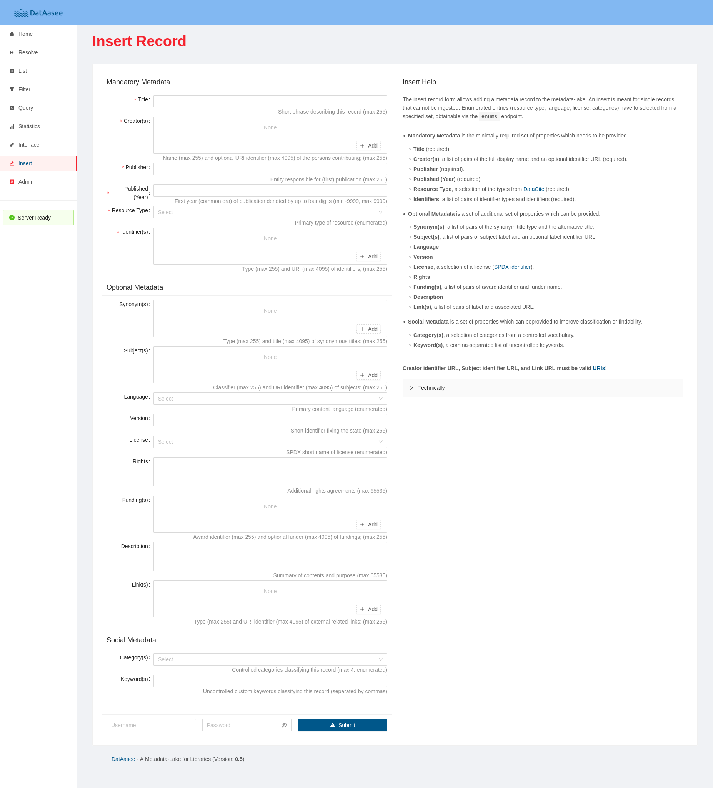

# DatAasee Software Documentation

**Version: 0.5**

**DatAasee** is a [metadata-lake](#about)
for centralizing bibliographic data and scientific metadata from different sources,
to increase research data findability and discoverability, as well as metadata availability,
and thus supporting [FAIR](https://www.go-fair.org/fair-principles) research
in university libraries, research libraries, academic libraries or scientific libraries.

In particular, **DatAasee** is developed for and by the [University and State Library of Münster](https://ulb.uni-muenster.de),
but available openly under a free and open-source license.

**Table of Contents:**

1. [Explanations](#1-explanations) (learning-oriented)
2. [How-Tos](#2-how-tos) (goal-oriented)
3. [References](#3-references) (information-oriented)
4. [Tutorials](#4-tutorials) (understanding-oriented)
5. [Appendix](#5-appendix) (development-oriented)

**Selected Subsections:**

* [How to Deploy](#deploy)
* [Runtime Configuration](#runtime-configuration)
* [HTTP-API Reference](#http-api)
* [Schema Reference](#native-schema)
* [Development FAQ](#development-decision-rationales)

--------------------------------------------------------------------------------

## 1. Explanations

In this section in-depth explanations and backgrounds are collected.

**Overview:**

* [About](#about)
* [Features](#features)
* [Components](#components)
* [Design](#design)
* [Data Model](#data-model)
* [EtLT Process](#etlt-process)
* [Persistence](#persistence)
* [Security](#security)

### About

* What problem is **DatAasee** solving?
    - DatAasee provides a single, unified, and uniform access to distributed sources of bibliographic and research metadata.
* What does **DatAasee** do?
    - DatAasee centralizes, indexes, and serves metadata after ingesting, partially transforming, and interconnecting it.
* What is **DatAasee**?
    - DatAasee is a metadata-lake.
* What is a **Metadata-Lake**?
    - A metadata-lake (a.k.a. metalake) is a data-lake restricted to metadata data.
* What is a **Data-Lake**?
    - A data-lake is a data architecture for structured, semi-structured and unstructured data.
* How does a data-lake differ from a **database**?
    - A data-lake includes a database, but requires further components to import and export data.
* How does a data-lake differ from a **data warehouse**?
    - A data warehouse transforms incoming data to fit its schema (cf [ETL](https://en.wikipedia.org/wiki/Extract,_transform,_load)), a data-lake ingests incoming data as-is and transforms it on-demand (cf [ELT](https://en.wikipedia.org/wiki/Extract,_load,_transform)).
* How is data in a data-lake organized?
    - A data lake includes a **metadata catalog** that stores data locations, its metadata, and transformations.
* What makes a metadata-lake special?
    - The metadata-lake's data-lake and metadata catalog coincide, this implies incoming metadata records are partially transformed (cf [EtLT](https://www.oreilly.com/library/view/data-pipelines-pocket/9781492087823/)) to hydrate the catalog aspect.
* How does a metadata-lake differ from a **data catalog**?
    - A metadata-lake's data is (textual) metadata while a data catalog's data is databases (and their contents).
* How is a metadata-lake a **data-lake**?
    - The ingested metadata is stored in raw form in the metadata-lake in addition to the partially transformed catalog metadata,
      and transformations are performed on the raw or catalog metadata upon request.
* How does a metadata-lake relate to a **virtual data-lake**?
    - A metadata-lake can act as a central metadata catalog for a set of distributed data sources and thus define a virtual data-lake.
* How does a metadata-lake relate to **data spaces**?
    - A data space is a set of (meta)data sources, their interrelations, best-effort interpretation, as-needed integration, and a uniform interface for access.
      In this sense the metadata-lake DatAasee spans a data space.
* How does the DatAasee metadata-lake relate to a **search-engine**?
    - DatAasee can conceptionally be seen as a metasearch engine for metadata.
* What is an executive summary of **DatAasee**?
    - DatAasee is a metadata hub for organizations with many different data and metadata sources.

### Features

* **Deploy via:** `Docker`, `Podman`, `Kubernetes`, [`NerdCTL`]
* **Ingest:** `DataCite` (XML), `DC` (XML), `LIDO` (XML), `MARC` (XML), `MODS` (XML)
* **Ingest via:** `OAI-PMH` (HTTP), `S3` (HTTP), `GET` (HTTP), `DatAasee` (HTTP), [`GraphQL` (HTTP)]
* **Search via:** full-text, facet-filters, ingest-source, doi
* **Query by:** `SQL`, `Gremlin`, `Cypher`, `MQL`, `GraphQL`, [`SPARQL`]
* **Export as:** `DataCite` (JSON), `BibJSON` (JSON), [`KDSF` (JSON)]
* REST-like API with CQRS aspects
* Best-of statistics for enumerated properties
* CRUD frontend for manual interaction and observation

Features in brackets [` `] are under construction.

### Components

**DatAasee** uses a [three-tier architecture](https://en.wikipedia.org/wiki/Multitier_architecture#Three-tier_architecture)
with these separately containered components and orchestrated by [Compose](https://compose-spec.io):

| Function         | Abstraction                      | Tier                    | Product
|------------------|----------------------------------|-------------------------|----------------------------------
| Metadata Catalog | Multi-Model Database             | Data (Database)         | [ArcadeDB](https://arcadedb.com)
| EtLT Processor   | Declarative Streaming Processor  | Logic (Backend)         | [Benthos](https://github.com/redpanda-data/benthos)
| Web Frontend     | Declarative Web Framework        | Presentation (Frontend) | [Lowdefy](https://lowdefy.com)

### Design

* Each component is encapsulated in its own container.
* External access is provided through an HTTP API transporting JSON and conforming to [JSON:API](https://jsonapi.org).
* Ingests may happen via compatible (pull) protocols, e.g. `OAI-PMH`, `S3`, `HTTP-GET`.
* The frontend is optional as it is exclusively using the (backend) HTTP-API.
* Internal communication happens via the components' HTTP-APIs.
* Only the database component holds state, the backend (and frontend) are stateless.
* For more details see the [architecture documentation](arc42.md).

### Data Model

The internal data model is based on the one big table (OBT) approach, but with
the exception of linked enumerated dimensions (Look-Up tables) making it
effectively a denormalized wide table with star schema.
Practically, a graph database is used with a central node (vertex) type (cf. table) named `metadata`.
The node properties are based on [DataCite](https://schema.datacite.org) for the _descriptive_ metadata.

### EtLT Process

The ingest of metadata records follows typical data transport patterns.
Combining the **ETL** (Extract-Transform-Load / schema-on-write)
and **ELT** (Extract-Load-Transform / schema-on-read) concepts,
processing is built upon an **EtLT** approach:

* **E**xtract: Ingest from data source, see [ingest endpoint](#ingest-endpoint).
* **t**ransform: Partial parsing and cleaning of ingested data.
* **L**oad: Write raw and transformed data to the database.
* **T**ransform: Export to respective format on-demand.

Particularly, this means "EtL" happens (batch-wise) during ingest, while "T" occurs when requested.

### Persistence

**Backup and Restore:**

* The database component holds all state of the DatAasee service.
* The database can be backed-up on demand (see [backup endpoint](#backup-endpoint)).
* After a successful ingest and before every shutdown a backup is made.
* When starting the DatAasee service the latest backup in the specified backup location is restored.

### Security

**Secrets:**

* Two secrets need to be handled: _datalake_ admin password and _database_ admin password.
* The default _datalake_ admin user name is `admin`, the password can be passed during initial deploy (`DL_PASS`), there is no default password.
* The _database_ admin user name is `root`, the password can be passed during initial deploy (`DB_PASS`), there is no default password.
* These passwords are handled as secrets by the deploying Compose-file (loaded from an environment variable and provided to containers as a file).
* The database credentials are used by the backend and may also be used for manual database access.
* If the secrets are kept on the host, they need to be protected, see [Secret Management](#secret-management).
* During development, the database can be directly accessed via its web [studio](https://docs.arcadedb.com/#studio).
* When deployed, the database is only directly accessible through the [console](https://docs.arcadedb.com/#console) from inside the database container.
* There is no session data as all interactions are per-request.

**Infrastructure:**

* Component containers are custom-build and hardened.
* Only `HTTP` and `Basic Authentication` are used, as it is assumed that `HTTPS` is provided by an operator-provided proxy-server.

**Interface:**

* HTTP-API `GET` requests are idempotent and thus **unchallenged**.
* HTTP-API `POST` requests may change the state of the database and thus need to be authorized by the data-lake admin user credentials.
* See the [DatAasee OpenAPI definition](../api/openapi.yaml).

--------------------------------------------------------------------------------

## 2. How-Tos

In this section, step-by-step guides for real-world problems are listed.

**Overview:**

* [Prerequisite](#prerequisite)
* [Resources](#resources)
* [Using DatAasee](#using-dataasee)
* [Deploy](#deploy)
* [Logs](#logs)
* [Shutdown](#shutdown)
* [Probe](#probe)
* [Ingest](#ingest)
* [Backup Manually](#backup-manually)
* [Update](#update)
* [Upgrade](#upgrade)
* [Web Interface (Prototype)](#web-interface-prototype)
* [API Indexing](#api-indexing)

### Prerequisite

The (virtual) machine deploying **DatAasee** requires [`docker-compose`](https://docs.docker.com/compose/install/)
on top of `docker` or `podman`, see also [container engine compatibility](#container-engines).

### Resources

The compute and memory resources for **DatAasee** can be configured via the [`compose.yaml`](../compose.yaml).
To run, a bare-metal machine or virtual machine requires:

* _Minimum:_ 4 CPU, 8G RAM (a _Raspberry Pi_ 4 would be sufficient)
* _Recommended:_ 8 CPU, 32G RAM

In terms of **DatAasee** components this breaks down to:

* Database:
    * _Minimum:_ 2 CPU, 4G RAM
    * _Recommended:_ 4 CPU, 24G RAM
* Backend:
    * _Minimum:_ 1 CPU, 2G RAM
    * _Recommended:_ 2 CPU, 4G RAM
* Frontend:
    * _Minimum:_ 1 CPU, 2G RAM
    * _Recommended:_ 2 CPU, 4G RAM

Note, that resource and system requirements depend on load;
especially the database is under heavy load during ingest.
Post ingest, (new) metadata records are interrelated, also causing heavy database loads.
Generally, the _database_ drives the overall performance.
Thus, to improve performance, try first to increase the memory `limits` (in the `compose.yaml`)
for the database component (i.e. from 4G to 24G).

### Using DatAasee

In this section the terms "operator" and "user" are utilized,
where "operator" refers to the party installing, serving and maintaining DatAasee,
and "user" refers to the individuals or services reading from DatAasee.

**Operator Activities**

* Updating DatAasee
* Ingesting from external sources
* Database backups

**User Activities**

* Metadata queries (support)
* Data queries (data)
* Custom queries (read-only)

This means the user can only use the `GET` API endpoints, while the operator typically uses the `POST` API endpoints.

For details about the HTTP-API calls, see the [API reference](#http-api).

### Deploy

Deploy DatAasee via (Docker) Compose by providing the two secrets:

* `DL_PASS` is for authorizing day-to-day operator actions in the backend, like _backup_, _ingest_, or _health_ checks;
* `DB_PASS` is used by the backend itself, and exceptionally by the operator, to interact with the database directly;

for further details see the [Getting Started tutorial](#getting-started) as well as the [compose.yaml](../compose.yaml) and the Docker [Compose file reference](https://docs.docker.com/reference/compose-file/).

```shell
$ mkdir -p backup  # or: ln -s /path/to/backup/volume backup
$ wget https://raw.githubusercontent.com/ulbmuenster/dataasee/0.5/compose.yaml
$  DL_PASS=password1 DB_PASS=password2 docker compose up -d
```

> **NOTE:** The backup folder (or mount) needs permissions to read from, and write into by the __root__
            (actually by the database container's user, but root can represent them on the host).
            Thus, a change of ownership `sudo chown root backup` is typically required.
            For testing purposes `chmod o+w backup` is fine, but not recommended for production.

> **NOTE:** The required secrets are kept in the temporary environment variables `DL_PASS` and `DB_PASS`;
            note the leading space in the line with `docker compose`, omitting it from the history.

> **NOTE:** To further customize your deploy, use [environment variables](#runtime-configuration).
            The runtime configuration environment variables can be stored in an `.env` file.

> **WARNING:** Do not put secrets into the `.env` file!

### Logs

```shell
$ docker compose logs backend --no-log-prefix
```

> **NOTE:** For better readability the log output can be piped through `grep -E --color '^([^\s]*)\s|$'`
            highlighting the text before the first whitespace, which corresponds to the log-level in the DatAasee logs.

### Shutdown

```shell
$ docker compose down
```

> **NOTE:** A (database) backup is automatically triggered on every shutdown.

### Probe

For further details see [`/ready` endpoint](#ready-endpoint) API reference entry.

```shell
wget -SqO- http://localhost:8343/api/v1/ready
```

> **NOTE:** The default port for the HTTP API is `8343`.

### Ingest

For further details see [`/ingest` endpoint](#ingest-endpoint) API reference entry.

```shell
$ wget -qO- http://localhost:8343/api/v1/ingest --user admin --ask-password --post-data \
  '{"source":"https://my.url/to/oai","method":"oai-pmh","format":"mods","rights":"CC0","steward":"steward.data@metadata.source"}'
```
> **NOTE:** This is an async action, progress and completion is only noted in the logs.

> **NOTE:** The `rights` field should be a controlled term setting the access rights or license of the ingested metadata records.

> **NOTE:** The `steward` field should be a URL or email, but can be any identification of a responsible person for the ingested source.

### Backup (Manually)

For further details see [`/backup` endpoint](#backup-endpoint) API reference entry.

```shell
$ wget -qO- http://localhost:8343/api/v1/backup --user admin --ask-password --post-data=
```

> **NOTE:** A (database) backup is also automatically triggered after every ingest.

> **NOTE:** A custom backup location can be specified via `DL_BACKUP` or inside the `compose.yaml`.

### Update

```shell
$ docker compose pull
$  DL_PASS=password1 DB_PASS=password2 docker compose up -d
```

> **NOTE:** "Update" means: if available, new images of the same DatAasee version but with updated dependencies
            will be installed, whereas "Upgrade" means: a new version of DatAasee will be installed.

> **NOTE:** An update terminates an ongoing ingest or interconnect process.

### Upgrade

```shell
$ docker compose down
$  DL_PASS=password1 DB_PASS=password2 DL_VERSION=0.5 docker compose up -d
```

> **NOTE:** `docker compose restart` cannot be used here because environment
            variables (such as `DL_VERSION`) are not updated when using restart.

> **NOTE:** Make sure to put the `DL_VERSION` variable into an `.env` file for a permanent upgrade or edit the compose file.

### Reset

```shell
$ docker compose restart
```

> **NOTE:** A reset may become necessary if, for example, the backend crashes during an ingest; a database backup is created during a reset, too.

### Web Interface (Prototype)

All frontend pages show a menu on the left side listing all other pages, as well as an indicator if the backend server is ready.

> **NOTE:** The default port for the web frontend is `8000`, i.e. `http://localhost:8000`, and can be adapted in the `compose.yaml`.

---


The home page has a full-text search input.

---


The "DOI Search" page takes a DOI and returns the associated metadata record.

---


The "List Records" page allows to list all metadata records from a selected source.

---


The "Filter Search" page allows to filter for a sub set of metadata records by _categories_, _resource types_, _languages_, _licenses_, or _publication year_.

---


The "Custom Query" page allows to enter a query via _sql_, _cypher_, _gremlin_, _graphql_, or _mql_.

---


The "Statistics Overview" page shows top-10 bar graphs for _number of views_, _publication years_, and _keywords_, as well as top-100 pie charts for _resource types_, _categories_, _licenses_, _subjects_, _languages_, and metadata _schemas_.

---


The "Interface Summary" page lists the backend API endpoints and provides links to _parameter_, _request_, and _response_ schemas.

---


The "Display Record" page presents a single metadata record.

---



The "Insert Record" page allows to insert a single metadata record.

---


The "Admin Controls" page allows to trigger actions in the backend like _backup database_, _ingest source_, or _health check_.

### API Indexing

Add the JSON object below to the `apis` array in your global [`apis.json`](http://apisjson.org):

```json
{
  "name": "DatAasee API",
  "description": "The DatAasee API enables research data search and discovery via metadata",
  "keywords": ["Metadata"],
  "attribution": "DatAasee",
  "baseURL": "http://your-dataasee.url/api/v1",
  "properties": [
    {
      "type": "InterfaceLicense",
      "url": "https://creativecommons.org/licenses/by/4.0/"
    },
    {
      "type": "x-openapi",
      "url": "http://your-dataasee.url/api/v1/api"
    }
  ]
}
```

For [FAIRiCat](https://signposting.org/FAIRiCat/), add the JSON object below to the `linkset` array:

```json
{
  "anchor": "http://your-dataasee.url/api/v1",
  "service-doc": [
    {
      "href": "http://your-dataasee.url/api/v1/api",
      "type": "application/json",
      "title": "DatAasee API"
    }
  ]
}
```

--------------------------------------------------------------------------------

## 3. References

In this section technical descriptions are summarized.

**Overview:**

* [Runtime Configuration](#runtime-configuration)
* [HTTP-API](#http-api)
* [Ingest Protocols](#ingest-protocols)
* [Ingest Encodings](#ingest-encodings)
* [Ingest Formats](#ingest-formats)
* [Native Schema](#native-schema)
* [Interrelation Edges](#interrelation-edges)
* [Ingestable to Native Schema Crosswalk](#ingestable-to-native-schema-crosswalk)
* [Query Languages](#query-languages)

### Runtime Configuration

The following environment variables affect **DatAasee** if set before starting:

| Symbol       | Value                     | Meaning
|--------------|---------------------------|---------
| `TZ`         | `CET` (Default)           | Timezone of all component servers
| `DL_PASS`    | `password1` (Example)     | DatAasee password (**use only command local!**)
| `DB_PASS`    | `password2` (Example)     | Database password (**use only command local!**)
| `DL_VERSION` | `0.5` (Example)           | Requested DatAasee version
| `DL_BACKUP`  | `$PWD/backup` (Default)   | Path to backup folder
| `DL_USER`    | `admin` (Default)         | DatAasee admin username
| `DL_BASE`    | `http://my.url` (Example) | Outward DatAasee base URL (including protocol and port, but no trailing slash)
| `DL_PORT`    | `8343` (Default)          | DatAasee API port
| `FE_PORT`    | `8000` (Default)          | Web Frontend port

### HTTP-API

The HTTP-API is served under `http://<your-base-url>:port/api/v1` (see [`DL_PORT` and `DL_BASE`](#runtime-configuration)) and provides the following endpoints:

| Method | Endpoint                          | Type     | Summary
|--------|-----------------------------------|----------|---------
| `GET`  | [`/ready`](#ready-endpoint)       | system   | Returns service readiness
| `GET`  | [`/api`](#api-endpoint)           | system   | Returns API specification and schemas
| `GET`  | [`/schema`](#schema-endpoint)     | support  | Returns database schema
| `GET`  | [`/enums`](#enums-endpoint)       | support  | Returns enumerated property values
| `GET`  | [`/stats`](#stats-endpoint)       | support  | Returns metadata record statistics
| `GET`  | [`/sources`](#sources-endpoint)   | support  | Returns ingested metadata sources
| `GET`  | [`/metadata`](#metadata-endpoint) | **data** | Returns queried metadata record(s)
| `POST` | [`/ingest`](#ingest-endpoint)     | system   | Triggers async ingest of metadata records from source.
| `POST` | [`/insert`](#insert-endpoint)     | system   | Inserts single metadata record (discouraged)
| `POST` | [`/backup`](#backup-endpoint)     | system   | Triggers database backup
| `POST` | [`/health`](#health-endpoint)     | system   | Probes and returns service liveness

For more details see also the associated [OpenAPI definition](../api/openapi.yaml).
Furthermore, parameters, request and response bodies are specified as JSON-Schemas, which are linked in the respective endpoint entries below.

> **NOTE:** The default base path for all endpoints is `/api/v1`.

> **NOTE:** All `GET` requests are unchallenged, all `POST` requests are challenged, which are handled via "Basic Authentication",
            where the user name is `admin` (by default, or was set via `DL_USER`), and the password was set via `DL_PASS`.

> **NOTE:** All request and response bodies have content type `JSON`,
            thus, if provided, the `Content-Type` HTTP header must be `application/json` or `application/vnd.api+json`!

> **NOTE:** Responses follow the [JSON:API](https://jsonapi.org) format, with the exception of the `/api` endpoint.

> **NOTE:** The `id` property, in a response's `data` property, is the server's [Unix timestamp](https://en.wikipedia.org/wiki/Unix_time).

---

#### `/ready` Endpoint

Returns a boolean answering if service is ready.

This endpoint is meant for readiness checks by an orchestrator, monitoring or in a frontend.

* HTTP Method: `GET`
* Request Parameters: None
* Response Body: [`response/ready.json`](../api/response/ready.json)
* Cached Response: No
* Access: Public
* Process: [see architecture](arc42.md#ready-endpoint-public)

> **NOTE:** The `ready` endpoint can be used as readiness probe.

> **NOTE:** Internally, the overall readiness consists of the backend server [AND](https://en.wikipedia.org/wiki/Logical_conjunction) database server readiness.

**Status:**

* [200](https://httpstatuses.io/200) OK
* [406](https://httpstatuses.io/406) Not Acceptable
* [413](https://httpstatuses.io/413) Payload Too Large
* [414](https://httpstatuses.io/414) Request-URI Too Long
* [503](https://httpstatuses.io/503) Service Unavailable

**Example:**

Get service readiness:
```shell
$ wget -qO- http://localhost:8343/api/v1/ready
```

---

#### `/api` Endpoint

Returns OpenAPI specification (without parameters), or parameter, request and response schemas (with respective parameter).

This endpoint documents the HTTP API as a whole as well as parameter, request, and response JSON schemas for all endpoints,
and helps navigating the API for humans and machines.

* HTTP Method: `GET`
* Request Parameters: [`params/api.json`](../api/params/api.json)
  * `params`  (optional; if provided, a parameter schema for the endpoint in the parameter value is returned.)
  * `request` (optional; if provided, a request schema for the endpoint in the parameter value is returned.)
  * `response` (optional; if provided, a response schema for the endpoint in the parameter value is returned.)
* Response Body: [`response/api.json`](../api/response/api.json)
* Cached Response: Yes (refreshed never)
* Access: Public
* Process: [see architecture](arc42.md#api-endpoint-public)

> **NOTE:** In case of a successful request, the response is _NOT_ in the `JSON:API` format, but the requested JSON file directly.

**Statuses:**

* [200](https://httpstatuses.io/200) OK
* [404](https://httpstatuses.io/404) Not Found
* [406](https://httpstatuses.io/406) Not Acceptable
* [413](https://httpstatuses.io/413) Payload Too Large
* [414](https://httpstatuses.io/414) Request-URI Too Long
* [500](https://httpstatuses.io/500) Internal Server Error

**Examples:**

Get OpenAPI definition:
```shell
$ wget -qO- http://localhost:8343/api/v1/api
```

Get `enums` endpoint parameter schema:
```shell
$ wget -qO- http://localhost:8343/api/v1/api?params=enums
```

Get `ingest` endpoint request schema:
```shell
$ wget -qO- http://localhost:8343/api/v1/api?request=ingest
```

Get `metadata` endpoint response schema:
```shell
$ wget -qO- http://localhost:8343/api/v1/api?response=metadata
```

---

#### `/schema` Endpoint

Returns internal metadata schema.

This endpoint provides the hierarchy of the data model as well as labels and descriptions for all properties,
and is meant for labels, hints or tooltips in a frontend.

* HTTP Method: `GET`
* Request Parameters: None
* Response Body: [`response/schema.json`](../api/response/schema.json)
* Cached Response: Yes (refreshed every 1h)
* Access: Public
* Process: [see architecture](arc42.md#schema-endpoint-public-cached)

> **NOTE:** Keys prefixed with `@` refer to meta information (schema `version`, type `comment`) or edge type names.

**Statuses:**

* [200](https://httpstatuses.io/200) OK
* [406](https://httpstatuses.io/406) Not Acceptable
* [413](https://httpstatuses.io/413) Payload Too Large
* [414](https://httpstatuses.io/414) Request-URI Too Long
* [500](https://httpstatuses.io/500) Internal Server Error

**Example:**

Get native metadata schema:
```shell
$ wget -qO- http://localhost:8343/api/v1/schema
```

---

#### `/enums` Endpoint

Returns lists of enumerated property values.

This endpoint returns lists of possible values for the `categories`, `languages`, `licenses`, `relations`, `resourceTypes`, `schemas` properties, as well as suggested values for the `name` sub-property of the `externalLinks`, `synonyms` properties,
for frontends and query design.

* HTTP Method: `GET`
* Request Parameters: [`params/enums.json`](../api/params/enums.json)
    * `type` (optional; if provided only selected enumeration is returned.)
* Response Body: [`response/enums.json`](../api/response/enums.json)
* Cached Response: Yes (refreshed every 1h)
* Access: Public
* Process: [see architecture](arc42.md#enums-endpoint-public-cached)

**Statuses:**

* [200](https://httpstatuses.io/200) OK
* [404](https://httpstatuses.io/404) Not Found
* [406](https://httpstatuses.io/406) Not Acceptable
* [413](https://httpstatuses.io/413) Payload Too Large
* [414](https://httpstatuses.io/414) Request-URI Too Long
* [500](https://httpstatuses.io/500) Internal Server Error

**Example:**

Get all enumerated properties:
```shell
$ wget -qO- http://localhost:8343/api/v1/enums
```

Get "languages" property values:
```shell
$ wget -qO- http://localhost:8343/api/v1/enums?type=languages
```

---

#### `/stats` Endpoint

Returns statistics about records.

The returned Top-10 viewed records, occurring publication years, and keywords,
as well as the Top-100 resource types, categories, licenses, subjects, languages, and metadata schemas,
are meant for frontend dashboards and serve as an example for querying statistics.

* HTTP Method: `GET`
* Request Parameters: None
* Response Body: [`response/stats.json`](../api/response/stats.json)
* Cached Response: Yes (refreshed every 1h)
* Access: Public
* Process: [see architecture](arc42.md#stats-endpoint-public-cached)

**Statuses:**

* [200](https://httpstatuses.io/200) OK
* [406](https://httpstatuses.io/406) Not Acceptable
* [413](https://httpstatuses.io/413) Payload Too Large
* [414](https://httpstatuses.io/414) Request-URI Too Long
* [500](https://httpstatuses.io/500) Internal Server Error

**Example:**

Get record statistics:
```shell
$ wget -qO- http://localhost:8343/api/v1/stats
```

---

#### `/sources` Endpoint

Returns ingested sources.

This endpoint is meant for downstream services to obtain the ingested sources,
which in a subsequent query can be used to filter by source.

* HTTP Method: `GET`
* Request Parameters: None
* Response Body: [`response/sources.json`](../api/response/sources.json)
* Cached Response: Yes (refreshed every 1h)
* Access: Public
* Process: [see architecture](arc42.md#sources-endpoint-public-cached)

**Statuses:**

* [200](https://httpstatuses.io/200) OK
* [406](https://httpstatuses.io/406) Not Acceptable
* [413](https://httpstatuses.io/413) Payload Too Large
* [414](https://httpstatuses.io/414) Request-URI Too Long
* [500](https://httpstatuses.io/500) Internal Server Error

**Example:**

Get ingested sources:
```shell
$ wget -qO- http://localhost:8343/api/v1/sources
```

---

#### `/metadata` Endpoint

Fetches, searches, filters or queries metadata record(s).
Five modes of operation are available:

* If `id` is given, a record with this `recordId` is returned if it exists;
* if `id` and `format` are given, a record with the requested export format is returned if it exists;
* if `query` and `language` are given, a custom query is send;
* if `source` and optionally `format` are given, records are filtered for source and metadata format;
* if no `id` or `source` is given and the `language` is not a compatible query language,
  a combined full-text search of `search`, `doi`, and filter search of `language`, `resourcetype`, `license`, `category`, `format`, `from`, `till` is performed.

Paging via `page` is supported only for the source query and the combined full-text and filter search, sorting via `newest` only for the latter.

This is the main endpoint serving the metadata data of the DatAasee database.

* HTTP Method: `GET`
* Request Parameters: [`params/metadata.json`](../api/params/metadata.json)
    * `id` (optional; if provided, a metadata record with this `recordId` is returned.)
        * together with `id`, `format` can be `datacite` or `bibjson`
    * `source` (optional; if provided, metadata records from this `source` are returned.)
        * sources can be listed via the [`/sources`](#sources-endpoint)
    * `query` (optional; if provided, query results using this value are returned.)
        * together with `query`, `language` can be `sql`, `gremlin`, `cypher`, `mongo`, or `graphql`
    * `language` (optional; if provided, filter results by `language` are returned; also used to set `query` language.)
    * `search` (optional; if provided, full-text search results for this value are returned.)
    * `resourcetype` (optional; if provided, filter results by `resourceType` are returned.)
    * `license` (optional; if provided, filter results by `license` are returned.)
    * `category` (optional; if provided, filter results by `category` are returned.)
    * `format` (optional; if provided, filter results by `metadataFormat` are returned; also used to set export format.)
    * `doi` (optional; if provided, filter results by `identifiers.data` are returned for `identifiers.name = 'doi'`)
    * `from` (optional; if provided, filter results greater or equal `publicationYear` are returned.)
    * `till` (optional; if provided, filter results lesser or equal `publicationYear` are returned.)
    * `page` (optional; if provided, the n-th page of results is returned.)
    * `newest` (optional; if provided, results are sorted new-to-old if true, or old-to-new if false, by default, no sorting.)
* Response Body: [`response/metadata.json`](../api/response/metadata.json)
* Cached Response: No
* Access: Public
* Process: [see architecture](arc42.md#metadata-endpoint-public)

> **NOTE:** Only idem-potent read operations are permitted in custom queries.

> **NOTE:** This endpoint's responses include pagination links, where applicable.

> **NOTE:** For requests with `id` at most one result is returned.
            For requests with `query` or `source` at most one-hundred results are returned per page.
            Other requests return at most twenty results per page.

> **NOTE:** An explicitly empty `source` parameter (i.e. `source=`) implies all sources.

> **NOTE:** A full-text search always matches for all argument terms (AND-based) in titles, descriptions and keywords in any order,
            while accepting `*` as wildcards and `_` to build phrases, for example: `I_*_a_dream`.

> **NOTE:** The `type` in a `BibJSON` export is renamed `entrytype` due to a collision with `JSON API` constraints.

> **NOTE:** The `id=dataasee` is a special record in the backend for testing purposes; it is not stored in the database.

**Statuses:**

* [200](https://httpstatuses.io/200) OK
* [404](https://httpstatuses.io/404) Not Found
* [406](https://httpstatuses.io/406) Not Acceptable
* [413](https://httpstatuses.io/413) Payload Too Large
* [414](https://httpstatuses.io/414) Request-URI Too Long
* [500](https://httpstatuses.io/500) Internal Server Error

**Examples:**

Get record by record identifier:
```shell
$ wget -qO- http://localhost:8343/api/v1/metadata?id=dataasee
```

Export record in given format:
```shell
$ wget -qO- http://localhost:8343/api/v1/metadata?id=dataasee&format=datacite
```

Search records by single filter:
```shell
$ wget -qO- http://localhost:8343/api/v1/metadata?language=chinese
```

Search records by multiple filters:
```shell
$ wget -qO- http://localhost:8343/api/v1/metadata?resourcetype=book&language=german
```

Search records by full-text for word "History":
```shell
$ wget -qO- http://localhost:8343/api/v1/metadata?search=History
```

Search records by full-text and filter, oldest first:
```shell
$ wget -qO- http://localhost:8343/api/v1/metadata?search=Geschichte&resourcetype=book&language=german&newest=false
```

Search records by custom SQL query:
```shell
$ wget -qO- http://localhost:8343/api/v1/metadata?language=sql&query=SELECT%20FROM%20metadata%20LIMIT%2010
```

List the second page of records from all sources:
```shell
$ wget -qO- http://localhost:8343/api/v1/metadata?source=&page=1
```

---

#### `/ingest` Endpoint

Triggers async ingest of metadata records from source.

This endpoint is the principal way to transport (meta-)data into DatAasee.

* HTTP Method: `POST`
* Request Body: [`request/ingest.json`](../api/request/ingest.json)
    * `source` must be an URL
    * `method` must be one of `oai-pmh`, `s3`, `get`, `dataasee` (from another DatAasee instance)
    * `format` must be one of `datacite`, `oai_datacite`, `dc`, `oai_dc`, `marc21`, `marcxml`, `mods`, or `rawmods`
    * `steward` should be an URL or email address, but can be any description of the source's data steward
    * `rights` should be a rights or license identifier, but can be any description of the source's use restrictions
    * `options` (optional) ampersand separated selective harvesting options (_currently only for OAI-PMH_)
    * `username` (optional) a username or access key for the source (_currently only for S3_)
    * `password` (optional) a password or secret key for the source (_currently only for S3_)
* Response Body: [`response/ingest.json`](../api/response/ingest.json)
* Cached Response: No
* Access: Challenged (Basic Authentication)
* Process: [see architecture](arc42.md#ingest-endpoint-private-external-read)

> **NOTE:** This is an async action, so the response just reports if an ingest was started.
            Completion is noted in the backend logs and the subsequent interconnect in the database logs.

> **NOTE:** To test if the server is busy, send an empty (POST) body to this endpoint.

> **NOTE:** The `method` and `format` parameters are case-sensitive.

> **NOTE:** The `options` field follows the [selective harvesting in OAI-PMH](https://www.openarchives.org/OAI/openarchivesprotocol.html#SelectiveHarvesting),
            For example, admissible values are for example `from=2000-01-01` or `set=institution&from=2000-01-01`

**Status:**

* [200](https://httpstatuses.io/200) OK
* [202](https://httpstatuses.io/202) Accepted
* [400](https://httpstatuses.io/400) Bad Request
* [403](https://httpstatuses.io/403) Invalid credentials
* [406](https://httpstatuses.io/406) Not Acceptable
* [413](https://httpstatuses.io/413) Payload Too Large
* [414](https://httpstatuses.io/414) Request-URI Too Long
* [503](https://httpstatuses.io/503) Service Unavailable

**Example:**

Check if server is busy ingesting:
```shell
$ wget -qO- http://localhost:8343/api/v1/ingest --user admin --ask-password --post-data=''
```

Start ingest from a given source:
```shell
$ wget -qO- http://localhost:8343/api/v1/ingest --user admin --ask-password --post-data \
  '{"source":"https://datastore.uni-muenster.de/oai","method":"oai-pmh","format":"datacite","rights":"CC0","steward":"forschungsdaten@uni-muenster.de"}'
```

---

#### `/insert` Endpoint

Inserts and parses, if necessary, a new record into the database.

This endpoint allows to manually insert a metadata record, however, this functionality is meant for testing and corner cases
which cannot be ingested, for example, a report about a DatAasee instance.

* HTTP Method: `POST`
* Request Body: [`request/insert.json`](../api/request/insert.json)
* Response Body: [`response/insert.json`](../api/response/insert.json)
* Cached Response: No
* Access: Challenged (Basic Authentication)
* Process: [see architecture](arc42.md#insert-endpoint-private)

> **NOTE:** Generally, the usage of this endpoint is discouraged.

> **NOTE:** Enumerated properties in the body (resourceType, language, license, categories) set only values if found in a controlled vocabulary.
            The respective enumerations can be obtained via the [`enums` endpoint](#enums-endpoint).

**Status:**

* [201](https://httpstatuses.io/201) Created
* [400](https://httpstatuses.io/400) Bad Request
* [403](https://httpstatuses.io/403) Invalid Credentials
* [406](https://httpstatuses.io/406) Not Acceptable
* [413](https://httpstatuses.io/413) Payload Too Large
* [414](https://httpstatuses.io/414) Request-URI Too Long
* [500](https://httpstatuses.io/500) Internal Server Error

**Example:**

Insert record with given fields: TODO:
```shell
$ wget -qO- http://localhost:8343/api/v1/insert --user admin --ask-password --post-file=myinsert.json
```

---

#### `/backup` Endpoint

Triggers a database backup.

This endpoint is meant to create an on-demand backup in addition to the on-shutdown and after-ingest backups,
to back up usage data.

* HTTP Method: `POST`
* Request Body: None
* Response Body: [`response/backup.json`](../api/response/backup.json)
* Cached Response: No
* Access: Challenged (Basic Authentication)
* Process: [see architecture](arc42.md#backup-endpoint-private-external-write)

> **NOTE:** The backup location on the host can be set through the `DL_BACKUP` environment variable.

> **NOTE:** In case a backup request times out, likely a backup takes longer than expected.

**Status:**

* [200](https://httpstatuses.io/200) OK
* [403](https://httpstatuses.io/403) Invalid Credentials
* [406](https://httpstatuses.io/406) Not Acceptable
* [413](https://httpstatuses.io/413) Payload Too Large
* [414](https://httpstatuses.io/414) Request-URI Too Long
* [500](https://httpstatuses.io/500) Internal Server Error

**Example:**

Back up the database and thus all state of DatAasee:
```shell
$ wget -qO- http://localhost:8343/api/v1/backup --user admin --ask-password --post-data=''
```

---

#### `/health` Endpoint

Returns internal status and versions of service components.

This endpoint is meant for liveness checks by an orchestrator, observability or for manually inspecting the database and processor health.

* HTTP Method: `POST`
* Request Body: None
* Response Body: [`response/health.json`](../api/response/health.json)
* Cached Response: No
* Access: Challenged (Basic Authentication)
* Process: [see architecture](arc42.md#health-endpoint-private)

> **NOTE:** The `health` endpoint can be used as liveness probe.

**Status:**

* [200](https://httpstatuses.io/200) OK
* [403](https://httpstatuses.io/403) Invalid Credentials
* [406](https://httpstatuses.io/406) Not Acceptable
* [413](https://httpstatuses.io/413) Payload Too Large
* [414](https://httpstatuses.io/414) Request-URI Too Long
* [500](https://httpstatuses.io/500) Internal Server Error

**Example:**

Get service health:
```shell
$ wget -qO- http://localhost:8343/api/v1/health --user admin --ask-password --post-data=''
```

---


### Ingest Protocols

* [OAI-PMH](http://www.openarchives.org/OAI/openarchivesprotocol.html) (Open Archives Initiative Protocol for Metadata Harvesting)
  * Identifier: `oai-pmh`
  * Supported Versions: `2.0`
  * List available metadata formats via `http://url.to/oai?verb=ListMetadataFormats`
* [S3](https://docs.aws.amazon.com/AmazonS3/latest/API) (Simple Storage Service)
  * Identifier: `s3`
  * Supported Versions: `2006-03-01`
  * Expects a bucket of files in the same format (!) which is ingested entirely file by file
* [GET](https://httpwg.org/specs/rfc9110.html#GET) (Plain HTTP GET)
  * Identifier: `get`
  * Expects a single `.xml` file
  * The file's contents require an XML root-element (of any name).
* [DatAasee](https://github.com/ulbmuenster/dataasee)
  * Identifier: `dataasee`
  * Supported Versions: `0.5`
  * Ingest all contents from another DatAasee instance, the associated `format` parameter should be valued `dataasee`.

### Ingest Encodings

Currently, [XML](https://www.w3.org/XML) (eXtensible Markup Language) is the sole encoding for
ingested metadata, with the exception of ingesting via the `DatAasee` protocol, which uses
[JSON](https://www.json.org) (JavaScript Object Notation).

### Ingest Formats

* [DataCite](https://datacite.org/)
  * Identifiers: `datacite`, `oai_datacite`
  * Supported Versions: `4.4`, `4.5`, `4.6`
  * [Format Specification](https://support.datacite.org/docs/datacite-metadata-schema-v44-properties-overview)
* [DC](https://www.dublincore.org/) (Dublin Core)
  * Identifiers: `dc`, `oai_dc`
  * Supported Versions: `1.1`
  * [Format Specification](https://www.dublincore.org/specifications/dublin-core/dces/)
* [LIDO](https://lido-schema.org) (Lightweight Information Describing Objects)
  * Identifiers: `lido`
  * Supported Versions: `1.0`
  * [Format Specification](https://cidoc.mini.icom.museum/working-groups/lido/lido-overview/lido-schema/)
* [MARC](https://www.loc.gov/marc/) (MAchine-Readable Cataloging)
  * Identifier: `marc21`, `marcxml`
  * Supported Versions: `1.1` (XML)
  * [Format Specification](https://www.loc.gov/marc/bibliographic/)
* [MODS](http://www.loc.gov/mods/) (Metadata Object Description Schema)
  * Identifiers: `mods`, `rawmods`
  * Supported Versions: `3.7`, `3.8`
  * [Format Specification](https://www.loc.gov/standards/mods/userguide/generalapp.html)

### Native Schema

The underlying DBMS (ArcadeDB) is a property-graph database of nodes (vertexes) and edges being documents (resembling JSON files).
The graph nature is utilized by interconnecting records (vertex documents) via identifiers (i.e. DOI) during ingest,
given a set of predefined [relations](#interrelation-edges).

Conceptually, the data model for metadata records has five sections:

* **Process** - documenting information generated and assigned during ingest process
* **Technical** - information about the underlying data's appearance
* **Social** - usage counting and discoverability information of the metadata record
* **Descriptive** - information about the underlying data's content
* **Raw** - originally ingested metadata

The central type of the `metadatalake` database is the `metadata` vertex type, with the following properties:

| Key                | Section     | Entry     | Internal Type | Constraints         | Comment
|--------------------|-------------|-----------|---------------|---------------------|---------
| `schemaVersion`    | Process     | Automatic | Integer       | =1                  |
| `recordId`         | Process     | Automatic | String        | max 31              | Hash (XXH64) of: source, format, sourceId/publisher, publicationYear, name
| `metadataFormat`   | Process     | Automatic | String        | max 255             |
| `metadataQuality`  | Process     | Automatic | String        | max 255             | Currently one of: "Incomplete", "OK"
| `dataSteward`      | process     | Automatic | String        | max 4095            |
| `source`           | Process     | Automatic | Link(pair)    | sources             |
| `sourceRights`     | Process     | Automatic | String        | max 4095            |
| `createdAt`        | Process     | Automatic | Datetime      |                     |
||||||
| `sizeBytes`        | Technical   | Optional  | Integer       | min 0               |
| `dataFormat`       | Technical   | Optional  | String        | max 255             |
| `dataLocation`     | Technical   | Optional  | String        | max 4095, URL regex |
||||||
| `numberViews`      | Social      | Automatic | Integer       | min 0               |
| `keywords`         | Social      | Optional  | String        | max 255             | Full-text indexed, comma separated
| `categories`       | Social      | Optional  | List(String)  | max 4               | Pass array of strings to API, returned as array of strings form API
||||||
| `name`             | Descriptive | Mandatory | String        | max 255             | Full-text indexed, title
| `creators`         | Descriptive | Mandatory | List(pair)    | max 255             | Pass array of [pair](#pair-documents) objects (name, identifier) to API
| `publisher`        | Descriptive | Mandatory | String        | max 255             |
| `publicationYear`  | Descriptive | Mandatory | Integer       | min -9999, max 9999 |
| `resourceType`     | Descriptive | Mandatory | Link(pair)    | resourceTypes       | Pass string to API, returned as string from API
| `identifiers`      | Descriptive | Mandatory | List(pair)    | max 255             | Pass array of [pair](#pair-documents) objects (type, identifier) to API
||||||
| `synonyms`         | Descriptive | Optional  | List(pair)    | max 255             | Pass array of [pair](#pair-documents) objects (type, title) to API
| `language`         | Descriptive | Optional  | Link(pair)    | languages           | Pass string to API, returned as string from API
| `subjects`         | Descriptive | Optional  | List(pair)    | max 255             | Pass array of [pair](#pair-documents) objects (name, identifier) to API
| `version`          | Descriptive | Optional  | String        | max 255             |
| `license`          | Descriptive | Optional  | Link(pair)    | licenses            | Pass string to API, returned as string from API
| `rights`           | Descriptive | Optional  | String        | max 65535           |
| `fundings`         | Descriptive | Optional  | List(pair)    | max 255             | Pass array of [pair](#pair-documents) objects (project, funder) to API
| `description`      | Descriptive | Optional  | String        | max 65535           | Full-text indexed
| `externalItems`    | Descriptive | Optional  | List(pair)    | max 255             | Pass array of [pair](#pair-documents) objects (type, URL) to API
||||||
| `rawMetadata`      | Raw         | Optional  | String        | max 262144          | Larger raw data is discarded
| `rawChecksum`      | Raw         | Automatic | String        | max 255             | Hash (MD5) of: rawMetadata

> **NOTE:** See also the [custom queries](#custom-queries) section and the schema diagram: [schema.md](schema.md).

> **NOTE:** The properties `related`, `selfies`, `visited` are only for internal purposes and hence not listed here.

> **NOTE:** The preloaded set of `categories` (see [categories.csv](../database/preload/categories.csv)) is highly opinionated.

#### Global Metadata

The `metadata` type has the custom metadata fields:

| Key       | Type    | Comment
|-----------|---------|---------
| `version` | Integer | Internal schema version (to compare against the `schemaVersion` property)
| `comment` | String  | Database comment

#### Property Metadata

Each schema property has a `label`, additionally the descriptive properties have
a `comment` property.

| Key       | Type    | Comment
|-----------|---------|---------
| `label`   | String  | For UI labels
| `comment` | String  | For UI helper texts

#### `pair` Documents

A helper document type used for `source`, `creators`, `identifiers`, `synonyms`, `language`, `subjects`, `license`, `fundings`, `externalItems` link targets or list elements.

| Property | Type   | Constraints
|----------|--------|-------------
| `name`   | String | min 1, max 255
| `data`   | String | max 4095, URL regex

> **NOTE:** The URL regex is based on [stephenhay](https://mathiasbynens.be/demo/url-regex)'s pattern.

### Interrelation Edges

| Type                    | Comment
|-------------------------|---------
| `isRelatedTo`           | Generic catch-all edge type and base type for all other edge types
| `isNewVersionOf`        | See [DataCite](https://datacite-metadata-schema.readthedocs.io/en/4.6/appendices/appendix-1/relationType/)
| `isDerivedFrom`         | See [DataCite](https://datacite-metadata-schema.readthedocs.io/en/4.6/appendices/appendix-1/relationType/)
| `hasPart`               | See [DataCite](https://datacite-metadata-schema.readthedocs.io/en/4.6/appendices/appendix-1/relationType/)
| `isPartOf`              | See [DataCite](https://datacite-metadata-schema.readthedocs.io/en/4.6/appendices/appendix-1/relationType/)
| `isDescribedBy`         | See [DataCite](https://datacite-metadata-schema.readthedocs.io/en/4.6/appendices/appendix-1/relationType/)
| `commonExpression`      | See [OpenWEMI](https://www.dublincore.org/specifications/openwemi/specification/)
| `commonManifestation`   | See [OpenWEMI](https://www.dublincore.org/specifications/openwemi/specification/)

> **NOTE:** The graph is directed, so the edge names have a direction. By default, the edge name refers to the outbound direction.

#### Edge Metadata

| Key        | Type    | Comment
|------------|---------|---------
| `label`    | String  | For UI labels (outbound edge)
| `altlabel` | String  | For UI labels (incoming edge)

### Ingestable to Native Schema Crosswalk

TODO:

| DatAasee              | DataCite                                                           | DC            | LIDO                                                                                                                                              | MARC                                            | MODS
|----------------------:|:------------------------------------------------------------------:|:-------------:|:-------------------------------------------------------------------------------------------------------------------------------------------------:|:-----------------------------------------------:|:----:
| `name`                | `titles.title`                                                     | `title`       | `descriptiveMetadata.objectIdentificationWrap.titleWrap.titleSet`                                                                                 | `245`, `130`                                    | `titleInfo`, `part`
| `creators`            | `creators.creator`                                                 | `creator`     | `descriptiveMetadata.eventWrap.eventSet`                                                                                                          | `100`, `700`                                    | `name`, `relatedItem`
| `publisher`           | `publisher`                                                        | `publisher`   | `descriptiveMetadata.objectIdentificationWrap.repositoryWrap.repositorySet`                                                                       | `260`, `264`                                    | `originInfo`
| `publicationYear`     | `publicationYear`                                                  | `date`        | `descriptiveMetadata.eventWrap.eventSet`                                                                                                          | `260`, `264`                                    | `originInfo`, `part`
| `resourceType`        | `resourceType`                                                     | `type`        | `category` (TODO)                                                                                                                                 | `007`, `337`                                    | `genre`, `typeOfResource`
| `identifiers`         | `identifier`, `alternateIdentifiers.alternateIdentifier`           | `identifier`  | `lidoRecID`, `objectPublishedID`                                                                                                                  | `001`, `003`, `020`, `024`, `856`               | `identifier`, `recordInfo`
| `synonyms`            | `titles.title`                                                     | `title`       | `descriptiveMetadata.objectIdentificationWrap.titleWrap.titleSet`                                                                                 | `210`, `222`, `240`, `242`, `243`, `246`, `247` | `titleInfo`
| `language`            | `language`                                                         | `language`    | `descriptiveMetadata.objectClassificationWrap.classificationWrap.classification`                                                                  | `008`, `041`                                    | `language`
| `subjects`            | `subjects.subject`                                                 | `subject`     | `descriptiveMetadata.objectRelationWrap.subjectWrap.subjectSet`, `descriptiveMetadata.objectClassificationWrap.classificationWrap.classification` | `655`, `689`                                    | `subject`, `classification`
| `version`             | `version`                                                          |               | `descriptiveMetadata.objectIdentificationWrap.displayStateEditionWrap.displayEdition`                                                             | `250`                                           | `originInfo`
| `license`             | `rightsList.rights`                                                |               | `administrativeMetadata.rightsWorkWrap.rightsWorkSet`                                                                                             | `506`, `540`                                    | `accessCondition`
| `rights`              | `rightsList.rights`                                                | `rights`      | `administrativeMetadata.rightsWorkWrap.rightsWorkSet`                                                                                             | `506`, `540`                                    | `accessCondition`
| `fundings`            | `fundingReferences.fundingReference`                               |               |                                                                                                                                                   |                                                 |
| `description`         | `descriptions.description`                                         | `description` | `descriptiveMetadata.objectIdentificationWrap.objectDescriptionWrap.objectDescriptionSet`                                                         | `500`, `520`                                    | `abstract`
| `externalItems`       | `relatedIdentifiers.relatedIdentifier`                             | `related`     | `descriptiveMetadata.objectRelationWrap.relatedWorksWrap.relatedWorkSet`                                                                          | `856`                                           | `relatedItem`
|||||
| `keywords`            | `subjects.subject`                                                 | `subject`     | `descriptiveMetadata.objectIdentificationWrap.objectDescriptionWrap.objectDescriptionSet`                                                         | `653`                                           | `subject`, `classification`
|||||
| `dataLocation`        | `identifier`                                                       |               |                                                                                                                                                   | `856`                                           | `location`
| `dataFormat`          | `formats.format`                                                   | `format`      |                                                                                                                                                   |                                                 |
| `sizeBytes`           |                                                                    |               |                                                                                                                                                   |                                                 |
|||||
| `isRelatedTo`         | `relatedItems.relatedItem`, `relatedIdentifiers.relatedIdentifier` | `related`     | `descriptiveMetadata.objectRelationWrap.relatedWorksWrap.relatedWorkSet`                                                                          | `780`, `785`, `786`, `787`                      | `relatedItem`
| `isNewVersionOf`      | `relatedItems.relatedItem`, `relatedIdentifiers.relatedIdentifier` |               |                                                                                                                                                   |                                                 | `relatedItem`
| `isDerivedFrom`       | `relatedItems.relatedItem`, `relatedIdentifiers.relatedIdentifier` |               |                                                                                                                                                   |                                                 | `relatedItem`
| `isPartOf`            | `relatedItems.relatedItem`, `relatedIdentifiers.relatedIdentifier` |               |                                                                                                                                                   | `773`                                           | `relatedItem`
| `hasPart`             | `relatedItems.relatedItem`, `relatedIdentifiers.relatedIdentifier` |               |                                                                                                                                                   |                                                 | `relatedItem`
| `CommonExpression`    |                                                                    |               |                                                                                                                                                   |                                                 | `relatedItem`
| `CommonManifestation` | `identifier`, `alternateIdentifiers.alternateIdentifier`           | `identifier`  | `lidoRecID`, `objectPublishedID`                                                                                                                  | `001`, `003`, `020`, `024`, `856`               | `identifier`, `recordInfo`

### Query Languages

| Language | Identifier | Tutorial         | Documentation
|----------|------------|------------------|---------------
| SQL      | `sql`      | [here](#sql)     | [ArcadeDB SQL](https://docs.arcadedb.com/#sql)
| Cypher   | `cypher`   | [here](#cypher)  | [Neo4J Cypher](https://neo4j.com/docs/cypher-manual/current/)
| GraphQL  | `graphql`  | [here](#graphql) | [GraphQL Spec](https://spec.graphql.org/)
| Gremlin  | `gremlin`  | [here](#gremlin) | [Tinkerpop Gremlin](https://kelvinlawrence.net/book/PracticalGremlin.html)
| MQL      | `mongo`    | [here](#mql)     | [Mongo MQL](https://www.mongodb.com/docs/manual/tutorial/query-documents/)
||||
| SPARQL   | `sparql`   | (WIP)            | [SPARQL](https://www.w3.org/TR/sparql11-query/)

--------------------------------------------------------------------------------

## 4. Tutorials

In this section lessons for new-comers are given.

**Overview:**

* [Getting Started](#getting-started)
* [Example Ingest](#example-ingest)
* [Example Harvest](#example-harvest)
* [Secret Management](#secret-management)
* [Container Engines](#container-engines)
* [Container Probes](#container-probes)
* [Custom Queries](#custom-queries)
* [Custom Frontend](#custom-frontend)

### Getting Started

0. Setup [compatible compose](#container-engines) orchestrator
1. Download **DatAasee** release
    ```shell
    $ wget https://raw.githubusercontent.com/ulbmuenster/dataasee/0.5/compose.yaml
    ```
   or:
    ```shell
    $ curl https://raw.githubusercontent.com/ulbmuenster/dataasee/0.5/compose.yaml
    ```
2. Create or mount folder for backups (assuming your backup volume is mounted under `/backup` on the host in case of mount)
    ```shell
    $ mkdir -p backup
    ```
   or:
    ```shell
    $ ln -s /backup backup
    ```
3. Ensure the backup location has the necessary permissions:
    ```shell
    $ chmod o+w backup  # For testing
    ```
   or:
    ```shell
    $ sudo chown root backup  # For deploying
    ```
4. Start **DatAasee** service: "␣" denotes a space, which in front of a shell command causes it to be omitted from the history.
    ```shell
    $ ␣DB_PASS=password1 DL_PASS=password2 docker compose up -d
    ```
   or:
    ```shell
    $ ␣DB_PASS=password1 DL_PASS=password2 podman compose up -d
    ```

Now, if started locally, point a browser to [`http://localhost:8000`](http://localhost:8000) to use the web frontend,
or send requests to [`http://localhost:8343/api/v1/`](http://localhost:8343/api/v1/) to use the HTTP API directly, for example via `wget`, `curl`.

### Example Ingest

For demonstration purposes the collection of the "Directory of Open Access Journals" (DOAJ) is ingested.
An ingest has four phases: First, the operator needs to collect the necessary information of the metadata source,
i.e. URL, protocol, format, and data steward.
Second, the ingest is triggered via the HTTP-API.
Third, the backend ingests the metadata records from the source to the database.
Fourth and lastly, the ingested data is interconnected inside the database.

1. Check the "Directory of Open Access Journals" (in a browser) for a compatible ingest method:
    ```http
    https://doaj.org
    ```
   The `oai-pmh` protocol is available.

2. Check the documentation about OAI-PMH for the corresponding endpoint:
    ```http
    https://doaj.org/docs/oai-pmh/
    ```
   The OAI-PMH endpoint URL is: `https://doaj.org/oai`.

3. Check the OAI-PMH endpoint for available metadata formats (for example, in a browser):
    ```http
    https://doaj.org/oai?verb=ListMetadataFormats
    ```
   A [compatible metadata format](#ingest-formats) is `oai_dc`.

4. Trigger the ingest:
    ```shell
    $ wget -qO- http://localhost:8343/api/v1/ingest --user admin --ask-password --post-data \
      '{"source":"https://doaj.org/oai", "method":"oai-pmh", "format":"oai_dc", "rights":"CC0", "steward":"helpdesk@doaj.org"}'
    ```
   A status `202` confirms the start of the ingest.
   Here, no steward is listed in the DOAJ documentation, thus a general contact is set.
   Alternatively, the "Ingest" form of the "Admin" page in the web frontend can be used.

5. DatAasee reports the start of the ingest in the backend logs:
    ```shell
    $ docker logs dataasee-backend-1
    ```
   with a message akin to: `Ingest started from https://doaj.org/oai via oai-pmh as oai_dc.`.

6. DatAasee reports completion of the ingest in the backend logs:
    ```shell
    $ docker logs dataasee-backend-1
    ```
   with a message akin to: `Ingest completed from https://doaj.org/oai of 22133 records (of which 0 failed) after 0.1h.`.

7. DatAasee starts interconnecting the ingested metadata records:
    ```shell
    $ docker logs dataasee-database-1
    ```
   with the message: `Interconnect Started!`.

8. DatAasee finishes interconnecting the ingested metadata records:
    ```shell
    $ docker logs dataasee-database-1
    ```
   with the message: `Interconnect Completed!`.

> **NOTE:** The interconnect is a potentially long-running, asynchronous operation, whose status is only reported in the database logs.

> **NOTE:** Generally, the ingest methods `OAI-PMH` for suitable sources, `S3` for multi-file sources, and `GET` for single-file sources should be used.

### Example Harvest

A typical use-case for DatAasee is to forward all metadata records from a specific source.
To demonstrate this, the previous [Example Ingest](#example-ingest) is assumed to have happened.

1. Check the ingested sources
    ```shell
    $ wget -qO- http://localhost:8343/api/v1/sources
    ```

2. Request the first set of metadata records from source `https://doaj.org/oai` (the source needs to be [URL encoded](https://en.wikipedia.org/wiki/Percent-encoding)):
    ```shell
    $ wget -qO- http://localhost:8343/api/v1/metadata?source=https%3A%2F%2Fdoaj.org%2Foai
    ```
   At most 100 records are returned. For the first page, also the parameter `page=0` may be used.

3. Request the next set of metadata records via pagination:
    ```shell
    $ wget -qO- http://localhost:8343/api/v1/metadata?source=https%3A%2F%2Fdoaj.org%2Foai&page=1
    ```
   The last page can contain less than 100 records, all pages before contain 100 records.

> **NOTE:** Using the `source` filter, the **full** record is returned, instead of a search result when used without, see [`/metadata`](#metadata-endpoint)

> **NOTE:** The records are returned in no ordered which can be relied upon, thus assume no order.

### Secret Management

Two secrets need to be managed for DatAasee, the database root password and the backend admin password.
To protect these secrets on a host running docker(-compose), for example, the following tools can be used:

#### [sops](https://getsops.io)

```shell
$ printf "DL_PASS=password1\nDB_PASS=password2" > secrets.env
```

```shell
$ sops encrypt -i secrets.env
```

```shell
$ sops exec-env secrets.env 'docker compose up -d'
```

> **NOTE:** For testing use `gpg --full-generate-key` and pass `SOPS_PGP_FP`.

#### consul & [envconsul](https://github.com/hashicorp/envconsul)

```shell
$ consul kv put dataasee/DL_PASS password1
```

```shell
$ consul kv put dataasee/DB_PASS password2
```

```shell
$ envconsul -prefix dataasee docker compose up -d
```

> **NOTE:** For testing use `consul agent -dev`.

#### [env-vault](https://github.com/romantomjak/env-vault)

```shell
$ EDITOR=nano env-vault create secrets.env
```

* Enter a password and then in the editor (here `nano`) the secrets line-by-line `DL_PASS=password1`, `DB_PASS=password2`; save and exit.

```shell
$ env-vault secrets.env docker compose -- up -d
```

#### `openssl`

```shell
$  printf "DL_PASS=password1\nDB_PASS=password2" | openssl aes-256-cbc -e -a -salt -pbkdf2 -in - -out secrets.enc
```

```shell
$ (openssl aes-256-cbc -d -a -pbkdf2 -in secrets.enc -out secrets.env; docker compose --env-file .env --env-file secrets.env up -d; rm secrets.env)
```


### Container Engines

**DatAasee** is deployed via a `compose.yaml` (see [How to deploy](#deploy)),
which is compatible to the following container and orchestration tools:

* Docker / Podman via [`docker compose`](https://docs.docker.com/compose/)
* Kubernetes / Minikube via [`kompose`](https://kompose.io)

#### Docker-Compose (Docker)

* docker
* docker compose >= 2

Installation see: [docs.docker.com/compose/install/](https://docs.docker.com/compose/install/)

```shell
$  DB_PASS=password1 DL_PASS=password2 docker compose up -d
```

```shell
$ docker compose ps
```

```shell
$ docker compose down
```

#### Docker-Compose (Podman)

* podman
* docker compose >= 2

Installation see: [podman-desktop.io/docs/compose/setting-up-compose](https://podman-desktop.io/docs/compose/setting-up-compose)

> **NOTE:** See also the [`podman compose` manpage](https://docs.podman.io/en/latest/markdown/podman-compose.1.html).

> **NOTE:** Alternatively the package `podman-docker` (on Ubuntu) can be used to emulate docker through podman.

> **NOTE:** The compose implementation `podman-compose` is not compatible at the moment.

```shell
$  DB_PASS=password1 DL_PASS=password2 podman compose up -d
```

```shell
$ podman compose ps
```

```shell
$ podman compose down
```

#### Kompose (Minikube)

* minikube
* kubectl
* kompose

Installation see: [kompose.io/installation/](https://kompose.io/installation/)

Rename the `compose.yaml` to `compose.txt` and run:

```shell
$ kompose -f compose.txt convert
```

* In `database-deployment.yaml` change:
    * `mountPath: /db` to `mountPath: /db/secret`
    * `secretName: database` to `secretName: dataasee`

* In `backend-deployment.yaml` change:
    * `mountPath: /db` to `mountPath: /db/secret`
    * `secretName: database` to `secretName: dataasee`
    * `mountPath: /dl` to `mountPath: /dl/secret`
    * `secretName: datalake` to `secretName: dataasee`

```shell
$ minikube start
```

```shell
$ kubectl create secret generic dataasee --from-literal=database=password1 --from-literal=datalake=password2
```

```shell
$ kubectl apply -f .
```

```shell
$ kubectl port-forward service/backend 8343:8343  # now the backend can be accessed via `http://localhost:8343/api/v1`
```

> **NOTE:** Due to a Kubernetes/Next.js issue this does currently not work for the frontend.

```shell
$ minikube stop
```

### Container Probes

The following endpoints are available for monitoring the respective containers;
here the `compose.yaml` host names (service names) are used.
Logs are written to the standard output.

#### Backend

**Ready:**
```http
http://backend:4195/ready
```
returns HTTP status `200` if ready, see also [Connect `ready`](https://docs.redpanda.com/redpanda-connect/components/http/about/#endpoints).

**Liveness:**
```http
http://backend:4195/ping
```
returns HTTP status `200` if live, see also [Connect `ping`](https://docs.redpanda.com/redpanda-connect/components/http/about/#endpoints).

#### Database

**Ready:**
```http
http://database:2480/api/v1/ready
```
returns HTTP status `204` if ready, see also [ArcadeDB `ready`](https://docs.arcadedb.com/#http-checkready).

**Liveness:**
```http
http://database:2480/api/v1/exists/metadatalake
```
returns HTTP status `200` if live.

#### Frontend

**Ready:**
```http
http://frontend:8000
```
returns HTTP status `200` if ready.


### Custom Queries

Custom queries are meant for downstream services to customize recurring data access.
Overall, the DatAasee database schema is based around the `metadata` vertex type,
which corresponds to a one-big-table (OBT) pattern in relational terms.
See the [schema reference](#native-schema) as well as the [schema overview](schema.md) for the data model.

> **NOTE:** All custom query results are limited to 100 items per request; use respective paging.

#### SQL

**DatAasee** uses the [ArcadeDB SQL dialect](https://docs.arcadedb.com/#sql) (`sql`).
For custom SQL queries, only single, read-only queries are admissible,
meaning:

* [`SELECT`](https://docs.arcadedb.com/#sql-select)
* [`MATCH`](https://docs.arcadedb.com/#sql-match)
* [`TRAVERSE`](https://docs.arcadedb.com/#sql-traverse)

The vertex type (cf. table) holding the metadata records is named `metadata`.

**Examples:**

Get the schema:
```sql
SELECT FROM schema:types
```

Get (at most) the first one-hundred metadata record titles:
```sql
SELECT name FROM metadata
```

#### Gremlin

**DatAasee** supports a subset of [Gremlin](https://docs.arcadedb.com/#gremlin-api) (`gremlin`).

**Examples:**

Get (at most) the first one-hundred metadata record titles:
```gremlin
g.V().hasLabel("metadata")
```

#### Cypher

**DatAasee** supports a subset of [OpenCypher](https://docs.arcadedb.com/#open-cypher) (`cypher`).
For custom Cypher queries, only read-queries are admissible,
meaning:

* `MATCH`
* `OPTIONAL MATCH`
* `RETURN`

**Examples:**

Get labels:
```cypher
MATCH (n) RETURN DISTINCT labels(n)
```

Get one-hundred metadata record titles:
```cypher
MATCH (m:metadata) RETURN m
```

#### MQL

**DatAasee** supports a subset of a [MQL](https://docs.arcadedb.com/#mongodb-query-language) (`mongo`) as JSON queries.

**Examples:**

Get (at most) the first one-hundred metadata record titles:
```json
{ 'collection': 'metadata', 'query': { } }
```

#### GraphQL

**DatAasee** supports a subset of a [GraphQL](https://docs.arcadedb.com/#graphql) (`graphql`).
GraphQL use requires some prior setup:

1. A corresponding GraphQL type for the native `metadata` type needs to be defined:
    ```graphql
    type metadata { id: ID! }
    ```
2. Some GraphQL query needs to be defined, for example named `getMetadata`:
    ```graphql
    type Query { getMetadata(id: ID!): [metadata!]! }
    ```

Since GraphQL type and query declarations are ephemeral,
declarations and query execution should be send together.

**Examples**

Get (at most) the first one-hundred metadata record titles:
```graphql
type metadata { id: ID! }

type Query { getMetadata(id: ID!): [metadata!]! }

{ getMetadata { name } }
```

#### SPARQL

TODO:

### Custom Frontend

#### Remove Prototype Frontend

Remove the YAML object `"frontend"` in the `compose.yaml` (all lines below `## Frontend # ...`).

--------------------------------------------------------------------------------

## 5. Appendix

In this section development-related guidelines are gathered.

**Overview:**

* [Reference Links](#reference-links)
* [Dependency Docs](#dependency-docs)
* [Development Decision Rationales](#development-decision-rationales)
* [Development Workflows](#development-workflows)

### Reference Links:

* [`DatAasee`: A Metadata-Lake as Metadata Catalog for a Virtual Data-Lake](https://arxiv.org/abs/2409.05512)
* [The Rise of the Metadata-Lake](https://towardsdatascience.com/the-rise-of-the-metadata-lake-1e95127594de)
* [Implementing the Metadata Lake](https://medium.com/@ganandg/implementing-the-metadata-lake-7676f9dadb89)
* [ELT is dead, and EtLT will be the end of modern data processing architecture](https://blog.devgenius.io/elt-is-dead-and-etlt-will-be-the-end-of-modern-data-processing-architecture-154b87c1cce0)
* [Dataspace](https://en.wikipedia.org/wiki/Dataspace)

#### Dependency Docs:

* [Docker Compose Docs](https://docs.docker.com/compose/)
* [ArcadeDB Docs](https://docs.arcadedb.com)
* [Benthos Docs](https://docs.redpanda.com/redpanda-connect/home/) (via Redpanda Connect)
* [Lowdefy Docs](https://docs.lowdefy.com)
* [GNU Make Docs](https://www.gnu.org/software/make/manual/make.html)

### Development Decision Rationales:

#### Usage

* What user data is collected (cf. GDPR)?
    * No personal data is collected by DatAasee. DatAasee also does not have user accounts.
      Usage data of records is tracked anonymously by counting individual record requests by id.

#### Infrastructure

* What versioning scheme is used?
    * DatAasee uses [SimVer](https://simver.org) versioning, with the addition, that the minor
      version starts with one for the first release of a major version (`X.1`), so during the
      development of a major version the minor version will be zero (`X.0`).

* How stable is the upgrade to a new release?
    * During the development releases (`0.X`) every release will likely be breaking, particularly
      with respect to backend API and database schema. Once a version `1.1` is released, breaking
      changes will only occur between major versions.

* What are the three `compose` files for?
    * The `compose.develop.yaml` is only for the development environment (dev-only),
    * The `compose.package.yaml` is only for building the release container images (dev-only),
    * The `compose.yaml` is the sole file representing a release (!).

* Why does a release consist only of the `compose.yaml`?
    * The compose configuration acts as a installation script and deploy recipe.
      All containers are set up on-the-fly by pulling.
      No other files are needed.

* Why is **Ubuntu 24.04** used as base image for database and backend?
    * Overall, the [calendar based version together with the 5 year support policy for Ubuntu LTS](https://ubuntu.com/about/release-cycle)
      makes keeping current easier. Generally, `glibc` is used, and specifically for the database,
      OpenJDK is supported, as opposed to Alpine.

* Why is the security so weak (i.e. `http` not `https`, `basic auth` not `digest`, no rate limiter)?
    * DatAasee is a backend service supposed to run behind a proxy or API gateway, which provides
      `https` (then `basic auth` is not too problematic) as well as a rate limiter.

* Why does the testing setup require `busybox` and `wget`, isn't `wget` part of `busybox`?
    * `busybox` is used for its onboard HTTP server; and while a `wget` is part of `busybox`, this
      is a slimmed down variant, specifically the flag `--content-on-error` is not supported.

* Why do (ingest) tests say the (busybox) `httpd` was not found even though `busybox` is installed?
    * In some distributions an extra package (ie `busybox-extras` in Alpine) needs to be installed.

* Why are the permission conflicts when using `docker` and `podman` with the same volume?
    * Each container engine manages this mount internally, meaning a `docker volume` or `podman volume`
      is created and attached to the local `backup` folder. To switch engines run `make empty`
      which will delete all data stored in `backup` and the associated volume.

#### Data Model

* What is the data model based on?
    * The descriptive metadata in the native data model is largely corresponding to the DataCite metadata
      schema. The remaining properties (process, technical, social, raw) are typical data-lake or
      data-warehouse metadata attributes.

* Why are `pair`s used?
    * The `pair` document type is a standardized universal product type for a label (`name`) and
      detail (`data`), with the extra constraint that if the detail starts with `http://` or
      `https://` then it has to be a valid URL. This helper type is used whenever an identifier
      (or URL) with a human-readable name is stored.

* How is the record identifier (`recordId`) created?
    * The record id is a hash of metadata source, metadata format, source record identifier,
      publication year and name. See [process.yaml](../backend/resources/process.yaml) for details.

#### Database

* Why is an `init.sh` script used instead of a plain command in the database container?
    * This is used to restore the most recent database backup if available, and triggering a backup on shutdown.

* How to fix the database if a `/health` report has issues?
    * First of all, this should be a rare occurrence, if not please report an
      [issue](https://github.com/ulbmuenster/dataasee/issues). A fix can be attempted by starting
      a shell in the database container, `docker exec -it dataasee-database-1 sh` and open the
      database console via `bin/console.sh`, then connect **remotely** to the database (local
      connections will not work): `connect remote:localhost/metadatalake root <db_pass>` and run
      the commands: `CHECK DATABASE FIX` and `REBUILD INDEX *`. Infos on AcadeDB's console can be
      found in the [ArcadeDB Docs](https://docs.arcadedb.com/#console).

* How are enumerated properties filled?
    * Enumerated types, and also suggestions for free text fields, are stored in CSV files in the
      `preload` sub-folder. These files contain at least one column with the label (first line)
      "name" and optionally a second column with the label "data".

* Why does deleting backups on the host require super-user privileges?
    * The user running the database inside the container has a user id and group id mismatching
      the user running the container service via Compose on the host causing a mismatch leading
      to requiring privileges. This has a safety facet: backups cannot accidently be deleted,
      in case backups need to be deleted this can be done from inside the database container,
      i.e. `docker exec -it dataasee-database-1 sh` and then `rm /backup/metadatalake/*`.

* How can a backup be made to an S3 bucket?
    * Currently, the best option is to mount a bucket on the host machine via `s3fs` and forward
      this mount as backup location for the database service in the Compose file. Alternatively,
      a Docker plugin like `rexray/s3fs` could be used to create an S3 Docker volume.

* Why is the G1 garbage collector used?
    * DatAasee is aimed at servers with less than 32GB memory, for which the G1 works best. If
      you have a server with more than 32GB memory you can try the Z garbage collector. In this
      case, you need to raise the memory limit of the database service in the compose file to at
      least 32GB.

* What are the internal properties `related`, `selfies`, `visited` in the schema for?
    * All are used only for the [interconnect](../backend/resources/interconnect.yaml) process:
      `related` is a map of list of related identifiers; `selfies` is an indexed list self
      identifiers; `visited` logs if an interconnect process connected this record to the graph
      already.

#### Backend

* Why are the main processing components part of the **input** and not a separate **pipeline**?
    * Since the ingests may take very long, it is only triggered and the successful triggering is
      reported in the response while the ingest keeps on running. This async behavior is only
      possible with a `buffer` which has to be directly after the input and after `sync_response`
      of the trigger, thus the input post-processing processors are used as main pipeline.

* Why is the content type `application/json` used for responses and not `application/vnd.api+json`?
    * Using the official JSON MIME-type makes a response more compatible and states what it is in
      more general terms. Requested content types on the other hand may be either empty, `*/*`,
      `application/json`, or `application/vnd.api+json`.

* Why are there limits for requests and their bodies and what are they?
    * This is an additional defense against exhaustion attacks. A parsed request header together
      with its URL may not exceed 8192 Bytes, likewise the request body may not exceed 8192 Bytes.

#### Frontend

* Why is the frontend a prototype?
    * The frontend is not meant for direct production use but serves as system testing device,
      a proof-of-concept, living documentation, and simplification for manual testing. Thus it has
      the layout of an internal tool. Nonetheless, it can be used as a basis or template for a
      production frontend.

* Why is there custom JS defined?
    * This is necessary to enable triggering the submit button when pressing the "Enter" key.

* Why does the frontend container use the `backend` name explicitly and not the host loopback, i.e.
  `extra_hosts: [host.docker.internal:host-gateway]`?
    * Because `podman` does not seem to support it yet.

### Development Workflows

#### Development Setup

1. `git clone https://github.com/ulbmuenster/dataasee && cd dataasee` (clone repository)
2. `make setup` (builds container images locally)
3. `make start` (starts development setup)

#### Release Builds

* `make build`
* The environment variable `REGISTRY` sets the registry of the container images (default is `localhost.localhost`)
* The repository name is `dataasee` and the image name is the service name (`database`, `backend`, `frontend`)
* The environment variable `DL_VERSION` sets the tag of the container image (by default read from `.env`)
* Altogether this gives `$REGISTRY/dataasee/{database,backend,frontend}:$DL_VERSION`

#### Compose Setup

* `make xxx` (uses `docker compose`)
* `make xxx COMPOSE="docker compose"` (uses `docker compose`)
* `make xxx COMPOSE="podman compose"` (uses `podman compose`)

#### Dependency Updates

1. [Dependency listing](deps.md)
2. [Dependency versions](../.env)
3. [Version verification](../frontend/lowdefy.yaml) (Frontend only)

#### Schema Changes

1. [Schema definition](schema.md)
2. [Schema documentation](#native-schema)
3. [Schema implementation](../database/schema.sql)

#### API Changes

1. [API architecture](arc42.md)
2. [API documentation](#http-api)
3. [API implementation](../backend/resources/handler_xyz.yaml)
4. [API rendering](../api/openapi.yaml)
5. [API testing](../tests/Makefile)

#### Dev Monitoring

* Use [`lazydocker`](https://github.com/jesseduffield/lazydocker) (select tabs via `[` and `]`)

#### Coding Standards

* YAML and SQL files must have a comment header line containing: dialect, project, license, author.
* YAML should be restricted to [StrictYAML](https://hitchdev.com/strictyaml/) (except `gitlab-ci`).
* SQL commands should be all-caps.

#### Release Management

* Each release is a marked by a tag.
* The latest section of the CHANGELOG becomes its description.
* At a tag, a branch with its version as name is created.
