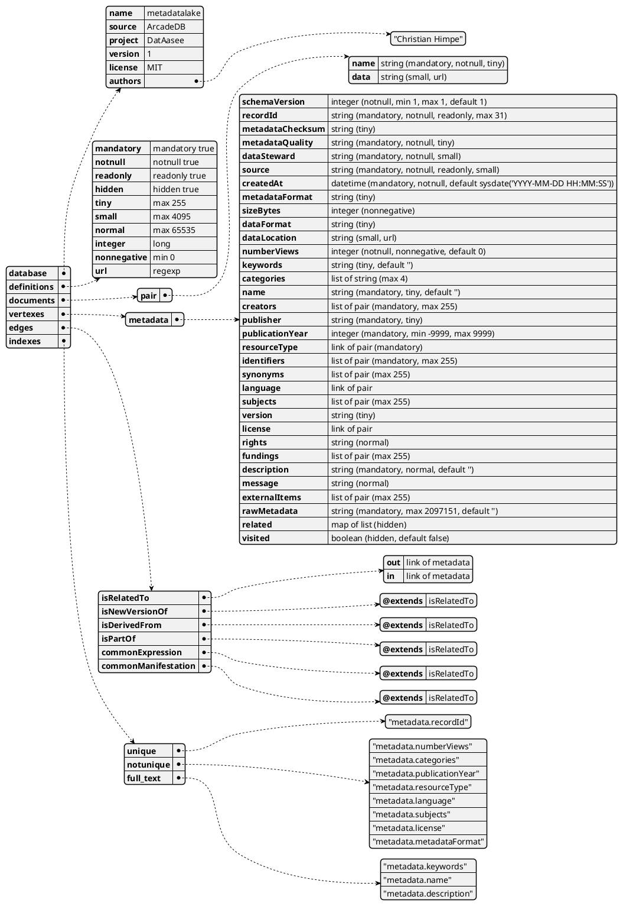

```plantuml
@startyaml

database:
  name: "metadatalake"
  source: "ArcadeDB"
  project: "DatAasee"
  version: 1
  license: "MIT"
  authors:
    - "Christian Himpe"

definitions:
  mandatory: "mandatory true"
  notnull: "notnull true"
  readonly: "readonly true"
  hidden: "hidden true"
  tiny: "max 255"
  small: "max 4095"
  normal: "max 65535"
  integer: "long"
  nonnegative: "min 0"
  url: "regexp"

documents:
  pair:
    name: "string (mandatory, notnull, tiny)"
    data: "string (small, url)"

vertexes:
  metadata:

    # Process
    schemaVersion: "integer (notnull, min 1, max 1, default 1)"
    recordId: "string (mandatory, notnull, readonly, max 31)"
    metadataChecksum: "string (tiny)"
    metadataQuality: "string (mandatory, notnull, tiny)"
    dataSteward: "string (mandatory, notnull, small)"
    source: "string (mandatory, notnull, readonly, small)"
    createdAt: "datetime (mandatory, notnull, default sysdate('YYYY-MM-DD HH:MM:SS'))"

    # Technical
    metadataFormat: "string (tiny)"
    sizeBytes: "integer (nonnegative)"
    dataFormat: "string (tiny)"
    dataLocation: "string (small, url)"

    # Social
    numberViews: "integer (notnull, nonnegative, default 0)"
    keywords: "string (tiny, default '')"
    categories: "list of string (max 4)"

    # Descriptive (Mandatory)
    name: "string (mandatory, tiny, default '')"
    creators: "list of pair (mandatory, max 255)"
    publisher: "string (mandatory, tiny)"
    publicationYear: "integer (mandatory, min -9999, max 9999)"
    resourceType: "link of pair (mandatory)"
    identifiers: "list of pair (mandatory, max 255)"

    # Descriptive (Optional)
    synonyms: "list of pair (max 255)"
    language: "link of pair"
    subjects: "list of pair (max 255)"
    version: "string (tiny)"
    license: "link of pair"
    rights: "string (normal)"
    fundings: "list of pair (max 255)"
    description: "string (mandatory, normal, default '')"
    message: "string (normal)"
    externalItems: "list of pair (max 255)"

    # Raw Metadata
    rawMetadata: "string (mandatory, max 2097151, default '')"

    # Internal
    related: "map of list (hidden)"
    visited: "boolean (hidden, default false)"

edges:
  isRelatedTo:
    out: "link of metadata"
    in: "link of metadata"

  isNewVersionOf:
    @extends: "isRelatedTo"

  isDerivedFrom:
    @extends: "isRelatedTo"

  isPartOf:
    @extends: "isRelatedTo"

  commonExpression:
    @extends: "isRelatedTo"

  commonManifestation:
    @extends: "isRelatedTo"

indexes:
  unique:
    - "metadata.recordId"

  notunique:
    - "metadata.numberViews"
    - "metadata.categories"
    - "metadata.publicationYear"
    - "metadata.resourceType"
    - "metadata.language"
    - "metadata.subjects"
    - "metadata.license"
    - "metadata.metadataFormat"

  full_text:
    - "metadata.keywords"
    - "metadata.name"
    - "metadata.description"

@endyaml
```
  