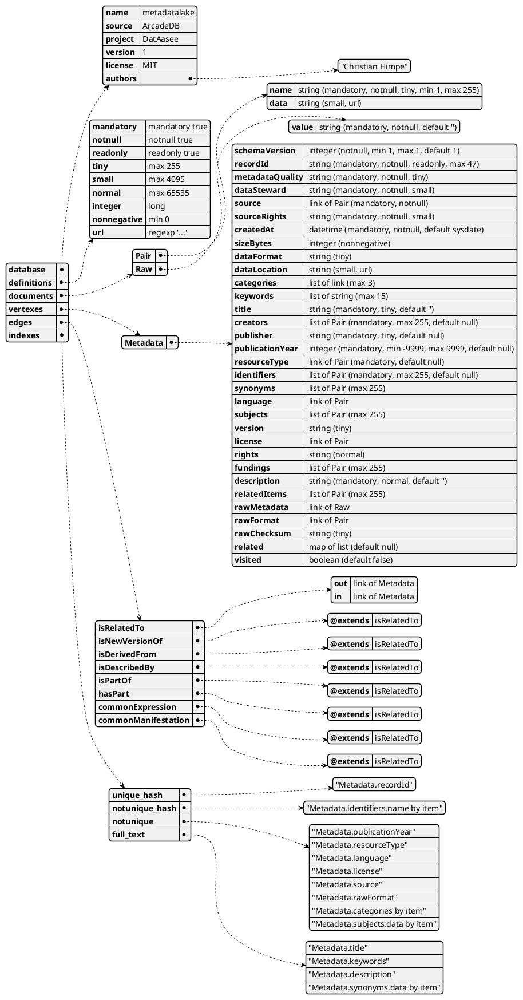

```plantuml
@startyaml

database:
  name: "metadatalake"
  source: "ArcadeDB"
  project: "DatAasee"
  version: 1
  license: "MIT"
  authors:
    - "Christian Himpe"

definitions:
  mandatory: "mandatory true"
  notnull: "notnull true"
  readonly: "readonly true"
  tiny: "max 255"
  small: "max 4095"
  normal: "max 65535"
  integer: "long"
  nonnegative: "min 0"
  url: "regexp '...'"

documents:
  Pair:
    name: "string (mandatory, notnull, tiny, min 1, max 255)"
    data: "string (small, url)"

  Raw:
    value: "string (mandatory, notnull, default '')"

vertexes:
  Metadata:
    # Process
    schemaVersion: "integer (notnull, min 1, max 1, default 1)"
    recordId: "string (mandatory, notnull, readonly, max 47)"
    metadataQuality: "string (mandatory, notnull, tiny)"
    dataSteward: "string (mandatory, notnull, small)"
    source: "link of Pair (mandatory, notnull)"
    sourceRights: "string (mandatory, notnull, small)"
    createdAt: "datetime (mandatory, notnull, default sysdate)"

    # Technical
    sizeBytes: "integer (nonnegative)"
    dataFormat: "string (tiny)"
    dataLocation: "string (small, url)"

    # Social
    categories: "list of link (max 3)"
    keywords: "list of string (max 15)"

    # Descriptive (Mandatory)
    title: "string (mandatory, tiny, default '')"
    creators: "list of Pair (mandatory, max 255, default null)"
    publisher: "string (mandatory, tiny, default null)"
    publicationYear: "integer (mandatory, min -9999, max 9999, default null)"
    resourceType: "link of Pair (mandatory, default null)"
    identifiers: "list of Pair (mandatory, max 255, default null)"

    # Descriptive (Optional)
    synonyms: "list of Pair (max 255)"
    language: "link of Pair"
    subjects: "list of Pair (max 255)"
    version: "string (tiny)"
    license: "link of Pair"
    rights: "string (normal)"
    fundings: "list of Pair (max 255)"
    description: "string (mandatory, normal, default '')"
    relatedItems: "list of Pair (max 255)"

    # Raw Metadata
    rawMetadata: "link of Raw"
    rawFormat: "link of Pair"
    rawChecksum: "string (tiny)"

    # Internal
    related: "map of list (default null)"
    visited: "boolean (default false)"

edges:
  isRelatedTo:
    out: "link of Metadata"
    in: "link of Metadata"

  isNewVersionOf:
    @extends: "isRelatedTo"

  isDerivedFrom:
    @extends: "isRelatedTo"

  isDescribedBy:
    @extends: "isRelatedTo"

  isPartOf:
    @extends: "isRelatedTo"

  hasPart:
    @extends: "isRelatedTo"

  commonExpression:
    @extends: "isRelatedTo"

  commonManifestation:
    @extends: "isRelatedTo"

indexes:
  unique_hash:
    - "Metadata.recordId"

  notunique_hash:
    - "Metadata.identifiers.name by item"

  notunique:
    - "Metadata.publicationYear"
    - "Metadata.resourceType"
    - "Metadata.language"
    - "Metadata.license"
    - "Metadata.source"
    - "Metadata.rawFormat"
    - "Metadata.categories by item"
    - "Metadata.subjects.data by item"

  full_text:
    - "Metadata.title"
    - "Metadata.keywords"
    - "Metadata.description"
    - "Metadata.synonyms.data by item"

@endyaml
```
